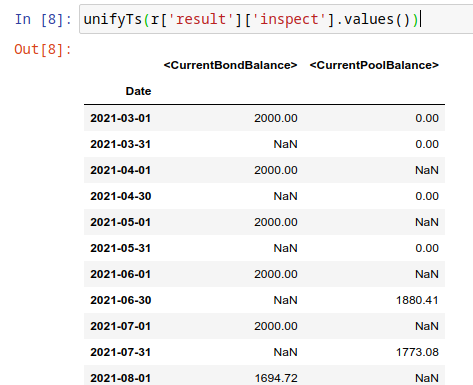
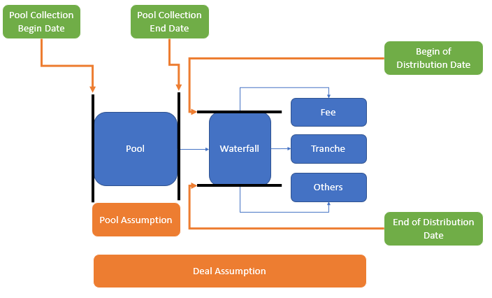
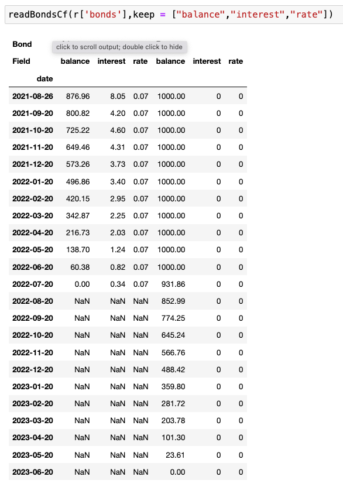

Analytics
==============

.. autosummary::
   :toctree: generate

Setup a API
----------------

here is a list of available servers at `absbox.org <https://absbox.org>`_

.. code-block:: python

   from absbox import API,EnginePath
   
   localAPI = API("https://absbox.org/api/latest")

   # setting default language
   localAPI = API("https://absbox.org/api/latest",lang='english')

   # since version 0.26.7
   # https://absbox.org/api/dev
   localAPI = API(EnginePath.DEV,check=False)
    
   # https://absbox.org/api/latest
   localAPI = API(EnginePath.PROD,check=False)

   # http://localhost:8081
   localAPI = API(EnginePath.LOCAL,check=False)

.. note::
   User can pull the docker image to run his/her own in-house environment

.. note::
   the remote engine exposes RESTful Service , ``absbox`` send deal models and cashflow projection assumptions to that server.
   The engine code was hosted at `Hastructure <https://github.com/yellowbean/Hastructure>`_

Asset Performance Assumption
----------------------------------------

Assumpitions are required to set when running stressed scenario as well as getting specific outputs other than cashflow.

There are two type of assumptions:

* Assumptions for performance of asset
* Assumptions for running a deal

.. graphviz::
    :name: sphinx.ext.graphviz
    :caption: pool assumption
    :alt: pool assumption
    :align: center
 
    digraph {
        rankdir = LR
        "Asset Performance" -> "Current"
        "Current" -> "Mortgage/Installment/Loan"
        "Mortgage/Installment/Loan" -> "Prepayment" 
        "Mortgage/Installment/Loan" -> "Default"
        "Mortgage/Installment/Loan" -> "Recovery"
        "Receivable" -> "Recovery" [label="Not implemented", "color"="red"]
        "Receivable" -> "Default"
        "Current" -> "Lease"
        "Lease" -> "Rental Increase"
        "Lease" -> "Rental Renew"
        "Current" -> "FixedAsset"
        "Current" -> "Receivable"
        "FixedAsset" -> "Production Rate"
        "FixedAsset" -> "Utilization Rate"
        "Asset Performance" -> "Delinquent" [label="Not implemented","color"="red"]
        "Asset Performance" -> "Defaulted" 
        "Prepayment" ["color"="green"]
        "Default" ["color"="green"]
        "Recovery" ["color"="green"]
        "Rental Renew" ["color"="green"]
        "Rental Increase" ["color"="green"]
        "Production Rate" ["color"="green"]
        "Utilization Rate" ["color"="green"]
    }

.. seealso::
   
   The assumption of asset start from point of time of `Asset`
   :ref:`How assumption was applied on asset ?`

Mortgage
^^^^^^^^^^^^^^^^^^^^^^^^^^^^^^

Here is sample which used to set ``Pool`` level assumption on ``Mortgage`` asset class.

.. code-block:: python

   r = localAPI.run(deal
                  ,poolAssump = ("Pool",("Mortgage",<default assump>,<prepay assump>,<recovery assump>,<extra assump>)
                                          ,<delinq assumption>
                                          ,<defaulted assumption>)
                  ,runAssump = None
                  ,read=True)

.. note::

  * ``Pool`` ,means the assumption will be applied to ``all`` the assets in the pool
  * ``Mortgage`` ,means the it's assumption applied to ``Mortgage`` asset class

Performing
""""""""""""

* <Default Assumption>
  
  default assumption for performing asset
  
    * ``{"CDR":0.01}`` means 1% in annualized of current balance will be defaulted at the end of each period
    * ``{"CDR":[0.01,0.02,0.04]}`` means a vector of CDR will be applied since the asset snapshot date (determined by ``remain terms``)
    * ``{"CDRPadding":[0.01,0.02,0.04]}`` same with above but the CDR 4% will be applied to rest of periods of the asset
    * ``{"ByAmount":(2000,[500,500,1000])}`` apply a custom default amount vector.
    * ``{"DefaultAtEndByRate":(0.05,0.10)}``, will apply 5% as CDR for all periods except last period. The last period will use default CDR 10% (which start from begining day).
    .. versionadded:: 0.42.2

    * ``{"ByTerm":[ [vec1],[vec2]...]``, input list of vectors, asset will use vector with same origin term length
* <Prepayment Assumption>
  
  prepayment assumption for performing asset
  
    * ``{"CPR":0.01}`` means 1% in annualized of current balance will be prepay at the end of each period
    * ``{"CPR":[0.01,0.02,0.04]}`` means a vector of CPR will be applied since the asset snapshot date (determined by ``remain terms``)
    * ``{"CPRPadding":[0.01,0.02,0.04]}`` same with above but the CPR 4% will be applied to rest of periods of the asset
    .. versionadded:: 0.42.2
    * ``{"PSA": 1.0}`` 100% of PSA Speed. 
    * ``{"ByTerm":[ [vec1],[vec2]...]``, input list of vectors, asset will use vector with same origin term length

* <Recovery Assumption>

  recovery assumption for performing asset
    
    * ``{"Rate":0.7,"Lag":18}`` means 70% of current balance will be recovered at 18 periods after defaulted date

Non-Performing
""""""""""""""""""""

* <Delinquent Assumption>

  assumption to project cashflow of asset in ``delinquent`` status

  .. warning::
   <delinq assumption> is not implemented yet ,it only serves as a place holder

  
  *reserve for future use* : always use ``None``

* <Defaulted Assumption>

  assumption to project cashflow of asset in ``defaulted`` status

    .. code-block:: python 
    
        ("Defaulted":[0.5,4,[0.5,0.2,0.3]])

    which says:

    * the recovery percentage is 50% of current balance
    * the recovery starts at 4 periods after defaulted date
    * the recovery distribution is 50%,20% and 30%

Summary
""""""""""""""""

.. graphviz::
    :name: sphinx.ext.graphviz
    :caption: mortgage-assumption
    :alt: mortgage-assumption
    :align: center
    
    digraph {
        rankdir = LR
        Mortgage -> Performing
        Mortgage -> Delinquent
        Mortgage -> Defaulted
        Performing -> "Default Assumption"
        Performing -> "Prepayment Assumption"
        Performing -> "Recovery Assumption"
        "Default Assumption" -> "{'CDR':x}"
        "Default Assumption" -> "{'CDR':[x...]}"
        "Default Assumption" -> "{'CDRPadding':[x...]}"
        "Default Assumption" -> "{'ByAmount':(<total>, [x...])}"
        "Default Assumption" -> "{'DefaultAtEndByRate':(x,y)}"
        "Default Assumption" -> "{'byTerm':....}"
        "Prepayment Assumption" -> "{'CPR':x}"
        "Prepayment Assumption" -> "{'CPR':[x...]}"
        "Prepayment Assumption" -> "{'CPRPadding':[x...]}"
        "Prepayment Assumption" -> "{'byTerm':....}"
        "Recovery Assumption" -> "{'Rate':x,'Lag':y}"
        "Defaulted" -> "Defaulted Assumption"
        "Defaulted Assumption" -> "{'Defaulted':[x,y,[z...]]}"
    }

Loan
^^^^^^^^^^^^^^^^^^^^^^^^^^^^^^

.. code-block:: python

   r = localAPI.run(deal
                  ,poolAssump = ("Pool",("Loan",<default assump>,<prepay assump>,<recovery assump>,<extra assump>)
                                          ,<delinq assumption>
                                          ,<defaulted assumption>)
                  ,runAssump = None
                  ,read=True)

* Default

  * <default assump> : ``{"CDR":<%>}``, can be a vector or constant value
  * <default assump> : ``{"CDRPadding":<%>}``, can be a vector or constant value, with last element till end of the asset
  .. versionadded:: 0.42.2
  * ``{"ByTerm":[ [vec1],[vec2]...]``, input list of vectors, asset will use vector with same origin term length
* Prepayment

  * <prepayment assump> : ``{"CPR":<%>}``, can be a vector or constant value
  * <prepayment assump> : ``{"CPRPadding":<%>}``, can be a vector or constant value , with last element till end of the asset
  .. versionadded:: 0.42.2
  * ``{"ByTerm":[ [vec1],[vec2]...]``, input list of vectors, asset will use vector with same origin term length

Summary
""""""""""""""""

.. graphviz::
    :name: sphinx.ext.graphviz
    :caption: loan-assumption
    :alt: loan-assumption
    :align: center
    
    digraph {
        rankdir = LR
        Loan -> Performing
        Loan -> Delinquent
        Loan -> Defaulted
        Performing -> "Default Assumption"
        Performing -> "Prepayment Assumption"
        Performing -> "Recovery Assumption"
        "Prepayment Assumption" -> "{'CPR':x}"
        "Prepayment Assumption" -> "{'CPR':[x...]}"
        "Prepayment Assumption" -> "{'CPRPadding':[x...]}"
        "Prepayment Assumption" -> "{'byTerm':....}"
        "Default Assumption" -> "{'CDR':x}"
        "Default Assumption" -> "{'CDR':[x...]}"
        "Default Assumption" -> "{'CDRPadding':[x...]}"
        "Default Assumption" -> "{'DefaultAtEndByRate':(x,y)}"
        "Default Assumption" -> "{'byTerm':....}"
        "Recovery Assumption" -> "{'Rate':x,'Lag':y}"
    }

Installment
^^^^^^^^^^^^^^^^^^^^^^^^^^^^^^

.. code-block:: python

   r = localAPI.run(deal
                  ,poolAssump = ("Pool",("Installment",<default assump>,<prepay assump>,<recovery assump>,<extra assump>)
                                          ,<delinq assumption>
                                          ,<defaulted assumption>)
                  ,runAssump = None
                  ,read=True)

* Default

  * <default assump> : ``{"CDR":<%>}``
  .. versionadded:: 0.42.2
  * ``{"ByTerm":[ [vec1],[vec2]...]``, input list of vectors, asset will use vector with same origin term length
* Prepayment

  * <prepayment assump> : ``{"CPR":<%>}``
  .. versionadded:: 0.42.2
  * ``{"ByTerm":[ [vec1],[vec2]...]``, input list of vectors, asset will use vector with same origin term length

Summary
""""""""""""""""

.. graphviz::
    :name: sphinx.ext.graphviz
    :caption: installment-assumption
    :alt: installment-assumption
    :align: center
    
    digraph {
        rankdir = LR
        Installment -> Performing
        Installment -> Delinquent
        Installment -> Defaulted
        Performing -> "Default Assumption"
        Performing -> "Prepayment Assumption"
        Performing -> "Recovery Assumption"
        "Prepayment Assumption" -> "{'CPR':x}"
        "Prepayment Assumption" -> "{'byTerm':....}"
        "Default Assumption" -> "{'CDR':x}"
        "Default Assumption" -> "{'DefaultAtEndByRate':(x,y)}"
        "Default Assumption" -> "{'byTerm':....}"
        "Recovery Assumption" -> "{'Rate':x,'Lag':y}"
    }

Receivable 
^^^^^^^^^^^^^^^^^^^^^

user can set assumption on receivable asset class:

* Default
  
  * assume default at last period ( 0 cash received )
  * a CDR way ,which is a percentage of current balance remains.

.. versionadded:: 0.27.3

* Recovery
  
  * aussming a reocvery rate, with a distribution of recoverys by day offsets from defaulted day

.. code-block:: python

  # apply on asset level
  r = localAPI.run(test01
              ,runAssump=[]
              ,poolAssump = ("ByIndex"
                                ,([0],(("Receivable", {"CDR":0.12}, None, None)
                                      ,None,None))
                                ,([1],(("Receivable", "DefaultAtEnd", None, None)
                                      ,None,None))
                                )
              ,read=True)

  receivableAssump = ("Pool"
                      ,("Receivable", {"CDR":0.01}, None, None)
                      ,None
                      ,None)

  receivableAssump = ("Pool",("Receivable" ,"DefaultAtEnd" ,{"Rate":0.5,"ByDays":[(10,0.5),(20,0.5)]} ,None)
                      ,None
                      ,None)

  # apply on pool level
  r = localAPI.run(test01
              ,runAssump=[]
              ,poolAssump = receivableAssump
              ,read=True)

Summary
""""""""""""""""

.. graphviz::
    :name: sphinx.ext.graphviz
    :caption: receivable-assumption
    :alt: receivable-assumption
    :align: center
    
    digraph {
        rankdir = LR
        Receivable -> Performing
        Receivable -> Delinquent
        Receivable -> Defaulted
        Performing -> "Default Assumption"
        Performing -> "Recovery Assumption"
        "Default Assumption" -> "'DefaultAtEnd'"
        "Default Assumption" -> "{'CDR':x}"
        "Recovery Assumption" -> "{'Rate':0.5,'ByDays':[(10,0.5),(20,0.5)]}"
    }

Extra Stress 
^^^^^^^^^^^^^^^^^^^^^^^^^^^^^^

Supported Asset Class:

*  :ref:`Mortgage` 
*  :ref:`Loan`
*  :ref:`Installment`
*  :ref:`Receivable`

.. versionadded:: 0.29.9

user can specify a time series stress curve on prepay or default curve

syntax:
  
  ``("StressByCurve",[<stress curve>,<assumption>])``
  
    * ``<stress curve>`` : a list of [date,rate] pairs
    * ``<assumption>`` : the assumption to apply when the curve is active

.. code-block:: python

    # stress default curve
    defAssump = {"CDR":0.017}
    stressCurve = [["2020-10-01",1.0],["2023-03-01",4.0]]
    stressDef = {"StressByCurve":[stressCurve,defAssump]}

    p = localAPI.runPool(myPool,poolAssump=("Pool",("Mortgage",stressDef ,None,None,None)
                                                  ,None
                                                  ,None)
                        ,read=True)

    # stress prepay curve
    ppyAssump = {"CPR":0.017}
    stressCurve = [["2020-10-01",1.0],["2023-03-01",4.0]]
    stressPpy = {"StressByCurve":[stressCurve,ppyAssump]}

    p = localAPI.runPool(myPool,poolAssump=("Pool",("Mortgage",None ,stressPpy,None,None)
                                                  ,None
                                                  ,None)
                        ,read=True)

Lease
^^^^^^^^^^^^^^^^^^^^^^^^^^^^^^

*Lease* is an asset type that model contractual cash inflow from leasing out equipments or houses.
It is differente from other asset type *Loan* or *Mortgage* in the performance assumption.

* No-Prepayment
  There is little economic motivation to prepay the rental in advance
* Revovling by default
  The *Lease* shall base on some physical entity, like the *Room/Hotel* or *CellPhone* , which can be used to generate a series of *Lease contracts*

.. code-block:: python

   r = localAPI.run(deal
                  ,poolAssump = ("Pool",("Lease", <default assumption>,<turnover gap>, <rental assump>, <end type>)
                                          ,<delinq assumption>
                                          ,<defaulted assumption>
                                          )
                  ,runAssump = None
                  ,read=True)

Notes:

  * ``<default assumption>`` ->  optional, assumption on gap days between new lease and old lease
  * ``<turnover gap>`` ->  assumption on gap days between new lease and old lease
  * ``<rental assump>`` -> describe the rental increase/decrease over time
  * ``<end type>`` 

    * ``("byDate", "2026-09-20")``-> the date when lease projection ends 
    * ``("byExtTimes",1)``-> how many times lease will roll over

Lease Rental 
""""""""""""""""
`Rental` is being used to factor in the future rental upside and downside risk.

In this example: it assume the market rental rate is dropping by 30% each year. When a new lease contract was created, the new rental rate depends on the two attributes from `last lease`.

``('byAnnualRate', -0.3)``

* `rental rate` from `last lease`
* `originate date` from `last lease`

syntax:

  * ``('byAnnualRate', <annual rate>)`` : the rental will increase/decrease by a fixed rate in annual
  * ``('byRateCurve', <curve>)`` : the rental will increase/decrease by a curve, which is a list of [date,rate] pairs
  * ``('byRateVec', -0.1,-0.3,-0.2)`` : the rental will increase/decrease by a vector of rates, which is applied to each new projected lease.

Lease Default
""""""""""""""""
User can pass it as ``None`` or default assumptions as below:

* ``('byContinuation', <default rate in annual>)``
* ``('byTermination', <default rate in annual>)``

.. note:: 
  `byContinuate` vs `byTermination`
  There are two type of asset being leased out, categorized by how default behaviors affecting cashflow.
  Like, office lending. The default behavior of first lease won't affect second lease. But for phone leasing, once the default happends, the phone will be lost and can't be lease any more. In the phone case, the default of first lease will affect cashflow of leases afterwards.

  * `byContinuation` : for the phone lease case.
  * `byTermination` : for the office/hotel room lease case.

Lease Gap
""""""""""""""
`Gap` was to model the blank period between `last lease` and `new lease`. In such period, there isn't any cash flow in. It varies because to model different type of asset. Like, commerial office , on average , has longer gap days than a smart phone.

* ``('days', x)`` : the number of days between old lease and new lease
* ``('byCurve', c)`` : the number of days between old lease and new lease depends on a curve

Lease End
""""""""""""""
Describle the end type of lease projection,either by a ``Date`` or a ``Extend Time``

* ``("byDate", "2026-09-20")`` : the date when lease projection ends
* ``("byExtTimes", 1)`` : how many times lease will roll over for 1 time
.. versionadded:: 0.46.1
* ``("earlierOf", "2026-09-20", 3)`` : the lease projection ends at the earlier of the date or extend time
* ``("laterOf", "2026-09-20", 3)`` : the lease projection ends at the later of the date or extend time

Summary
""""""""""""""""

.. graphviz::
    :name: sphinx.ext.graphviz
    :caption: lease-assumption
    :alt: lease-assumption
    :align: center
    
    digraph {
        rankdir = LR
        Lease -> Performing
        Lease -> Delinquent
        Lease -> Defaulted
        Performing -> "Lease Gap"
        Performing -> "Rental Curve"
        Performing -> "Default Assumption"
        Performing -> "End Type"
        "Default Assumption" -> "By Continuation"
        "By Continuation" -> "('byContinuation', x)"
        "Default Assumption" -> "By Termination"
        "By Termination" -> "('byTermination', x)"
        "Lease Gap" -> "('days', x)"
        "Lease Gap" -> "('byCurve', curve)"
        "Rental Curve" -> "('byAnnualRate', x)"
        "Rental Curve" -> "('byRateCurve', x)"
        "End Type" -> "end by date"
        "End Type" -> "end by extend time"
    }

Fixed Asset
^^^^^^^^^^^^^^^^^

syntax
  ("Fixed",<Utilization Rate Curve>,<Cash value per Unit>)

.. code-block:: python

   myAssump = ("Pool"
               ,("Fixed",[["2022-01-01",0.1]]
                        ,[["2022-01-01",400] ,["2024-09-01",300]])
               ,None
               ,None)
   
   p = localAPI.runAsset("2021-04-01"
                         ,assets
                         ,poolAssump=myAssump
                         ,read=True)

Summary 
""""""""""

.. graphviz::
    :name: sphinx.ext.graphviz
    :caption: fixedAsset-assumption
    :alt: fixedAsset-assumption
    :align: center
    
    digraph {
        rankdir = LR
        "Fixed Asset" -> Performing
        "Fixed Asset" -> Delinquent
        "Fixed Asset" -> Defaulted
        Performing -> "Utilization Rate"
        Performing -> "Production Rate"
        "Utilization Rate" -> "[(d,vs)...]"
        "Production Rate" -> "[(d,vs)..]"
    }

How to setup assumption for assets 
^^^^^^^^^^^^^^^^^^^^^^^^^^^^^^^^^^^^^^^^^^

Pool assumption can be applied via multiple ways:

* By Pool Level
* By Asset Index
* By Obligor

.. graphviz::
    :name: sphinx.ext.graphviz
    :caption: asset-assumption
    :alt: asset-assumption
    :align: center
    
    digraph {
        rankdir = LR
        "Asset Assumption" -> "Whole Pool"
        "Asset Assumption" -> "By Pool Name"
        "Asset Assumption" -> "By Deal Name"
        "Whole Pool" -> "('Pool',<assump>)"
        "By Pool Name" -> "('ByPoolId',<assump>)"
        "By Deal Name" -> "('ByDealName',<assump>)"
        "Asset Assumption" -> "By Pool Index"
        "By Pool Index" -> "('ByIndex',(index,<assump>)...)"
        "Asset Assumption" -> "By Obligor"
        "By Obligor" -> "obligor Id"
        "By Obligor" -> "obligor Tag"
        "By Obligor" -> "obligor Default"
        "obligor Tag" -> "TagEq"
        "obligor Tag" -> "TagAny"
        "obligor Tag" -> "TagSubset"
        "obligor Tag" -> "TagSuperset"
    }

By Pool Level
""""""""""""""""""""""""

The assump will be applied to *ALL* assets in the pool

.. code-block:: python
   
   #syntax 
   ("Pool",("Loan",<default assump>,<prepay assump>,<recovery assump>,<extra assump>)
                                   ,<delinq assumption>
                                   ,<defaulted assumption>)

Asset Level By Index
""""""""""""""""""""""""

The assumption will be applied to assets by their index position in the pool

.. code-block:: python
   
   #syntax 
   ("ByIndex"
     ,([<asset id>],(<default assump>,<prepay assump>,<recvoery assump>))
     ,([<asset id>],(<default assump>,<prepay assump>,<recvoery assump>))
     ,....
     )

i.e 

.. code-block:: python
  
  myAsset1 = ["Mortgage"
              ,{"originBalance": 12000.0
               ,"originRate": ["fix",0.045]
               ,"originTerm": 120
               ,"freq": "monthly"
               ,"type": "level"
               ,"originDate": "2021-02-01"}
              ,{"currentBalance": 10000.0
               ,"currentRate": 0.075
               ,"remainTerm": 80
               ,"status": "current"}]
  myAsset2 = ["Mortgage"
              ,{"originBalance": 12000.0
               ,"originRate": ["fix",0.045]
               ,"originTerm": 120
               ,"freq": "monthly"
               ,"type": "level"
               ,"originDate": "2021-02-01"}
              ,{"currentBalance": 10000.0
               ,"currentRate": 0.075
               ,"remainTerm": 80
               ,"status": "current"}]
  
  myPool = {'assets':[myAsset1,myAsset2],
            'cutoffDate':"2022-03-01"}
  
  Asset01Assump = (("Mortgage"
                   ,{"CDR":0.01} ,{"CPR":0.1}, None, None)
                   ,None
                   ,None)
  Asset02Assump = (("Mortgage"
                   ,{"CDR":0.2} ,None, None, None)
                   ,None
                   ,None)
  
  AssetLevelAssumption = ("ByIndex"
                          ,([0],Asset01Assump)
                          ,([1],Asset02Assump))
  
  r = localAPI.runPool(myPool
                     ,poolAssump=AssetLevelAssumption
                     ,read=True)
  
  # asset cashflow
  r[0]

By Obligor
""""""""""""""""""""""""

User can apply assumption on assets with specific obligor tags/id with optional default clause.

.. versionadded:: 0.29.1

User supply a list of rules to match assets, each rule will match a set of assets and apply the same assumption.

`Sequence` is important, earlier rule has higher priority, the assets not match any of above rules will be test agaist the rules next.

* By ID: hit when obligor id is in the list
* By Tag:
  <Match Rule>

  * ``TagEq`` hit when asset tags equals to tags in the assumption
  * ``TagSubset`` hit when asset tags is a subset of the list
  * ``TagSuperset`` hit when asset tags is a superset of the list
  * ``TagAny`` hit when asset tags has any intersetion with tags in assumption 
  * ``("not", "<Tag>")`` hit when negate the above rules
* By Default : default asset performance if assets are not hit by any of above rules before

.. code-block:: python

   #syntax 
   ("Obligor",("ByTag",<tags>,<match rule>,<assumption>)
              ,("ById",<ids>,<assumption>)
              ,("ByDefault",<assumption>))

.. seealso::

   Example :ref:`Apply Assumption with Obligor info`

By Obligor Fields
""""""""""""""""""""""""

.. versionadded:: 0.29.2

Syntax is similar to ``By Obligor``, but the match rule is based on asset fields.

Field Match Rule:
  * ("not", <Field Match Rule>) : negate the rule
  * (<fieldName>, "in", <option list>): hit when asset field value in the list
  * (<fieldName>, "cmp", <cmp>, <value>): only for numeric field value, hit when asset field value compare with value by cmp operator
  * (<fieldName>, "range", <rangeType>, <lowValue>, <highValue>): only for numeric field value, hit when asset field value in the range

.. code-block:: python

   ("Obligor",("ByTag",<tags>,<match rule>,<assumption>)
              ,("ById",<ids>,<assumption>)
              ,("ByField",[<field match rule>],<assumption>)
              ,("ByDefault",<assumption>))

By Pool Name 
""""""""""""""""""

This assumption map with key of assumption to the name of pool.

.. code-block:: python

   #syntax 
   ("ByPoolName",<assumption>)

By Deal Name
""""""""""""""""

This only apply to resercuritization deal, which the key of assumption is the name of underlying deal.

.. code-block:: python
  
   #syntax 
   ("ByDealName",<assumption>)

Deal Assumption
----------------------------------------

``Deal Assumption`` is just list of tuples passed to ``runAssump`` argument.

.. code-block:: python

  r = localAPI.run(deal
                   ,poolAssump = None 
                   ,runAssump = [("stop","2021-01-01")
                                ,("call",("CleanUp",("poolBalance",200)))
                                ,.....]
                   ,read=True)

Stop Run
^^^^^^^^^^^^^^

A debugging assumption to stop the deal projection. Either stop by a specific date or by a :ref:`Condition`.

cashflow projection will stop at the date specified.

.. code-block:: python

  ("stop","2021-01-01")

.. versionadded:: 0.46.5 

After 0.46.5, the stop run can be specified by a :ref:`Condition` which will be evaluated on each distribution date described by :ref:`DatePattern`.

    ("stop", <DatePattern>, *<Condition>)

.. code-block:: python

    # on each month end, the engine will evaluate two conditions, stop projection when ALL of them are met
    ("stop", "MonthEnd", [">=","2022-01-01"], [("bondBalance","A1"),"<=",200])

Project Expense
^^^^^^^^^^^^^^^^^

a time series of expense will be used in cashflow projection.

.. code-block:: python

  # fee in the deal model
  ,(("trusteeFee",{"type":{"fixFee":30}})
      
      ,("tsFee",{"type":{"customFee":[["2024-01-01",100]
                                    ,["2024-03-15",50]]}})
      ,("tsFee1",{"type":{"customFee":[["2024-05-01",100]
                                      ,["2024-07-15",50]]}})     
     )

  # assumption to override 
  r = localAPI.run(test01
               ,runAssump=[("estimateExpense",("tsFee"
                                               ,[["2021-09-01",10]
                                                ,["2021-11-01",20]])
                                              ,("tsFee1"
                                               ,[["2021-12-01",10]
                                                ,["2022-01-01",20]])
                           )]
               ,read=True)                    

Call When
^^^^^^^^^^^^^^

Assumptions to call the deal and run ``CleanUp`` waterfall. If no ``CleanUp`` waterfall is setup ,then no action perform.

* either of :ref:`Condition` was met, then the deal was called.
* the call test was run on `distribution day`, which is described by `payFreq` on :ref:`Deal Dates`

.. code-block:: python
  
  ("call",{"poolBalance":200},{"bondBalance":100})

  ("call",{"poolBalance":200} # clean up when pool balance below 200
         ,{"bondBalance":100} # clean  up when bond balance below 100
         ,{"poolFactor":0.03} # clean up when pool factor below 0.03
         ,{"bondFactor":0.03} # clean up when bond factor below 0.03
         ,{"afterDate":"2023-06-01"} # clean up after date 2023-6-1
         ,{"or":[{"afterDate":"2023-06-01"} # clean up any of them met
                 ,{"poolFactor":0.03}]}
         ,{"and":[{"afterDate":"2023-06-01"} # clean up all of them met
                 ,{"poolFactor":0.03}]}
         ,{"and":[{"afterDate":"2023-06-01"} # nested !! 
                  ,{"or":
                     [{"poolFactor":0.03}
                     ,{"bondBalance":100}]}]})

.. versionadded:: 0.23

Or more powerfull condition with :ref:`Condition` ! Yeah, we are reuse as many components as possible to flat the learning curve. 😎

.. code-block:: python
  
  ("call", ("if", <Condition>))
  ("call", ("condition", <Condition>))

Let's build some fancy call condition with a :ref:`Formula` value less than a threshold.

.. code-block:: python
  
  ("call", ("if", 
            [("substract",("poolWaRate",),("bondWaRate","A1","A2","B")), "<", 0.01]
            )
  )

.. versionadded:: 0.30.7 

New ``callWhen`` was introduced, which has two options:

* ``onDates``, the :ref:`Condition` will be tested on each date described by :ref:`DatePattern`
* ``if``, the :ref:`Condition` will be tested on waterfall payment date.  

Any :ref:`Condition` triggered will fire the `cleanUp` waterfall actions and ends the deal run.

.. code-block:: python

   ("callWhen", ("onDates", <DatePattern>, <Condition 1>, <Condition 2>...))
   ("callWhen", ("if", <Condition 1>, <Condition 2>...))

   ("callWhen", ("if", <Condition 1>, <Condition 2>...)
              , ("onDates", <DatePattern>, <Condition 1>, <Condition 2>...)
   )

   ("callWhen", ("if", <Condition 1>, <Condition 2>...)
              , ("onDates", <DatePattern 1>, <Condition 1>, <Condition 2>...)
              , ("onDates", <DatePattern 2>, <Condition 3>, <Condition 4>...)
   )

.. note::

   Example :ref:`Test Calls`

.. note::
   *Why Call is an assumption ?*

   In deal arrangement, `call` is an option which doesn't have to be triggered. It may grant issuer call option if net loss rate above 5%, but issuer may call the deal when loss rate is 7%. That's why when projecting cashflow, it leave option to user assumption.

Revolving Assumption
^^^^^^^^^^^^^^^^^^^^^

User can set assumption on revolving pool with two compoenents: assets and performance assumption.

pool of revolving assets
    :code:`["constant",asset1,asset2....]`

    there are three types of revolving pools:
      * ``constant`` : assets in the pool will not change after buy
      * ``static`` : assets size will be shrink after buy
      * ``curve`` : assets available for bought will be determined by a time based curve

assumption for revolving pool
    :code:`<same as pool performance>` 

.. warning::
   the assumption for revolving pool only supports "Pool Level"

.. code-block:: python

      ("revolving"
       ,["constant",revol_asset]
       ,("Pool",("Mortgage",{"CDR":0.07},None,None,None)
                 ,None
                 ,None))

User has the option to set multiple revovling pool in assumption  which represents different characteristics of assets to buy.

.. code-block:: python

  ("revolving"
      ,{"rA":(["constant",revol_asset1]
              ,("Pool",("Mortgage",{"CDR":0.07},None,None,None)
                        ,None
                        ,None)),
        "rB":(["constant",revol_asset2]
              ,("Pool",("Mortgage",{"CDR":0.03},None,None,None)
                        ,None
                        ,None)), 
        "rC":(["constant",revol_asset3]
              ,("Pool",("Mortgage",{"CDR":0.01},None,None,None)
                        ,None
                        ,None)),  
      }
  )

Refinance Bonds 
^^^^^^^^^^^^^^^^^^^^^^

.. versionadded:: 0.29.3

The bond's interest rate compontent can be changed at a future date. Floater rate can be changed to fix rate, or coupon rate can be changed to higher or lower rate.

syntax:
  * ``("refinance",<refinance 1>,<refinance 2>...)``
  
<refinance>
  ``("byRate",<Date>,<AccountName>,<BondName>,<InterestInfo>)``

  * <Date> : when the bond's interest rate changes
  * <AccountName> : the account used to settle interest accrued at changing date
  * <BondName>: which bond's interest to be changed
  * <InterestInfo>: the new interest info of the bond, same in the bond component

.. seealso::
  :ref:`Refinance by rate example`

Interest Rate
^^^^^^^^^^^^^^

set interest rate assumptions for cashflow projection. It can be either a flat rate or a rate curve.

syntax:
  * ``("interest",(<index>, rate))``
  * ``("interest",(<index>, rateCurve))``

  .. versionadded:: 0.30.8

  * ``("rate",(<index>, rate))``
  * ``("rate",(<index>, rateCurve))``
  

.. code-block:: python

   from absbox import Generic
   ## interest on asset
   r = localAPI.run(test01
                  ,runAssump=[("interest"
                              ,("LPR5Y",0.04)
                              ,("SOFR3M",[["2021-01-01",0.025]
                                          ,["2022-08-01",0.029]]))]
                  ,read=True)

Inspection
^^^^^^^^^^^^^^
Transparency matters ! For the users who are not satisfied with cashflow numbers but also having curiosity of the intermediary numbers, like `bond balance`, `pool factor` .

Users are able to query values from any point of time ,using 

syntax:
  * ``(<DatePattern>,<Formula>)``
  .. versionadded:: 0.29.14
  * ``(<DatePattern>,[<Formula>,<Formula>...])``  

* any point of time -> annoate by :ref:`DatePattern`
* values -> annoate by :ref:`Formula`

.. code-block:: python 

   ("inspect",("MonthEnd",("poolBalance",))
             ,("QuarterFirst",("bondBalance",))
             ,("QuarterEnd",[ ("bondBalance",), ("bondFactor",)])
             ,....)

   r = localAPI.run(test01
                ,poolAssump = ("Pool",("Mortgage",{"CDR":0.01},None,None,None)
                                        ,None
                                        ,None)
                ,runAssump = [("inspect",["MonthEnd",("poolFactor",)]
                                        ,["MonthEnd",("trigger","AfterCollect","DefaultTrigger")]
                                        ,['MonthEnd',("cumPoolDefaultedRate",)]
                                        ,['MonthEnd',("status","Amortizing")]
                                        ,['MonthEnd',("rateTest",("cumPoolDefaultedRate",),">=",0.00107)]
                                        ,['MonthEnd',("anyTest", False
                                                      ,("rateTest",("cumPoolDefaultedRate",),">=",0.00107)
                                                      ,("trigger","AfterCollect","DefaultTrigger")
                                                     )]
                              )]
                ,read=True)

To view these data as map, with formula as key and a dataframe with time series as value. 

.. code-block:: python
   
    # A map 
    r['result']['inspect'] 

    # a dataframe
    r['result']['inspect']['<CurrentBondBalance>'] 

    # join all vars into a single dataframe
    
    

But, the values are a dataframe with single column, how to view all the variables in a single dataframe ? Here is the answer :

.. code-block:: python
   
   from absbox import unifyTs,readInspect

   unifyTs(r['result']['inspect'].values())

   # .. versionadded:: 0.29.15, it will show vars from 'inspect' and 'inspectWaterfall'
   readInspect(r['result'])

.. note::

  * ``readInspect`` is the prefer way, it shows the data in a easy way which include both `inspect` and `inspectWaterfall` data.
  * Notebook Exmaple :ref:`Inspect Example`

Financial Reports
^^^^^^^^^^^^^^^^^^^

User just need to specify the ``dates`` of financial statement by :ref:`DatePattern`

.. note::
   There is a major refactor on financial reports on version 0.31.4

BalanceSheet
  The engine will query all the deal component (Accounts,Asset Pools,Bonds,Fees,misc).
  Then engine will calculate possbile `accrue` value ( accrue interest for bonds or accounts ,accure expenses)  
  Misc components includes the `Interest Rate Swap` and `Liquidity Provider`

CashflowReport
  The cashflow report will aggregate all transactions in the accounts during time period.
  Engine will group these transactions into `Inflow` and `Outflow`.

.. code-block:: python 

   ("report",{"dates":"MonthEnd"})

to view results

.. code-block:: python 

   r['result']['report']['balanceSheet']

   r['result']['report']['cash']

Pricing & IRR
^^^^^^^^^^^^^^^^

* User can provide a pricing curve and a pricing data to argument `pricing`,which all future bond cashflows will be discounted at that date with the curve provided.

.. code-block:: python

   ("pricing"
     ,{"date":"2021-08-22"
       ,"curve":[["2021-01-01",0.025]
                ,["2024-08-01",0.025]]})

* Caculate Z-spread  

User need to provide a ``{<bond name>:(<price date>,<price>)}``
The engine will calculate the how much spread need to added into ``curve``, then the PV of 
bond cashflow equals to ``<price>``

.. code-block:: python

   ("pricing"
     ,{"bonds":{"A1":("2021-07-26",100)}
      ,"curve":[["2021-01-01",0.025]
               ,["2024-08-01",0.025]]})

* Calculate IRR of bonds

.. versionadded:: 0.42.4

User shall input a dict with solo key ``IRR`` and value is a dict with bond name and ``IRR calculate assumption``

.. code-block:: python

  ("pricing"
      ,{"IRR":
          {"B":<IRR calculate assumption>
        }
      }
    )

IRR calculate assumption
  It has three types 

  * Holding a bond to maturity
      ``("holding",[<history of cashflow of investment>], <position size>)``

      ``{"B":("holding",[("2021-04-01",-500)],500)``
  * Holding a bond and sell it at a future date
      ``("holding",[<history of cashflow of investment>],<position size>,<sell date>,<sell price>)}``
      
      ``("holding",[("2021-04-01",-500)],500,"2021-08-19",("byFactor",1.0))}``
  * Buy a bond at a future date and hold it to maturity
      ``("buy",<buy date>,<buy price>,<cash to buy>)``

      ``("buy","2021-08-01",("byFactor",0.99),("byCash",200))``

.. seealso:: 
  
  Example :ref:`IRR Example`

Mannual Fire Trigger 
^^^^^^^^^^^^^^^^^^^^^^^^

.. versionadded:: 0.23

It's not that often but someone may need to mannually fire a trigger and run the effects of a trigger. 

syntax
  ``("fireTrigger", [(<Date Of Fire>,<Loc of Trigger>,<Trigger Name>)])``

.. code-block:: python

  ("fireTrigger",[("2021-10-01","AfterCollect","poolDef")

.. seealso::
  
  Example :ref:`Mannual fire a trigger` 

Make Whole Call 
^^^^^^^^^^^^^^^^^^^^^^

.. versionadded:: 0.26.0

User can specify a `Make Whole Call` date , and a `fixed spread` following, and a WAL/Spread mapping.

1. The engine will stop projection at the make whole call date.
2. Then project with no-stress on the pool and simulate the future bond cashflow.
3. calculate bond's WAL and find each bond's spread based on the input table
4. then for each bond's spread will be add with `fixed spread`.
5. using the total spread ( spread from lookup table and `fixed spread`) to discount future bond cashflow to get the PV 
6. the PV will be paid off the bond ,if PV > oustanding balance ,then excess will be paid to interest.

syntax
  ``("makeWhole",<date>,<fixed spread>,<WAL/Spread mapping>)``

.. code-block:: python 

  r = localAPI.run(deal
                  ,poolAssump = ("Pool",
                                    ("Mortgage",{"CDR":0.02} ,None, None, None)
                                    ,None
                                    ,None)
                  ,runAssump = [("interest",("LIBOR6M",0.04))
                                ,("makeWhole"
                                  ,"2022-04-20"
                                  ,0.001
                                  ,[[0.08,0.005],[0.55,0.01],[100,0.02]])]
                  ,read=True)  

Issue Bonds (Master Trust & Warehousing)
^^^^^^^^^^^^^^^^^^^^^^^^^^^^^^^^^^^^^^^^^

.. list-table:: bond financing type
   :header-rows: 1

   * - Financing type
     - New Bond Created
     - Use case
   * - ``fundingPlan(bond group)``
     - Yes
     - insert new bonds to bond group
   * - ``dynamic fundingPlan``
     - Yes
     - insert new bonds to bond group,but with a optional condition and optional balance/rate
   * - ``fundingPlan(single bond)``
     - No
     - change balance size of existing bond with optional condition

.. versionadded:: 0.28.9

In the `Master Trust` or `Warehousing Funding` structure, the deal shall able to raise extra funds and create a new liability.

syntax
  ``("issueBond",<fundingPlan 1>,<fundingPlan 2>....)``

.. graphviz::
    :name: sphinx.ext.graphviz
    :caption: funding-plan-type
    :alt: funding-plan-type
    :align: center
    
    digraph {
        rankdir = LR
        "IssueBond" -> "fundingPlan(bond group)" -> "New Bond Created"
        "IssueBond" -> "dynamic fundingPlan" -> "New Bond Created"
        "IssueBond" -> "fundingPlan(single bond)" -> "Existing Bond size Increased"
    }

fundingPlan(bond group)
  ``(<date of issuance>,<bond group name>,<account name>,<bond detail>)``

dynamic fundingPlan
  .. versionadded:: 0.29.1
  ``(<date of issuance>, <condition> , <bond group name>, <account name>, <bond detail>, <balance override>, <rate override>)``

  same as ``fundingPlan`` but with an extra condition to check if the bond can be issued via a :ref:`Condition`

  * ``<condition>`` : a :ref:`Condition` to check if the bond should be issued
  * ``<balance override>`` : a :ref:`Formula` to override the balance of the bond
  * ``<rate override>`` : a :ref:`Formula` to override the rate of the bond

.. warning::
  In the ``bond detail``, share same syntax of :ref:`Bonds/Tranches` , but require extra field ``name``.
  Make sure the ``name`` is unique in the ``bond group``.

.. code-block:: python

  fundingPlan = [("2022-04-02","A","acc01"
                      ,{"balance":600
                         ,"rate":0.08
                         ,"name":"A-3"
                         ,"originBalance":600
                         ,"originRate":0.07
                         ,"rateType":{"Fixed":0.08}
                         ,"bondType":{"Sequential":None}
                        ,"maturityDate":"2026-01-01"}
                      )]

  r = localAPI.run(test01
                  ,runAssump = [
                      ("issueBond",*fundingPlan)
                  ]
                  ,read=True)

.. seealso::
  
  Example :ref:`Master Trust Example` 

fundingPlan(single bond)
  .. versionadded:: 0.40.8
  funding a bond by increase the balance and deposit proceed to account
  
  ``("bond",<date of funding>,<Condition|None>, <bond name>, <account name>,<amount>)``

.. code-block:: python

  fundingPlan = [["2025-07-31",30000],["2025-12-31",5000] ]
  
  fundingPlanAssump = ("issueBond", *[ ("bond", x, None, "A1", "acc01", y) for (x,y) in fundingPlan ])

Running
--------------

Running
  Means sending request to backend engine server. A request has three input elmenets:
   * API instance 
   * Deal Object
   * Assumptions

     * Pool performance assumptions
     * Deal assumptions (May include Interest Rate / Clean Up Call etc)

.. list-table:: Run Type
   :header-rows: 1

   * - Source
     - Response Type
     - Function
   * - ``Run Sinlge Asset``
     - Single Result
     - ``api.runAsset()``
   * - ``Run a Pool of Assets``
     - Single Result
     - ``api.runPool()``
   * - ``Run a Pool of Assets``
     - Multiple Result
     - ``api.runPoolByScenarios()``
   * - ``Run a Deal``
     - Single Result
     - ``api.run()``
   * - ``Run a Deal``
     - Multiple Result
     - ``api.runByScenarios()``
   * - ``Run a Deal``
     - Multiple Result
     - ``api.runStructs()``
   * - ``Run a Deal``
     - Multiple Result
     - ``api.runByDealScenarios()``

Running a deal 
^^^^^^^^^^^^^^^^^

Once the API was instantised ,call ``run()`` to project cashflow and price the bonds

When the deal was trigger for a run:

* Project pool cashflow from the pool assumptions supplied by user 
* Feed pool cashflow to waterfall
* Waterfall distributes the fund to bonds, expenses, etc.

.. seealso::
  A flow chart may be helpful -> :ref:`Deal Run Cycle`

params:
   * ``deal`` : a deal instance
   * ``poolAssump`` : pool performance assumption, passing a map if run with multi scenaro mode
   * ``runAssump`` : deal assumptions 
   * ``showWarning``: if `False`, client won't show warning messages, defualt is `True`
   * ``read`` : if `True` , will try it best to parse the result into `DataFrame`

returns:
   * a map with keys of components like:
  
     * ``bonds``
     * ``fees`` 
     * ``accounts``
     * ``pool``
     * ``result``
     * ``pricing``
     * ``_deal``
     * ``ledgers``
     * ``agg_accounts``

.. code-block:: python

  localAPI.run(test01,
               poolAssump=("Pool",("Mortgage",{"CPR":0.01},{"CDR":0.01},{"Rate":0.7,"Lag":18})
                                 ,None
                                 ,None),
               runAssump =[("pricing"
                            ,{"PVDate":"2021-08-22"
                            ,"PVCurve":[["2021-01-01",0.025]
                                       ,["2024-08-01",0.025]]})],
               read=True)

Multi-Scenario Run
""""""""""""""""""""

Pass a map to ``poolAssump`` to run multiple scenarios.

.. code-block:: python

  localAPI.runByScenarios(test01,
                          poolAssump={"ScenarioA":("Pool",("Mortgage",{"CPR":0.01},{"CDR":0.01},{"Rate":0.7,"Lag":18})
                                            ,None
                                            ,None)
                                      ,"ScenarioB":("Pool",("Mortgage",{"CPR":0.02},{"CDR":0.02},{"Rate":0.7,"Lag":18})
                                            ,None
                                            ,None)
                                      },
                          runAssump =[("pricing"
                                        ,{"PVDate":"2021-08-22"
                                        ,"PVCurve":[["2021-01-01",0.025]
                                                  ,["2024-08-01",0.025]]})],
                          read=True)

.. seealso:: 
   For details on sensitivity run pls refer to :ref:`Sensitivity Analysis`

Running a pool of assets 
^^^^^^^^^^^^^^^^^^^^^^^^^^^^^

user can project cashflow for a pool only, with ability to set pool performance assumption.

params:
    * ``assets`` : a list of ``asset`` objects
    * ``cutoffDate`` : a date which suggests all cashflow after that date will be shown
    * ``poolAssump`` : pool performance assumption, passing a map if run with multi scenaro mode
    * ``rateAssump`` : interest rate assumption
    * ``read`` : if `True` , will try it best to parse the result into `DataFrame`

returns:
   * (``<Pool Cashflow>``
   *  , ``<Pool History Stats>``)

Single Scenario
""""""""""""""""""

.. code-block:: python

   myPool = {'assets':[
               ["Mortgage"
               ,{"originBalance": 12000.0
               ,"originRate": ["fix",0.045]
               ,"originTerm": 120
               ,"freq": "monthly"
               ,"type": "level"
               ,"originDate": "2021-02-01"}
               ,{"currentBalance": 10000.0
               ,"currentRate": 0.075
               ,"remainTerm": 80
               ,"status": "current"}]],
            'cutoffDate':"2022-03-01"}

   r = localAPI.runPool(myPool
                     ,poolAssump=("Pool",("Mortgage",{"CDR":0.01},None,None,None)
                                       ,None
                                       ,None)
                     ,read=True)
   r[0] # pool cashflow
   r[1] # pool history stats before cutoff date

Multi Scenarios
""""""""""""""""""

If user pass scenario with a map , the response will be a map as well.

.. code-block:: python

  myPool = {'assets':[
              ["Mortgage"
              ,{"originBalance": 12000.0
              ,"originRate": ["fix",0.045]
              ,"originTerm": 120
              ,"freq": "monthly"
              ,"type": "level"
              ,"originDate": "2021-02-01"}
              ,{"currentBalance": 10000.0
              ,"currentRate": 0.075
              ,"remainTerm": 80
              ,"status": "current"}]],
           'cutoffDate':"2022-03-01"}
  
  
  multiScenario = {
      "Stress01":("Pool",("Mortgage",{"CDR":0.01},None,None,None)
                                      ,None
                                      ,None)
      ,"Stress02":("Pool",("Mortgage",{"CDR":0.05},None,None,None)
                                      ,None
                                      ,None)
  }
  
  r = localAPI.runPoolByScenarios(myPool
                                ,poolAssump = multiScenario
                                ,read=True)
  r["Stress01"][0]
  r["Stress02"][0]

.. note::

  ``Run Pool of Asset`` is a good way to test the asset performance assumption and cashflow before running the whole deal. see example: :ref:`Run Assets in Pool` 

Running a single asset 
^^^^^^^^^^^^^^^^^^^^^^^^^^^^^

params:
    * ``cutoff date`` : only cashflow after `cutoff date` will be shown 
    * ``assets`` : a list of assets to project 
    * ``poolAssump`` : pool performance assumption
    * ``rateAssump`` : interest rate assumption
    * ``read`` : if `True` , will try it best to parse the result into `DataFrame`

returns:
   * (``<asset cashflow>``
   *  , ``<cumulative balance before cutoff date>``
   *  , ``<pricing result>``)  -> not implemented yet

.. code-block:: python

  myAsset = ["Mortgage"
            ,{"originBalance": 12000.0
             ,"originRate": ["fix",0.045]
             ,"originTerm": 120
             ,"freq": "monthly"
             ,"type": "level"
             ,"originDate": "2021-02-01"}
            ,{"currentBalance": 10000.0
             ,"currentRate": 0.075
             ,"remainTerm": 80
             ,"status": "current"}]

  r = localAPI.runAsset("2024-08-02"
                       ,[myAsset]
                       ,poolAssump=("Pool",("Mortgage",{'CDR':0.01},None,None,None)
                                          ,None
                                          ,None)
                       ,read=True)

  # asset cashflow
  r[0] 
  # cumulative defaults/loss/delinq before cutoff date
  r[1]

  # or just pattern match on the result
  (cf,stat,pricing) = localAPI.runAsset(....)

.. note::

  ``Run single asset`` is a good way to test the asset performance assumption and cashflow before running the whole deal. see example: :ref:`Run Single Assets` 

Getting Results
------------------

A `result` is returned by a `run()` call which has two components:

* :ref:`Cashflow Results`
* :ref:`Non-Cashflow Results`
* :ref:`All-In-One HTML report`

Cashflow Results
^^^^^^^^^^^^^^^^^

.. list-table:: Cashflow Results
   :header-rows: 1

   * - Response Component
     - Condition
     - Path
   * - ``Bonds flow``
     - /
     - r['bonds']
   * - ``Fees flow``
     - /
     - r['fees']
   * - ``Account flow``
     - /
     - r['accounts']
   * - ``Pool flow``
     - /
     - r['pool']['flow']
   * - ``Trigger flow``
     - if modeled
     - r['triggers']
   * - ``Liquidity flow``
     - if modeled
     - r['liqProvider']
   * - ``RateSwap flow``
     - if modeled
     - r['rateSwap']
   * - ``RateCap flow``
     - if modeled
     - r['rateCap']
   * - ``Ledger flow``
     - if modeled
     - r['ledgers']

* the `run()` function will return a dict which with keys of components like `bonds` `fees` `accounts` `pool`
* the first argument to `run()` is an instance of `deal`

.. code-block:: python

   r = localAPI.run(test01, 
                    ......
                    read=True)

the `runPool()` function will return cashflow for a pool, user need to specify `english` as second parameter to `API` class to enable return header in English

.. code-block:: python

   localAPI = API("http://localhost:8081",lang='english')

   mypool = {'assets':[
                     ["Lease"
                     ,{"fixRental":1000,"originTerm":12,"freq":["DayOfMonth",12]
                        ,"remainTerm":10,"originDate":"2021-02-01","status":"Current"}]
              ],
             'cutoffDate':"2021-04-04"}

Bond Cashflow 
""""""""""""""""

.. code-block:: python

   r['bonds'].keys() # all bond names
   r['bonds']['A1'] # cashflow for bond `A1`

.. versionadded:: 0.26.3

User have the option to view multiple cashflow in a single dataframe,with columns specified.

.. code-block:: python

  from absbox import readBondsCf

Fee Cashflow
""""""""""""""""

.. code-block:: python

   r['fees'].keys() # all fee names
   r['fees']['trusteeFee'] 

.. versionadded:: 0.26.3

User have the option to view multiple fees cashflow in a single dataframe,with columns specified.

.. code-block:: python

  from absbox import readFeesCf

Account Cashflow
""""""""""""""""

.. code-block:: python

   r['accounts'].keys() # all account names
   r['accounts']['acc01'] 

.. versionadded:: 0.26.3

User have the option to view multiple accounts cashflow in a single dataframe,with columns specified.

.. code-block:: python

  from absbox import readAccsCf

.. note::  Getting Multiple Items in same category

  User has the option to view multiple fees  or multiple bonds ,multiple accounts in a single dataframe. -> :ref:`View Multiple cashflow`

Pool Cashflow 
""""""""""""""""

.. code-block:: python

   r['pool']['flow'] # pool cashflow 

.. versionadded:: 0.29.7 

The ``readPoolsCf`` function can be used to view multiple pool cashflow.

.. code-block:: python

  from absbox import readPoolsCf

  readPoolsCf(r['pool']['flow'])

Non-Cashflow Results 
^^^^^^^^^^^^^^^^^^^^^^^^^

``r['result']`` save the run result other than cashflow.

.. list-table:: Non Cashflow Results
   :header-rows: 1

   * - Response Component
     - Condition
     - Path
   * - ``Deal Status flow``
     - /
     - r['result']['status']
   * - ``Bond Summary``
     - /
     - r['result']['bonds']
   * - ``Bond Pricing``
     - if `pricing` in deal assumption
     - r['pricing']
   * - ``Variable Inspect``
     - if `inspect` in deal assumption
     - r['result']['inspect']
   * - ``Variable Inspect``
     - if `inspect` in deal waterfall
     - r['result']['waterfallInspect']
   * - ``Deal Run Logs``
     - /
     - r['result']['logs']
   * - ``Waterfall Run``
     - /
     - r['result']['waterfall']
   * - ``Financial Reports``
     - if `reports` in deal assumption
     - r['result']['report']

Bond Pricing 
""""""""""""""""

if passing `pricing` in the `run`, then response would have a key `pricing`

.. code-block:: python

   r['pricing']

Deal Status Change During Run
""""""""""""""""""""""""""""""""

it is not uncommon that `triggers` may changed deal status between `accelerated` `defaulted` `amorting` `revolving`.
user can check the `status` chang log via :

.. code-block:: python
   
   r["result"]["status"]

or user can cross check by review the account logs by (if changing deal status will trigger selecting different waterfall) :

.. code-block:: python
   
   r["accounts"]["<account name>"].loc["<date before deal status change>"]
   r["accounts"]["<account name>"].loc["<date after deal status change>"]

Ledgers 
""""""""""""""""""""""""

.. versionadded:: 0.40.5

Read all ``ledgers`` in a joint dataframe

.. code-block:: python
   
  from absbox import readLedgers

  readLedgers(r['ledgers'])

Variables During Waterfall 
""""""""""""""""""""""""""""""""

If there is waterfall action in the waterfall 

.. code-block:: python
   
  ,["inspect","BeforePayInt bond:A1",("bondDueInt","A1")]

then the :ref:`Formula` value can be view in the ``result`` ``waterfallInspect``.

.. code-block:: python
   
  r['result']['waterfallInspect']

User can read a join dataframe from built-in function ``readInspect``

.. code-block:: python
   
  from absbox import readInspect
  
  readInspect(r['result'])

Validation Messages
""""""""""""""""""""""""""""""""

There are two types of validation message 

* ``Error`` -> result can't be trusted.
* ``Warning`` -> result is correct but need to be review.

.. code-block:: python
   
  r['result']['logs']

All-In-One HTML&Excel report
^^^^^^^^^^^^^^^^^^^^^^^^^^^^^^^

HTML Report
""""""""""""
.. versionadded:: 0.40.2

In a single deal cashflow run, if user get a result object via a `read=True`, then there is a candy function `toHtml()` will help to dump all cashflow and summaries to a single HTML file.

With a simple table of content , user can easily navigate to components of interset to inspect with.

.. code-block:: python
   
  from absbox import toHtml,OutputType

  toHtml(r,"testOutHtml.html")
  
  toHtml(r,"testOutHtml.html",style=OutputType.Anchor)

If user are running with multi-scenario , just supply with a key 

.. code-block:: python
   
  toHtml(r['scen01'],"testOutHtml.html",style=OutputType.Anchor)

Excel Report
""""""""""""""""
.. versionadded:: 0.40.9

.. code-block:: python
   
  from absbox import toExcel

  toExcel(r,"test.xlsx")

User who persues aesthetics may set extra format style. (ref:https://xlsxwriter.readthedocs.io/format.html)

.. code-block:: python

  toExcel(r,"test.xlsx", headerFormat={'bold': True, 'font_color': 'black', 'bg_color': '#000080'})

Sensitivity Analysis
----------------------

There are four types in sensitivity analysis in `absbox`: 

* ``Pool Performance``
  using multiple pool performance scenarios.
* ``Deal Structure``
  using multiple deal structures.
* ``Deal Run Assumption``
  using multiple deal assumptions, like call, interest rate curve etc.
* A combination of above
  a combination of above three types.

.. list-table:: Sensitivity Run Type
   :header-rows: 1

   * - Type
     - Deal
     - Pool Performance
     - Deal Run Assumption
     - Function
   * - ``Pool Performance``
     - Single
     - ``A Map``
     - Single
     - ``runByScenarios()``
   * - ``Deal Structures``
     - ``A Map``
     - Single
     - Single
     - ``runStructs()``
   * - ``Deal Run Assumption``
     - Single
     - Single
     - ``A Map``
     - ``runByDealScenarios()``
   * - ``Combination``
     - ``A Map``
     - ``A Map``
     - ``A Map``
     - ``runByCombo()``

``runByCombo()`` is introduced after version ``0.29.7``

.. graphviz::
    :name: sphinx.ext.graphviz
    :caption: which function I should use?
    :alt: which function I should use?
    :align: center

    digraph {
        b [shape=diamond, label="Which type sensitivity analysis?"]
        b -> "By different pool performances?" -> "runByScenarios()"
        b -> "By different deal components?"  -> "runStructs()"
        b -> "By different deal run assumptions?" -> "runByDealScenarios()"
        b -> "By combination of deal struct/pool performance/run assumption" -> "runByCombo()"

        "runByScenarios()" -> c [color="blue"]
        "runStructs()" -> c [color="blue"]
        "runByDealScenarios()" -> c [color="blue"]
        "runByScenarios()" -> d  [color="red"]
        "runStructs()" -> d [color="red"]
        "runByDealScenarios()" -> d [color="red"]
        "runByCombo()" -> d [color="red"]
        "runByCombo()" -> c [color="blue"]

        d [shape=diamond, label="Read result from single scenario"]
        c [shape=diamond, label="Compare result between scenarios"]
        c -> "plain Python keyword"
        d -> "plain Python keyword"
        c -> "readFlowsByScenarios()"
        c -> "readMultiFlowsByScenarios()"
        c -> "readFieldsByScenarios()"
    }

It is common to performn sensitivity analysis to get answers to:

* What are the pool performance in different scenarios ? 
* what if the call option was exercise in differnt date or different bond/pool factor ?
* what if interest rate curve drop/increase ?
* or any thing changes in the `assumption` ?

That's where we need to have a  `Multi-Scneario` run .

Multi-Scenario
^^^^^^^^^^^^^^^^^

if passing :ref:`Asset Performance Assumption` with a dict. Then the key will be treated as `secnario name`, the value shall be same as single scneario assumptions.

There are two ways to build multiple scenarios:

.. graphviz::
    :name: sphinx.ext.graphviz
    :caption: build scenarios
    :alt: build scenarios
    :align: center

    digraph {
        b [shape=diamond, label="Multi-Scenario Analysis"]
        b -> "Plain vanilla" 
        b -> "Using Lenses"
        "Plain vanilla" -> AssumpDict
        "Using Lenses" -> AssumpDict
        AssumpDict [label="A map(k=string,value=Pool Assumptions)"]
        "Deal Obj" -> "run()"
        AssumpDict -> "run()"
        "Deal Run Assumption" -> "run()"
        "run()" -> Result [label="A map(k=string,value=Run Result on each pool assumption)"]
    }

Plain Vanila Assumptions 
""""""""""""""""""""""""""

User can build a simple dict with ``pool assumption`` as value .

.. code-block:: python

   myAssumption = ("Pool",("Mortgage",{"CDR":0.01},None,None,None)
                                   ,None
                                   ,None)
   
   myAssumption2 = ("Pool",("Mortgage",None,{"CPR":0.01},None,None)
                                   ,None
                                   ,None)
   
   r = localAPI.runByScenarios(test01
                              ,poolAssump={"00":myAssumption
                                          ,"stressed":myAssumption2}
                              ,read=True)

Using Lenses 
""""""""""""""""""""

.. versionadded:: 0.24.3

Start with a `base` case and nudge the assumption by `lenses` . `absbox` shipped with a util function `prodAssumpsBy()`

.. code-block:: python

    from lenses import lens
    from absbox import prodAssumpsBy

    base = ("Pool",("Mortgage",{"CDR":0.01},None,None,None)
                                      ,None
                                      ,None)

    prodAssumpsBy(base, (lens[1][1]['CDR'], [0.01,0.02,0.03])).values()

`prodAssumpsBy()` will return a map with value as `pool assumption`. But the key representation is terrible, to be enhanced in future release.

Multi-Structs
^^^^^^^^^^^^^^^^^

In the structuring stage:

* what if sizing a larger bond balance for Bond A ?
* what if design a differnt issuance balance for tranches ? 
* what if include less/more assets in the pool ?
* what if changing a waterfall payment sequesnce ? 
* what if adding a trigger ? 
* or anything in changes in the `deal` component ?

That's where we need to have a `Multi-Structs` run .

.. code-block:: python

  r = localAPI.runStructs({"A":test01,"B":test02},read=True)

  # user can get different result from `r`

  # deal run result using structure test 01
  r["A"]

  # deal run result using structure test 02
  r["B"]

.. seealso::
  :ref:`How to structuring a deal`

Multi Deal Run Assumptions
^^^^^^^^^^^^^^^^^^^^^^^^^^^^^^^

.. versionadded:: 0.29.5

If user would like to have multiple scenarios on:

* interest rate curve ?
* call assumptions ?
* expense projection ?
* revolving asset quality ?
* pricing ?
* make whole call ?
* refinance on bond strategy ?

Just build a map with options from :ref:`Deal Assumption`

.. code-block:: python

  runAssumptionMap = {
      "A":[("call",("poolBalance",200))]
      ,"B":[("call",("poolBalance",500))]
  }
  
  r = localAPI.runByDealScenarios(test01
                                  ,runAssump=runAssumptionMap
                                  ,read=True)

.. seealso::
   notebook example :ref:`Sensitivity on Deal Run Assumption`

Combo Sensitivity Run
^^^^^^^^^^^^^^^^^^^^^^^^

In combination of above three.

.. code-block:: python

  r = localAPI.runByCombo({"A":test01,"B":test02}
                          ,poolAssump={"ScenarioA":("Pool",("Mortgage",{"CDR":0.01},None,None,None)
                                                                      ,None
                                                                      ,None)
                                      ,"ScenarioB":("Pool",("Mortgage",{"CDR":0.02},None,None,None)
                                                                    ,None
                                                                    ,None)}
                          ,runAssump={"A":[("call",("poolBalance",200))]
                                      ,"B":[("call",("poolBalance",500))]}
                          ,read=True)

Root Finder
----------------------

.. versionchanged:: 0.46.1

.. warning::

  This a collection of advance analytics which involves CPU intenstive task. Pls don't abuse these functions in public server.

.. warning::

  The root finder has been a major upgrade in version 0.46.1, the old root finder will be deprecated in future release.

`Root Finder` is an advance analytics with enables user to quick find a breakeven point given an range of tweak.

A tweak can be apply to a deal object ( mostly for structuring purpose) , or pool assumption or deal run assumption
A breakeven point can be a *specific shape* on deal run result: can be bond pricing result, pool cashflow, account cashflow/fee cashflow etc.

For example, the `First Loss Run`:

* breakeven point is "A specific bond incur a 0.01 loss"
* "range of tweak" is the `Different level of Default` in `Pool Performance Assumption`.

`Tweak` and `Stop Condition`
^^^^^^^^^^^^^^^^^^^^^^^^^^^^^^^^^^^^^^^^^^^^^^^^^^^^^^^^^

The seperation of `Tweak` and `Stop Condition` is to make the root finder more flexible.

For example, in `First Loss Run`, what if user want to stress the `Recovery Rate` instead of the `Default Rate` ?

The genius design is to *Seperate* the `Tweak` and `Stop Condition`, into a 2-element tuple:

   "FirstLossRun" -> ("Pool Default Stress", "Bond Incur 0.01 Loss")

That would ganrantee long term flexibility of the root finder. User can swap the first element to stress on `Recovery Rate` to find the breakeven point too.

   "FirstLossRun" -> ("Recovery Stress", "Bond Incur 0.01 Loss")

syntax
^^^^^^^^^^^^^^^^
Use ``runRootFinder()`` to run root finder, it has four parameters:

.. code-block:: python

  r0 = api.runRootFinder(
        <Deal Object>
        ,<Pool Assumption>
        ,<Run Assumption>
        ,(<Tweak>, <Stop Condition>>)
    )

Tweak
""""""""

Stress Default
  It will stress the default component in the pool performance assumption.

  syntax
    ``stressDefault``

Stress Prepayment
  It will stress the prepayment component in the pool performance assumption.

  syntax
    ``stressPrepayment``

Max Spread
  It will increase the spread of bond.
  
  syntax
    ``("maxSpread", <bondName>)``

Split Balance
  It will adjust balance distribution of two bonds. 

  syntax
    ``("splitBalance", <bondName1>, <bondName2>)``

Stop Condition
"""""""""""""""""""""

Bond Incur Loss
  The search stop when a bond incur a loss of 0.01 (outstanding bond principal or interest due amount)
  
  syntax
    ``("bondIncurLoss", <bondName>)``

Bond Principal Incur Loss
  The search stop when a bond incur a loss of ``threshold`` on principal amount.
  
  syntax
    ``("bondIncurPrinLoss", <bondName>, <threshold>)``

Bond Interest Incur Loss
  The search stop when a bond incur a loss of ``threshold`` on interest due amount.
  
  syntax
    ``("bondIncurIntLoss", <bondName>, <threshold>)``

Bond Pricing Equals to Face
  The search stop when a bond pricing equals to face value.
  
  syntax
    ``("bondPricingEqToOrigin", <bondName>, <TestBondFlag>, <TestFeeFlag>)``

Bond with target IRR
  The search stop when a bond hit a target IRR.
  
  syntax
    ``("bondMetTargetIrr", <bondName>, <targetIRR>)``

.. seealso:: 
   For details on first loss run pls refer to :ref:`A Lease Deal Example with root finder`

First Loss Run
^^^^^^^^^^^^^^^^^^^^

.. versionadded:: 0.42.2
.. deprecated:: 0.46.1

User can input with an assumption with one more field ("Bond Name") compare to single run: 

* deal object
* pool performance assumption
* deal run assumption 
* bond name 

.. versionchanged:: 0.42.6

Using endpoint of ``runRootFinder()``

syntax
  ``(<deal>,<poolAssump>,<runAssump>,("firstLoss", <bondName>))``

The engine will stress on the default assumption till the bond incur a 0.01 loss.
Then engine return a tuple 

* The factor it used and the stressed assumption.
* The assumption was applied to make the bond  incur first 0.01 loss.

.. warning::
  The iteration begins with stress 500x on the default assumption. Make sure the default assumption is not zero

.. code-block:: python

  r0 = localAPI.runRootFinder(
                  test01
                  ,("Pool",("Mortgage",{"CDRPadding":[0.01,0.02]},{"CPR":0.02},{"Rate":0.1,"Lag":5},None)
                          ,None
                          ,None)
                  ,[]
                  ,("firstLoss", "A1")
                  )
        )
  # stress factor 
  r0[0]
  # stressed result
  r0[1]
  # a tuple with (<Deal object>, <Pool Perf>, <Run Assump>)

.. seealso:: 
   For details on first loss run pls refer to :ref:`First Loss Example`

Spread Breakeven 
^^^^^^^^^^^^^^^^^^^^
.. versionadded:: 0.45.3
.. deprecated:: 0.46.1

It will tune up the spread/interest rate of a bond gradually till ``pricing of bond equals to originBalance``

* The pricing curve shall be passed in the runAssump.
* The bond init rate/original rate should be 0.0

syntax
  ``(<deal>,<poolAssump>,<runAssump>,("maxSpreadToFace",<bondName>,<TestBondFlag>,<TestFeeFlag>))``

* ``TestBondFlag`` : if `True` , the search algo failed if any the bond in the deal is outstanding
* ``TestFeeFlag`` : if `True` , the search algo failed if any the fee in the deal is outstanding

.. code-block:: python

    r = localAPI.runRootFinder( SLYF2501
                                ,p
                                ,newRassump
                                ,("maxSpreadToFace" ,"A" ,True ,True)
                              )

    # to get the result 
    r[0] # spread added 
    r[1][0] # the final deal object with the spread added to the bond

The result value means "Additional Spread" to the original rate of the bond. Then the pricing of bond equals to 100.00 face value.

Retriving Results
---------------------

The result returned from sensitivity run is just a map, with key as identifer for each scenario, the value is the same as single run. 

Plain Python Keys
^^^^^^^^^^^^^^^^^^

To access same component from different sceanrio : 

.. code-block:: python

  r # r is the sensitivity run result 
  
  # get bond "A1" cashflow from all the scenario ,using a list comprehension
  {k: v['bonds']["A1"] for k,v in r.items() }

  # get account flow "reserve_account_01"
  {k: v['accounts']["reserve_account_01"] for k,v in r.items() }

  
Built-in Comparision functions
^^^^^^^^^^^^^^^^^^^^^^^^^^^^^^^^^^

.. seealso::
  There are couple built-in functions will help user to get result in easier way :ref:`Read Multiple Result Map`

Compare two results
^^^^^^^^^^^^^^^^^^^^^^^^^^^^

.. versionadded:: 0.43.1

User can compare two results with a built-in function ``compResult`` , it will return a dict with difference of two results.

User can inspect difference as below:

.. code-block:: python

  from absbox import API,EnginePath,compResult

  r1 = localAPI.run(<Deal1>
                  ,poolAssump = ("Pool",("Mortgage",{"CDR":0.12},None,None,None)
                                        ,None
                                        ,None)
                  ,read=True)

  r2 = localAPI.run(<Deal1>
                  ,poolAssump = ("Pool",("Mortgage",{"CDR":0.11},None,None,None)
                                        ,None
                                        ,None)
                  ,read=True)

  diff = compResult(r1,r2,names=("highCDR","lowCDR"))

  diff['bond']['senior'][['balance','cash']]

Exmaple output:

.. image:: img/cmpResult.png
  :width: 600
  :alt: cmp_result