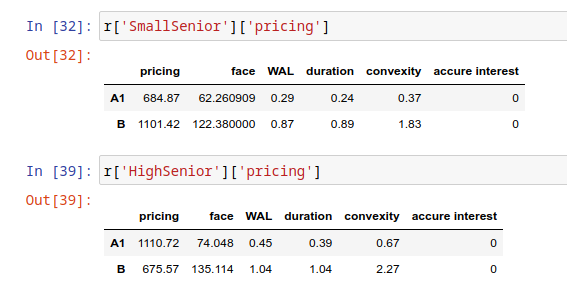
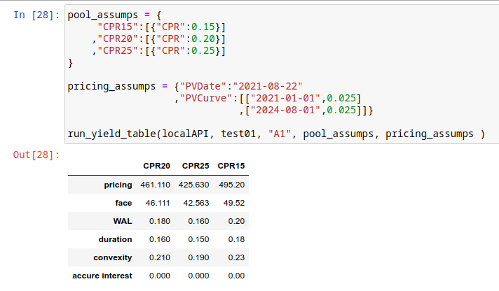
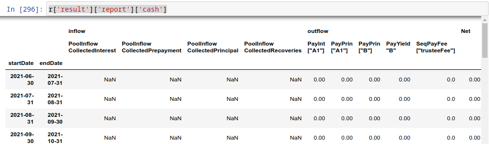
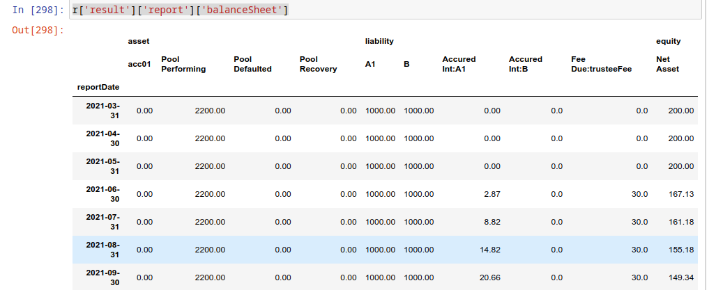
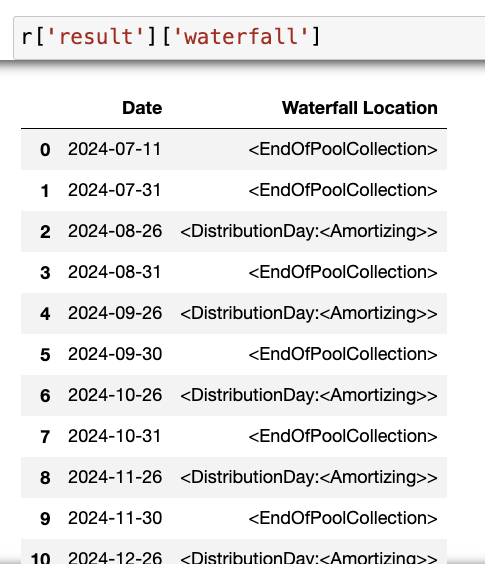
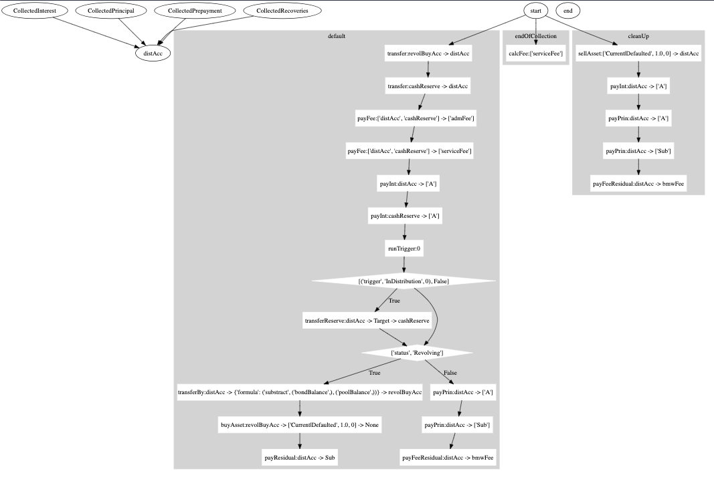
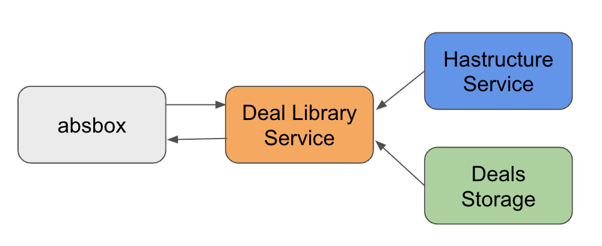
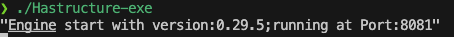
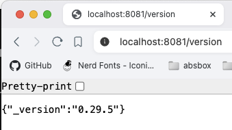

How To
========

A list of articles reveals the power of ``absbox`` in Python world

How to load loan level data(Freddie Mac)
-------------------------------------------
it is quite common to load loan level data to the model:

* in structuring stage, loading different set of assets to the model to see if current captial structure is sound enough to pay off all the liabilities.
* in surveiliance stage, loading latest loan tape, then project the cashflow with updated assumptions as well to see how bond cashflow is changing in the future.

Since ``absbox`` model deal in plain python data structure => `list` and `map`, the process is quite straight-foward:

1. load data into Python data structure from IO (local desk file,)
2. map fields to asset structure in ``absbox``

here is an example from loan level data from .. _3132H3EE9: https://freddiemac.mbs-securities.com/freddie/details/3132H3EE9 (Freddie Mac)

Loading data
^^^^^^^^^^^^^^^

Freddie Mac disclose its loan level data in form of tabular data in text file.The hardway is using built-in funciton `open` to read each rows, the easy way will be load it via `pandas`.

Sample file :download:`3132H3EE9 <files/U90133_3132H3EE9_COLLAT_CURRENT.txt>`

.. code-block:: python

  import pandas as pd

  loan_tape = pd.read_csv("~/Downloads/U90133_3132H3EE9_COLLAT_CURRENT.txt",sep="|",dtype={'First Payment Date':str})

Here is couple fields we are interested in :

.. code-block:: python
 
  ["Mortgage"
    ,{"originBalance":2200,"originRate":["fix",0.045],"originTerm":30
     ,"freq":"Monthly","type":"Level","originDate":"2021-02-01"}
     ,{"currentBalance":2200
      ,"currentRate":0.08
      ,"remainTerm":20
     ,"status":"current"}]

The plain `mortgage` asset has two parts: (1) Origin information (2) Current Status, each of them were represented in form of a dict.

we can extract the corresponding fields from the loan tape.

.. warning::
    This mapping table only demostrate the how mapping works but not indicate the correct mapping!

.. list-table:: Map source fields
   :header-rows: 1

   * - source fields
     - absbox fields
     - notes
   * - "Mortgage Loan Amount"
     - originBalance
     -
   * - "Original Interest Rate"
     - originRate
     -
   * - "LoanTerm"
     - originTerm
     -
   * -
     - freq
     - hard code to "Monthly"
   * - "Amortization Type"
     - type
     - hard code to "Fix"
   * - "First Payment Date"
     - originDate 
     - Need to push "First Payment Date" back by a month
   * - "Current Investor Loan UPB"
     - currentBalance 
     -
   * - "Current Interest Rate"
     - currentRate 
     -
   * - "Remaining Months to Maturity"
     - remainTerm
     -
   * - "Days Delinquent"
     - status 
     -

Now we have the fields required, let's subset the dataframe with :

.. code-block:: python

    d = loan_tape[['Mortgage Loan Amount','Current Investor Loan UPB','Amortization Type','Original Interest Rate','First Payment Date'
                ,'Loan Term','Remaining Months to Maturity','Index','Current Interest Rate','Days Delinquent']]

Mapping fields
^^^^^^^^^^^^^^^

Source data may not be consist with format required, we need preprocessing the data if necessary:

.. code-block:: python

  mapped_df = pd.DataFrame()
  mapped_df['originBalance'] = d['Mortgage Loan Amount']
  mapped_df['originRate'] = [["fix",_/100] for _ in d['Original Interest Rate'].to_list() ]
  mapped_df['originTerm'] = d['Loan Term']
  mapped_df['freq'] = "Monthly" 
  mapped_df['type'] = "Level"
  mapped_df['originDate'] = (pd.to_datetime(d['First Payment Date']) - pd.DateOffset(months=1)).map(lambda x: x.strftime("%Y-%m-%d"))
  mapped_df['currentBalance'] = d['Current Investor Loan UPB']
  mapped_df['currentRate'] = d['Current Interest Rate']/100
  mapped_df['remainTerm'] = d['Remaining Months to Maturity']
  mapped_df['status'] =  d['Days Delinquent'].map(lambda x: "Current" if x=='Current' else "Defaulted")

Once we have the mapping table ready, the next step will be building a mapping function to convert loan tape data into `absbox` compliant style.

.. code-block:: python

  origin_fields = set(['originBalance', 'originRate', 'originTerm', 'freq', 'type', 'originDate'])
  current_fields = set(['currentBalance', 'currentRate', 'remainTerm', 'status'])
  
  mortgages = [["Mortgage"
                ,{k:v for k,v in x.items() if k in origin_fields}
                ,{k:v for k,v in x.items() if k in current_fields}]
                   for x in mapped_df.to_dict(orient="records")]

Happy running
^^^^^^^^^^^^^^^

Once we have built the loan level data `loans` , we can just plug it into the _dummy_ deal:

.. code-block:: python

  ### <<Dummy Deal>>
  loan_level_deal = Generic(
      "loan_level_deal"
      ,{"cutoff":"2023-03-01","closing":"2023-02-15","firstPay":"2023-04-20"
       ,"payFreq":["DayOfMonth",20],"poolFreq":"MonthEnd","stated":"2042-01-01"}
      ,{'assets':mortgages}  #<<<<<--- here
      ,(("acc01",{"balance":0}),)
      ,(("A1",{"balance":37498392.54
               ,"rate":0.03
               ,"originBalance":1000
               ,"originRate":0.07
               ,"startDate":"2020-01-03"
               ,"rateType":{"Fixed":0.08}
               ,"bondType":{"Sequential":None}}),)
      ,(("trusteeFee",{"type":{"fixFee":30}}),)
      ,{"amortizing":[
           ["payFee","acc01",['trusteeFee']]
           ,["payInt","acc01",["A1"]]
           ,["payPrin","acc01",["A1"]]
       ]}
      ,[["CollectedInterest","acc01"]
        ,["CollectedPrincipal","acc01"]
        ,["CollectedPrepayment","acc01"]
        ,["CollectedRecoveries","acc01"]]
      ,None
      ,None)

Then, project the cashflow with:

.. code-block:: python

  r = localAPI.run(loan_level_deal ,assumptions=[] ,read=True)

  r['pool']['flow'] # Now you shall able to view the loan level cashflow ! 

.. warning::
  if the `run()` call taking too much time, probably it is caused by network IO or CPU on the server, pls consider using a local docker image instead.

Conclusion
^^^^^^^^^^^^^^

There are numerious format carrying loan level data, it is recommended to wrap the your own function to accomodate.

in this case, we just need one funciton:

.. code-block:: python

  def read_freddie_mac(file_path:str):
      loan_tape = pd.read_csv(file_path,sep="|",dtype={'First Payment Date':str})
      d = loan_tape[['Mortgage Loan Amount','Current Investor Loan UPB','Amortization Type','Original Interest Rate','First Payment Date'
            ,'Loan Term','Remaining Months to Maturity','Index','Current Interest Rate','Days Delinquent']]

      mapped_df = pd.DataFrame()
      mapped_df['originBalance'] = d['Mortgage Loan Amount']
      mapped_df['originRate'] = [["fix",_/100] for _ in d['Original Interest Rate'].to_list() ]
      mapped_df['originTerm'] = d['Loan Term']
      mapped_df['freq'] = "Monthly"
      mapped_df['type'] = "Level"
      mapped_df['originDate'] = (pd.to_datetime(d['First Payment Date']) - pd.DateOffset(months=1)).map(lambda x: x.strftime("%Y-%m-%d"))
      mapped_df['currentBalance'] = d['Current Investor Loan UPB']
      mapped_df['currentRate'] = d['Current Interest Rate']/100
      mapped_df['remainTerm'] = d['Remaining Months to Maturity']
      mapped_df['status'] =  d['Days Delinquent'].map(lambda x: "Current" if x=='Current' else "Defaulted")

      origin_fields = set(['originBalance', 'originRate', 'originTerm', 'freq', 'type', 'originDate'])
      current_fields = set(['currentBalance', 'currentRate', 'remainTerm', 'status'])
      
      mortgages = [["Mortgage"
                    ,{k:v for k,v in x.items() if k in origin_fields}
                    ,{k:v for k,v in x.items() if k in current_fields}]
                      for x in mapped_df.to_dict(orient="records")]

      return mortgages

How to structuring a deal
-------------------------------------------

Structuring
  `Structuring` may have different meanings for different people, in this context, `structuring` means using different deal components to see what is most desired reuslt (like bond price, WAL ,duration, credit event ) for issuance purpose

  `Modelling` / `Reverse Engineering` means using data(bond,trigger,repline pool,waterfall) from offering memorandum to build a deal, the goal is to get best possible bond cashflow/pool cashflow for trading purpose

Strucuring a deal may looks intimidating, while the process is simple:

1. Given a base deal, create a bunch of new components 
2. Swap them into the deal, build the multiple deals
3. Compare the new result of interest,back to Step 2 if result is not desired.

Two methods to construct structuring plans 
^^^^^^^^^^^^^^^^^^^^^^^^^^^^^^^^^^^^^^^^^^^^^

.. graphviz::
    :name: sphinx.ext.graphviz
    :caption: build deal plans
    :alt: build deal plans
    :align: center

    digraph {
        b -> "mkDealsBy()" [label="use dataclasses"]
        b -> "setDealsBy(),prodDealsBy()" [label="use Lenses"]
        "setDealsBy(),prodDealsBy()" -> Deals
        "mkDealsBy()" -> Deals
        Deals -> runStructs
        "Pool Assumption" -> runStructs
        "Deal Run Assumption" -> runStructs
        Deals [label="A map(k=string,value=deal objs)"]
        b [shape=diamond, label="Base Deal"]
        runStructs -> "Result Map" [label="A map(k=string,value=deal run results)"]
    }

Build multiple deals(mkDealBy())
^^^^^^^^^^^^^^^^^^^^^^^^^^^^^^^^^^^^

Build components
""""""""""""""""""

Assume we have already a base line model called :ref:`subordination exmaple <exmaple-01>` , now we want to see how differnt issuance size and issuance rate of the bonds would affect the pricing/bond cashflow.
(rationale : the smaller issuance size would require lower interest rate as short WAL)

.. code-block:: python

   # if senior balance = 1100, then rate is 7%
   # if senior balance = 1500, then rate is 8%
   issuance_plan = [ (1100,0.07),(1500,0.08) ]
   total_issuance_bal = 2000

   bond_plan = [ {"bonds":(("A1",{"balance":senior_bal
                             ,"rate":senior_r
                             ,"originBalance":senior_bal
                             ,"originRate":0.07
                             ,"startDate":"2020-01-03"
                             ,"rateType":{"Fixed":0.08}
                             ,"bondType":{"Sequential":None}})
                      ,("B",{"balance":(total_issuance_bal - senior_bal)
                             ,"rate":0.0
                             ,"originBalance":(total_issuance_bal - senior_bal)
                             ,"originRate":0.07
                             ,"startDate":"2020-01-03"
                             ,"rateType":{"Fixed":0.00}
                             ,"bondType":{"Equity":None}
                             }))}
        for senior_bal,senior_r in issuance_plan ]

Now we have ``bond_plan`` which has two bonds components, represents two different liability sizing structure.
(Same method applies to swapping different ``pool`` as well, user can swap different pool plans to structuring deals)

call mkDealBy()
""""""""""""""""""""""""""""""""""""

1. Now we need to build a dict with named key.
2. Call ``mkDealsBy()`` ,which takes a base deal, and a dict which will be swaped into the base deal. It will return a map with same key of `bond_plan`, with new deals as value.
3. User can inspect ``differentDeals`` the reuslt via key.

.. code-block:: python

  bond_plan_with_name = dict(zip(["SmallSenior","HighSenior"],bond_plan))

  from absbox import mkDealsBy

  differentDeals = mkDealsBy(test01,bond_plan_with_name)
  
  differentDeals['HighSenior']

Build multiple deals ( ``setDealsBy() / proDealsBy()``)
^^^^^^^^^^^^^^^^^^^^^^^^^^^^^^^^^^^^^^^^^^^^^^^^^^^^^^^^^^

.. versionadded:: 0.24.2

There are two new functions introduced after version ``0.24.2``, Both functions are quite small (only 12 lines of code!), but thanks to `lenses` package of python, they are good enough to generate a bunch variants of deal. The return deal map would be used to run sensitivity analysis.

syntax
  ``setDealsBy(baseDealObject:SPV|Generic, (path1,value1), (path2,value2)....., init=<common path>, )``

  * `baseDealObject` -> a SPV or Generic class
  * `(path1,value1)....` -> pairs with (`lens`, `value`) ,which the value will be set to specific location of deal object. The `lens` can be anything ,condtional, or apply with a function, see https://github.com/ingolemo/python-lenses
  * `init` -> a common path with will be patch to head of `pathN`

syntax
  ``prodDealsBy(baseDealObject:SPV|Generic,(path1,[value1,value2,value3]),(path2,[valueA,valueB]),init=<common path> )``
  
  * `baseDealObject` -> a SPV or Generic class
  * `init` -> a common path with will be patch to head of `pathN`
  * `guessKey` -> default to `False`.

 The difference is that ``setDealsBy()`` will update the deal obj with paths/vals and return a SINGLE deal object.
 While ``prodDealsBy`` , the prefix ``prod`` means *cartisian product* ,it will run all permunations of deals.

 If user pass ``guessKey=True``, the wrapper will try to `guess` a user readable string from `lenses` as key of the deal map.

Exmaple
""""""""""""

.. literalinclude:: deal_sample/structuring_sample.py
   :language: python
   :emphasize-lines: 56-59,62-66

Set Assumption & Get Result 
^^^^^^^^^^^^^^^^^^^^^^^^^^^^^

Once a map is ready with string as keys, and deal object ( ``Generic`` class ) as values.
  
To run mulitple deal with same assumptions ,use ``runStructs()``

.. code-block:: python

  from absbox import API
  localAPI = API("https://absbox.org/api/latest")

  r = localAPI.runStructs(differentDeals
                          ,read=True
                          ,runAssump = [('pricing',{"date":"2021-08-22"
                                                   ,"curve":[["2021-01-01",0.025]
                                                            ,["2024-08-01",0.025]]})]
                          ,poolAssump = ("Pool",("Mortgage",{"CDR":0.03},{"CPR":0.01},{"Rate":0.7,"Lag":18},None)
                                              ,None
                                              ,None)
                          )

Now the ``r`` is a map with key of "SmallSenior" and "HighSenior", value as cashflow of bond/pool/account/fee and a pricing.

.. code-block:: python

  #get A1 cashflow of each structure
  r['HighSenior']['bonds']['A1']
  r['SmallSenior']['bonds']['A1']

Whooray !

How to run a yield table
----------------------------

Prerequisite
^^^^^^^^^^^^^

* need a deal modeled
* pool performance assumption in a dict
* pricing assumption 

.. code-block:: python
   
  # pool performance  
  pool_assumps = {
       "CPR15":("Pool",("Mortgage",None,{"CPR":0.15},None,None)
                      ,None
                      ,None)
      ,"CPR20":("Pool",("Mortgage",None,{"CPR":0.20},None,None)
                      ,None
                      ,None)
      ,"CPR25":("Pool",("Mortgage",None,{"CPR":0.25},None,None)
                      ,None
                      ,None)
  }
  # pricing curves and PV date
  pricing_assumps = {"date":"2021-08-22"
                    ,"curve":[["2021-01-01",0.025]
                             ,["2024-08-01",0.025]]}
  

Run with candy function
^^^^^^^^^^^^^^^^^^^^^^^^^^

.. code-block:: python

  # impor the candy function
  ## before 0.24.2
  from absbox.local.analytics import run_yield_table

  ## after 0.24.2
  from absbox import run_yield_table
  from absbox import runYieldTable

  from absbox import API
  localAPI = API("https://absbox.org/api/latest")

  # test01 is a deal object
  runYieldTable(localAPI
                  , test01
                  , "A1"
                  , pool_assumps
                  , pricing_assumps )

You have it !

How to model cashflow for ARM Mortgage 
---------------------------------------------

``absbox`` support ``ARM`` mortgage in verison ``0.15``

with features like:

* initPeriod (required) -> using fix rate in first N periods 
* initial reset cap (optional) -> maxium spread can be jump at first reset date.
* periodic reset cap (optional)-> maxium spread can be jump at rest reset dates.
* life cap (optional) -> maxium rate during the whole mortgage life cycle
* life floor (optional) -> minium rate during the whole mortgage life cycle

.. literalinclude:: deal_sample/arm_sample.py
   :language: python
   :emphasize-lines: 6,8-12,15

How to view projected quasi Financial Reports ?
-----------------------------------------------------

After the deal was run, user can view the cashflow of `pool`/ `bonds` `fees` etc  or transaction logs from `accounts`

.. code-block:: python

    #view result of bonds
    r['bonds']

    #transaction logs of accounts
    r['accounts']

    #pool cashflow 
    r['pool']['flow']

    #expenses
    r['fee']

For the users who is not patient enough or who want to take a high level view of how the deal was changing during the future.
`absbox` support `Financial Reports` since version `0.17.0`.

Syntax
^^^^^^^^^^

To build the `financial reports` , user need to add a tuple in the list of `runAssump`.

.. code:: python 
   
    ("report",{"dates":<DatePattern>})

the `<DatePattern>` will be used to describe `Financial Report Date`.

Example:

.. code-block:: python 

  r = localAPI.run(deal
                  ,poolAssump = ("Pool"
                                  ,("Mortgage"
                                  ,{"CDR":0.01} ,None, None, None)
                                  ,None
                                  ,None)
                  ,runAssump = [("inspect",
                                  ("MonthEnd",("cumPoolDefaultedBalance",)))
                                ,("report",
                                  {"dates":"MonthEnd"})]
                  ,read=True)

Cash Report 
^^^^^^^^^^^^

Cash Report will list a cash inflows and outflows of the deal. Report was compiled against transaction logs of `accounts`.

.. code-block:: python 

    r['result']['report']['cash']

Balancesheet Report
^^^^^^^^^^^^^^^^^^^^

Balancesheet Report will take a `snapshot` of the deal on the dates described in `DatePattern`.
It will also include the bond interest accured or fee accured as both of them are `Payable` in the balance sheet .

.. code-block:: python 

    r['result']['report']['balanceSheet']

Model a revolving deal (BMW Auto)
-----------------------------------

Modelling a revolving deal is quite chanllenge , here is an real transaction which highlights the key components 

The whole model can be referred to here :ref:`BMW Auto Deal 2023-01`

Revolving Period
^^^^^^^^^^^^^^^^^^^
The revolving period usually was set like first 12/24 months after closing of deal. While the transaction may impose some other condition to enter `Amortization` stage when certain criteria was met, like pool cumulative default rate.

In this case, we model such event of `entering amortizating` with a trigger : 

  * if deal date was later than `2024-05-26` OR 
  * pool cumulative defaulted rate greater than 1.6%, 
  
then change the deal status from `Revolving` to `Amortizing`

.. code-block:: python 

  # a trigger 
  {"condition":["any"
                 ,[">=","2024-05-26"]
                 ,[("cumPoolDefaultedRate",),">",0.016]]
   ,"effects":("newStatus","Amortizing")
   ,"status":False
   ,"curable":False}

Once the deal enter a new status `Amortizing`, then in the waterfall acitons would branch base deal status :

.. code-block:: python 

  ["IfElse"  
    ,["status","Revolving"] # the predicate
    ,[["transferBy",{"formula":("substract",("bondBalance",),("poolBalance",))} # list of actions if predicate is True ()
                   ,"distAcc",'revolBuyAcc']
     ,["buyAsset",["Current|Defaulted",1.0,0],"revolBuyAcc",None]
     ,["payIntResidual","distAcc","Sub"] ]
    ,[["payPrin","distAcc",["A"]] # >>>> list of actions if deal is NOT  Revolving Status
     ,["payPrin","distAcc",["Sub"]]
     ,["payFeeResidual", "distAcc", "bmwFee"]]]]

Revolving Asset 
^^^^^^^^^^^^^^^^^^

Asset to be bought in the future isn't really part of deal data, thus we are going to supply these `dummy` asset in the `Assumption` 

Pls noted:

* revolving assets to be bought can be a `portfolio` which means a `list` of assets .
* user can set up a snapshot curve to simulate different assets at points of time in the future to be bought.
* user can set different pool performance assumption on the revolving pool 

.. code-block:: python 

  revol_asset = ["Mortgage"
                  ,{"originBalance":220,"originRate":["fix",0.043],"originTerm":48
                    ,"freq":"Monthly","type":"Level","originDate":"2021-07-01"}
                    ,{"currentBalance":220
                    ,"currentRate":0.043
                    ,"remainTerm":36
                    ,"status":"current"}]
  
  r = localAPI.run(BMW202301
                  ,runAssump = [("revolving"
                                  ,["constant",revol_asset]
                                  ,("Pool",("Mortgage",{"CDR":0.07},None,None,None)
                                            ,None
                                            ,None))]
                  ,read=True)

Revolving Buy
^^^^^^^^^^^^^^^

Pricing an revolving asset would have a huge impact on the pool cashflow . 

.. code-block:: python 

    ["buyAsset",<PricingMethod>,<Account>,None]

:ref:`Pricing Method` :

* price an asset with balance factor `["Current|Defaulted",0.95,0]` means , if the asset has a current balance of 100, then the price would be 100*0.95 = 95
* price an asset with curve, with a pricing curve supplied, price an asset by discount cashflow of the asset

.. code-block:: python 

  ["IfElse"  # 
   ,["status","Revolving"]
   ,[["transferBy",{"formula":("substract",("bondBalance",),("poolBalance",))}
                  ,"distAcc",'revolBuyAcc']
    ,["buyAsset",["Current|Defaulted",1.0,0],"revolBuyAcc",None] # <--- action of buying revolving assets
    ,["payIntResidual","distAcc","Sub"] ]
   ,[["payPrin","distAcc",["A"]]
    ,["payPrin","distAcc",["Sub"]]
    ,["payFeeResidual", "distAcc", "bmwFee"]]]]

Debug the cashflow
------------------------

Well.. there isn't such `Debug` action on the cashflow, but a more precise put: 

**a various angles to `View` the cashflow**

.. graphviz::
    :name: sphinx.ext.graphviz
    :caption: how to debug cashflow
    :alt: how to debug cashflow
    :align: center

    digraph {
      "Debug" -> "Deal Level"
      "Deal Level" -> "Financial Reports"
      "Financial Reports" -> "<Cash Report>"
      "Financial Reports" -> "<Balance Sheet Report>"
      "Deal Level" -> "Variables During Projection" 
      "Variables During Projection" -> "runAssump = ('inspect',...) "
      "Debug" -> "Waterfall Level"
      "Waterfall Level" -> "['inspect',....]"
    }

Stop Run At Certain Date
^^^^^^^^^^^^^^^^^^^^^^^^^^

user can instruct the projection to stop at certian date :ref:`Stop Run`

Error/Warning Log 
^^^^^^^^^^^^^^^^^^^^^^^^

.. versionadded:: 0.22

``Hastructure`` engine will perform certian validation check before or after deal run, user can inspect the log via:

``Error``
  Means the run result is in-complete, don't use the number for downstream

``Warning``
  Means the cashflow projection is complete but subject to unorthodox design

.. code-block:: python 

  from absbox import API,mkDeal
  localAPI = API("http://localhost:8081",check=False)

  deal = mkDeal(deal_data,preCheck=False)

  r = localAPI.run(deal
                  ,poolAssump = None
                  ,runAssump = None
                  ,read=True
                  ,preCheck=False)

  r['result']['logs']

Financial Reports 
^^^^^^^^^^^^^^^^^^^^^

This will offer a high level on how stats chagnes during cashflow projection.

user can inspect `Balancesheet` and `Cashflow` report from a highlevel. :ref:`How to view projected quasi Financial Reports ?`

Account transactions
^^^^^^^^^^^^^^^^^^^^^

if user want to view the break down of waterfall distribution, user may view account transaction via:

.. code-block:: python 

  r['accounts']['AccountName01']

Inspect Free Formulas on projection 
^^^^^^^^^^^^^^^^^^^^^^^^^^^^^^^^^^^^^^^

If user would like to view variables during the cashflow projection, there is a `time machine` built for this purpose. :ref:`Inspecting Numbers`

User just need to provide :

* "When" to view the variables via a :ref:`DatePattern` and 
* "What" variables to view via a :ref:`Formula`

Inspect Free formulas within waterfall distribution
^^^^^^^^^^^^^^^^^^^^^^^^^^^^^^^^^^^^^^^^^^^^^^^^^^^^^^^^

.. versionadded:: 0.22

* :ref:`Inspect Variables during waterfall`
* example :ref:`View Variables In Waterfall`

.. note::
  Free formula in **Projection** v.s Free formula in **Waterfall**

  * Free formula in **Projection**
      formula value was evaluated at **End of Day** on dates specified via ``DatePattern``. The value won't be changed again in that day.
  * Free formula in **Waterfall** 
      formula value was evaluated at **Point of time** on the location in the waterfall. The value may changes if futhur actions were taken in the waterfall in that day.

Joint Inspection Reader
^^^^^^^^^^^^^^^^^^^^^^^^^^^

.. versionadded:: 0.29.13

User can inspect the variables in *BOTH* `Projection` and `Waterfall` via function ``readInspect(r['result'])``

Which waterfalls has been run?
^^^^^^^^^^^^^^^^^^^^^^^^^^^^^^^^^^^^

.. versionadded:: 0.28.17

User can inspect the waterfalls has been run via:

.. code-block:: python

  r['result']['waterfall']

Visualize the cash `flow`
---------------------------

Waterfall rules can be complex and headache.
Luckily `absbox` is gentle enough to provide candy function to visualize the fund allocation.

`absbox` is using `Graphviz <https://graphviz.org/>`_  , 
pls make sure it was installed as well as python wrapper `graphviz <https://pypi.org/project/graphviz/>`_ 

Let's use the example -> :ref:`BMW Auto Deal 2023-01`

.. code-block:: python 

  from absbox.local.chart import viz
  
  viz(BMW202301) # that's it ,done !

preview

  
Project Cashflow for Solar Panel 
-------------------------------------

.. versionadded:: 0.23

Fixed Asset 
^^^^^^^^^^^
``FixedAsset`` was introduced in ``absbox`` version `0.23`, which represent a object:

* depreciates by `Accounting` rule
* has the ability to produce an amount of `something`, which can be monetized in the market.
* the `ability` (maxium amount of `something` produced ) may decay as the asset is depreciating.

But it's not always producing `something` in the maxium level, so it will subject to a ``Utilization Rate`` curve from input assumption.
And, it can't sell all the `something` at same price all over the time, the market price will be read from ``Price Curve`` from input assumption.

It looks abstract but indeed provide more coverage to different asset classes, like `Solar Panel` , `Hotel Room` etc .

.. graphviz::
    :name: sphinx.ext.graphviz
    :caption: how a fixed Asset generate cash
    :alt: how a fixed Asset generate cash
    :align: center

    digraph {
       "Fixed Asset" -> "Maximum Production" [label="Has a "]
       "Maximum Production" -> "Unit" [label="Apply with `Utilization Rate Curve` "]
       "Unit" -> "Cash" [label="Sell `Unit` with `Price Curve` "]       
    }

Solar Panel
^^^^^^^^^^^^^^

`Solar Panel` is a good example of this type of asset as it fullfill the feactures below:

* it produce `Electricity` as `Something`, the production of `Electricity` fluctuates due to seasonality, thus ``Utilization Rate`` Curve can be applied.
* the maxium production capacity is decaying due to the installation equipment depreciates.
* The `Electricity` can be monetized in someway ,and the price may varies, due to supply and demand, thus ``Price Curve`` can be applied as well.

Build a story
^^^^^^^^^^^^^^^^

OK, let's assume ,we are a homeowner that want to install a solar panel system with financing from a loan. Now we are going to build a cashflow deal model to see if it's a good `deal`.

* Liability & Equity

  * assuming taking a passthrough loan with rate of 5%
  * down payment at 40%

* Asset & expense

  * maxium production level : 20kw per day,average sunlight per month 20days.
  * cost 15000, expect usage life 15 yrs(180 months), residual value at $1000
  * monthly insurance fee 20
  * average maintenance cost $200 each year, extra $200 after 10yrs.

.. code-block:: python

  assets = [["FixedAsset"
              ,{"start":"2023-11-01","originBalance":15000,"originTerm":240
                ,"residual":1000,"period":"Monthly","amortize":"Straight"
                ,"capacity":("Fixed",20*20*2)}
              ,{"remainTerm":240}]] 

  exps = (("maintenance",{"type":{"recurFee":["YearFirst",200]}})
          ,("maintenance2",{"type":{"recurFee":["YearFirst",200],"feeStart":"2033-11-01"}})
          ,("insurance",{"type":{"recurFee":["MonthFirst",20]}}))

* Waterfall 
  
  * pay all the expense 
  * pay interest and principal of loan
  * pay principal to equity tranche but keep fee/insurance at account
  * when clean up deal , sell the asset and pay prin and yield to equity tranche.

.. code-block:: python

  waterfall = {"amortizing":[
                  ["payFee","acc01",['maintenance','maintenance2','insurance']]
                  ,["accrueAndPayInt","acc01",["A"]]
                  ,["payPrin","acc01",["A"]]
                  ,["payPrin","acc01",["EQ"]
                    ,{"limit":{"formula":("floorWithZero"
                                ,("substract"
                                  ,("accountBalance","acc01"),("constant",1045)))}}]
                ]
              ,"cleanUp":[
                  ["sellAsset",["Current|Defaulted",1.0,0],"acc01"]
                  ,["payPrin","acc01",["EQ"]]
                  ,["payIntResidual","acc01","EQ"]
              ]}

transaction file:

.. code-block:: python

  from absbox.local.generic import Generic
  from absbox import API
  localAPI = API("https://absbox.org/api/dev",lang='english',check=False)

  solarPanel = Generic(
    "TEST01"
    ,{"cutoff":"2024-01-01","closing":"2024-01-01","firstPay":"2024-02-01"
     ,"payFreq":"MonthEnd","poolFreq":"MonthEnd","stated":"2050-01-01"}
    ,{'assets':assets}
    ,(("acc01",{"balance":0}),)
    ,(("A",{"balance":9_000
           ,"rate":0.05
           ,"originBalance":9_000
           ,"originRate":0.00
           ,"startDate":"2024-01-01"
           ,"rateType":{"Fixed":0.05}
           ,"bondType":{"Sequential":None}})
      ,("EQ",{"balance":7_000
           ,"rate":0.0
           ,"originBalance":7_000
           ,"originRate":0.00
           ,"startDate":"2024-01-01"
           ,"rateType":{"Fixed":0.00}
           ,"bondType":{"Equity":None}}),
     )
    ,exps
    ,waterfall
    ,[["CollectedCash","acc01"]]
    ,None
    ,None
    ,None
    ,None
    ,("PreClosing","Amortizing")
    )

Project Cashflow
^^^^^^^^^^^^^^^^^^^

Nowe we need assumption to project cashflow:

* Assumption

  * utility rate, utility rate start first year at 90% and 85% second year, then stable at 80%
  * price of Electricity, fixed price first year at 0.3 and drop down 0.5 each year and remains at 0.2
  * call the deal at ``2044`` ,20yrs later

.. code-block:: python

  myAssump = ("Pool"
              ,("Fixed",[["2024-01-01",0.3]
                        ,["2025-01-01",0.25]
                        ,["2026-01-01",0.2]]
                       ,[["2024-01-01",0.9]
                        ,["2025-01-01",0.85]
                        ,["2026-01-01",0.8]])
              ,None
              ,None)

  p = localAPI.run(solarPanel,poolAssump=myAssump
                        ,runAssump=[("call",{"afterDate":"2044-01-01"})
                                    ,("report",{"dates":"MonthEnd"})]
                        ,read=True)

we can inspect the cashflow projection  :ref: 
and calculate the IRR of equity investment:

.. code-block:: python 

  from absbox.local.analytics import irr
  irr(p['bonds']['EQ'],init=('2024-01-01',-7_000))

it was ``1.67%`` (YoY)...whoa...sad 

Sensitivity Analysis 
^^^^^^^^^^^^^^^^^^^^^^^^

Well, things won't work out as planned, what happen if price fall down ? or the utilization rate fall ? 

We can perform sensitivity analysis to explore how robust our investment is

.. code-block:: python 

  scenarioMap = {
    "base":("Pool"
            ,("Fixed",[["2024-01-01",0.3]
                      ,["2025-01-01",0.25]
                      ,["2026-01-01",0.2]]
                     ,[["2024-01-01",0.9]
                      ,["2025-01-01",0.85]
                      ,["2026-01-01",0.8]])
            ,None
            ,None)
    ,"lowUtil" :("Pool"
                ,("Fixed",[["2024-01-01",0.3]
                          ,["2025-01-01",0.25]
                          ,["2026-01-01",0.2]]
                         ,[["2024-01-01",0.85]
                          ,["2025-01-01",0.80]
                          ,["2026-01-01",0.75]])
                ,None
                ,None)
   ,"lowPrice" : ("Pool"
                ,("Fixed",[["2024-01-01",0.3]
                          ,["2025-01-01",0.225]
                          ,["2026-01-01",0.19]]
                         ,[["2024-01-01",0.9]
                          ,["2025-01-01",0.85]
                          ,["2026-01-01",0.8]])
                ,None
                ,None)
   }
   p = localAPI.run(solarPanel,poolAssump=scenarioMap
                       ,runAssump=[("call",{"afterDate":"2044-01-01"})
                                  ,("report",{"dates":"MonthEnd"})]
                       ,read=True)
  from absbox.local.util import irr
  {k:irr(v['bonds']['EQ'],init=('2024-01-01',-7000)) 
    for k,v in p.items()}

  #  {'base': 0.016930937065270275,
  #   'lowPrice': 0.0028372850153230164,
  #   'lowUtil': -0.0013152392627518972}

Well, it's pretty clear that in current transaction , lower price isn't most scary factor comparing to low utilization rate.
In the long run of 20 years, keep higher utilization rate is important, so sweep the panel weekly! 

or you can buy a robot to do that ,but it will drag down the IRR :) 

Conclusion
^^^^^^^^^^^^^

Making an installation of roof solar panel is a big investment decision which involves pretty long time horizon and calculation of factor like electricity price as well as loan rate.

It may look easier if you can build a cashflow model and perform quantitative analysis to support the decision !

Happy hacking !

Other Asset types
^^^^^^^^^^^^^^^^^^^^^^^

The `FixedAsset` type can be used to model assets as well. For example ,

`Hotel`
""""""""""""
We can model a hotel as `FixedAsset` ,whose `capacity` is the all rooms available for booking.
When projects cashflow , we provide assumptions

* utility rate curve -> on average ,how many rooms served during the `Period`.
* price curve -> average price per night during the `Period`, which may reflect seasonality flucturation.

The multiplication of two would be the cashflow generated from this asset.

`EV charger station`
""""""""""""""""""""
same with `Hotel`

How to use Deal Library 
-------------------------------------

What is Deal Library?
^^^^^^^^^^^^^^^^^^^^^^^^

`Deal Library` is a collection of `deal` objects, which can be used to store and retrieve deal objects. 

As deal objects is actually represented in JSON , it can be easily stored in a Non-SQL database like `MongoDB` or `CouchDB` or even `AWS S3` or `Azure Blob Storage`.

Given a customizied tagging , user can easily retrieve the deal objects with criteria from the library.

.. note::
  The ``Deal Library Service`` / ``Deals Storage`` / ``Hastructure`` can be deployed in a self-host environment.

How to build a deal library?
^^^^^^^^^^^^^^^^^^^^^^^^^^^^^

``absbox.org`` provide a `deal library` service, user can store and retrieve deal objects via `absbox` API. 

Users have the option to build their own `Deal Library` or just deploy the service(code is available but offering is subjected to a commercial agreement) in self-host environment to minimise the security risk.

How to use a deal library?
^^^^^^^^^^^^^^^^^^^^^^^^^^^^^^^

User just need to pass the bond id and pool/deal level assumptions to the `runLibrary()` function, the deal object will be retrieved from the library and projected cashflow will be returned.

Why using a deal library ? 
^^^^^^^^^^^^^^^^^^^^^^^^^^^^

* seperating deal storages and deal calculation engine, which is good for security and performance.
* seperating running assumption and deal calculation, which is good for reusability and maintainability.

How to pass deal files around ?
------------------------------------

A deal object 
^^^^^^^^^^^^^^^^^

A deal object either initialized with `SPV` or `Generic` class, is actually a python `dataclass` which implements a ``.json()`` .

The ``json()`` function will convert the class to a json representation string .

A string 
^^^^^^^^^^^^^^^

Now with that string, user can just write it into a No-SQL document database . or sent via Email , or Fax it .

How to use Deal JSON string 
^^^^^^^^^^^^^^^^^^^^^^^^^^^^^^

The JSON string from `.json()` method can be used as part of post request send to `Hastructure` engine.

But unfortunately there is no way convert the string back to python class so far.

Primary Pricing with `Absbox`
-----------------------------------

Primary Pricing is a process of calculating the price of a bond at the time of issuance.

Tempalte: Model CLO
---------------------------

.. warning::
    Working in progess

CLO features:
^^^^^^^^^^^^^^^^^^^

 * Quarterly Payment
 * Floating Rate of assets and liabilities
 * IC/OC/IDT test
 * Interest & Principal Waterfall

How to get response ? 
-------------------------------

Typically, a function call has parameter ``read``

read = True 
^^^^^^^^^^^^^^^

If user supplied with ``True``, absbox will try to convert response with pandas dataframe where possible.

read = False
^^^^^^^^^^^^^^^

Or, use can pass with read with ``False``, which will just return a raw response from servant/aeson.

To make it slightly readable , there is a util function may help.

.. versionadded:: 0.42.6

.. code-block:: python

  from absbox import readAeson
  
  r0 = localAPI.run(.....,read=False)
  
  readAeson(r0)

How to use pre-built executable
------------------------------------------------

Download executable
^^^^^^^^^^^^^^^^^^^^^^^^

1. Go to the `Release link <https://github.com/yellowbean/Hastructure/releases>`_ and download the executable for your OS.
2. Download the `config.yaml` as well

Put both files in the same folder.

Mac OS 
^^^^^^^^

Windows 
^^^^^^^^^^^

Linux/Ubuntu/Debian
^^^^^^^^^^^^^^^^^^^^^

Verify
^^^^^^^^^
1. The console shall show running message

2. open a browser or cURL to make a get request to ``http://localhost:8081/version``

.. note::

   The port number can be changed in `config.yaml`

.. code-block:: bash

  curl http://localhost:8081/version

