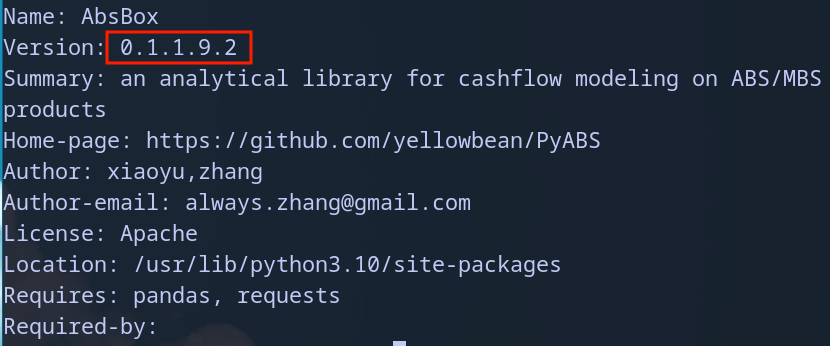

Installation
===============

.. autosummary::
   :toctree: generated

.. warning::
  ``absbox`` is heavily using ``match clause`` which was introduced in Python 3.10. Please make sure you are using *Python3.10* and after

Using pip
--------------

.. code-block:: console

    pip install absbox

Upgrade `absbox` package to latest
^^^^^^^^^^^^^^^^^^^^^^^^^^^^^^^^^^^

``absbox`` is evolving rapidly, please make sure you are using the latest one. 

.. code-block:: console

    pip install -U absbox

Check version
^^^^^^^^^^^^^^^

.. code-block:: console 

    pip show absbox 

which shows current version of `absbox` 

.. warning::
   *Version matters !!*
   
   As `absbox` is calling RESTful service from `Hastructure`. The message format for both shall be compatible to each other. 
   
   i.e `absbox 0.8.5` is compatible with `Hastructure 0.8.6`.
   A general rule is that the "MINOR" part shall be same. ( here the ``8`` )
   

Public Server vs Self-hosted
-----------------------------

``absbox`` needs connecting to an ``Hastructure`` engine. User can choose a public one or use it's own if user is keen on privacy and performance.

.. image:: img/user_choose_server.png
  :width: 600
  :alt: user_choose_server

Connect to a engine 
^^^^^^^^^^^^^^^^^^^^^

User just need to pass in a URL points to engine.

.. code-block:: python

   from absbox import API
   localAPI = API("https://absbox.org/api/latest")

   # optinally adding a `english` to request all responces in English
   localAPI = API("https://absbox.org/api/latest",'english')

Engine Shortcut
""""""""""""""""""""""""""""
.. versionadded:: 0.26.7

Since version ``0.26.7``, ``absbox`` ships with a shortcut to connect public/test engines.

.. code-block:: python 

  from absbox import API,EnginePath

  # https://absbox.org/api/dev
  localAPI = API(EnginePath.DEV,check=False)
  
  # https://absbox.org/api/latest
  localAPI = API(EnginePath.PROD,check=False)

  # http://localhost:8081
  localAPI = API(EnginePath.LOCAL,check=False)

Auto Connect Best Fit Engine
""""""""""""""""""""""""""""""""

The function ``PickApiFrom`` will try to connect to the best fit engine from the list of APIs.

If ``absbox`` is version ``0.28.5``, it will find first engine with version ``0.28.x`` and connect to it.

.. versionadded:: 0.28.5

.. code-block:: python 

  from absbox import PickApiFrom

  # auto connect to the best fit engine
  listOfApis = [EnginePath.PROD,EnginePath.DEV,"http://your_own_server:8081"]

  api = PickApiFrom(listOfApis,check=False,lang='english')

Use Public Server
^^^^^^^^^^^^^^^^^^^^^

For public server list, please visit `absbox.org <https://absbox.org>`_

.. warning::
  
  Public server :
  
  * may provide less calculation performance 
  * suffer high network IO 
  * doesn't ganrantee the SLA. 
  Please don't use it in production.

Use Private/In-House Server
^^^^^^^^^^^^^^^^^^^^^^^^^^^^^

If user want to have a self-hosted server 
  * user can build one from source code `Hastructure <https://github.com/yellowbean/Hastructure>`_
  * or using docker by one-line solution

    .. code-block:: bash

      docker pull yellowbean/hastructure
      docker run yellowbean/hastructure
      # by default the server expose its port at 8081

Hastructure ``latest`` v.s ``dev``
^^^^^^^^^^^^^^^^^^^^^^^^^^^^^^^^^^^^^^^^^^^^^^^^^^^^^^

There are two builds in the docker hub.
  * ``latest`` -> stable version
  * ``dev`` -> most sexy feature included

    .. code-block:: bash

      # get latest version by default
      docker pull yellowbean/hastructure  

      # get dev version by default
      docker pull yellowbean/hastructure:dev
      
      # get latest version by default
      docker pull yellowbean/hastructure:latest