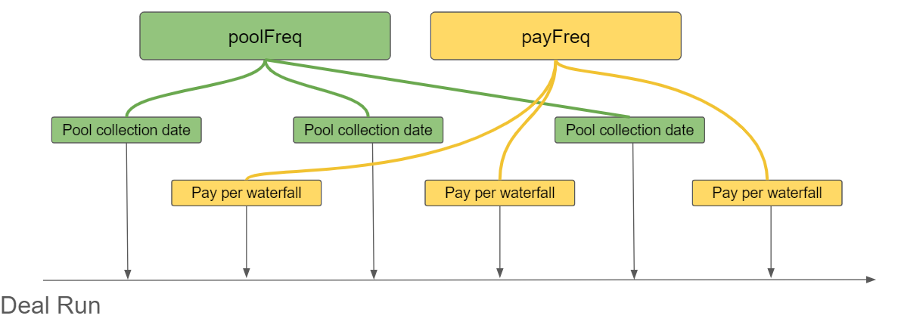
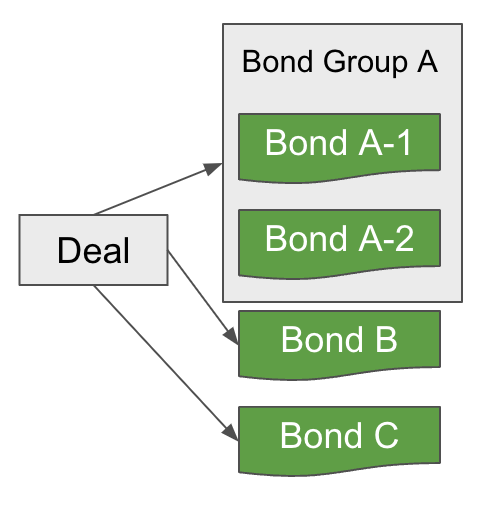
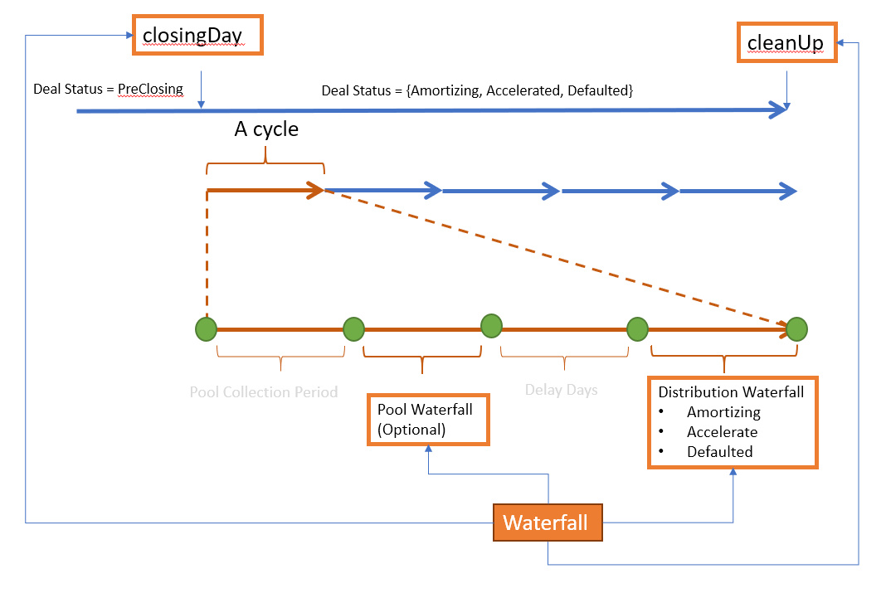
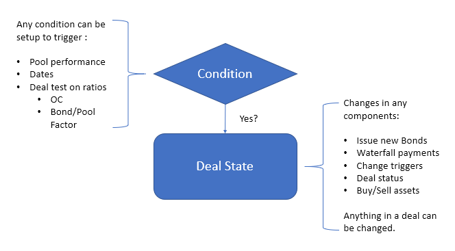
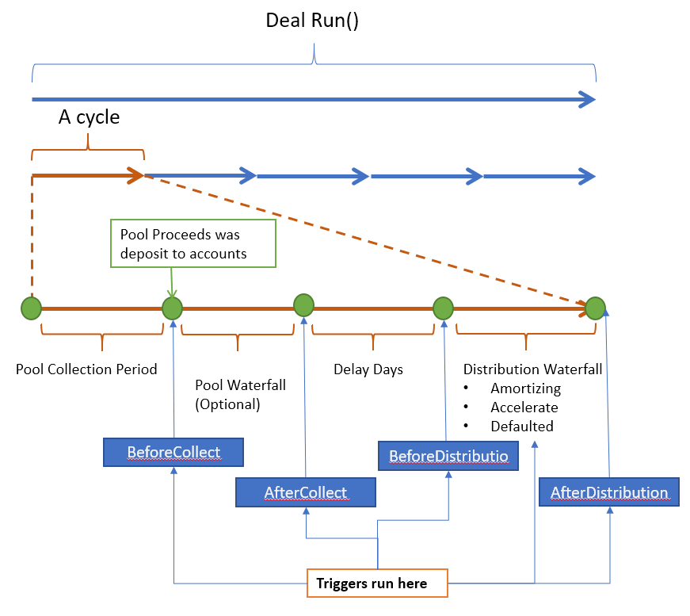

Modeling
***********

.. autosummary::
   :toctree: generated

Deal modeling is a process to build deal class with descriptive components follows:

* Dates info

  * Cutoff day / Closing Date / (Next/First) payment Date or series of custom dates
* Asset info 
  
  pool asset attributes, loan by loan or repline level data or projected cashflow as input
* Bond info
  
  bonds with different types and equity tranche
* Waterfall info 
  Describe the priority of payments when:

  * On Closing Date (Optional, One-off)
  * End of pool collection (Optional, reoccurring)
  * Distribution day for all the bonds and fees (reoccurring)
  * Clean up call (Optional, One-off)
* Triggers (Optional) 
  
  describe what may happened then what state changed should be performed in deal
* Liquidity Provider (Optional) 
  
  entities provides interest bearing/non-bearing support to shortfall of fee/interest or bond principal
* Hedges (Optional) 
  
  * interest rate swap
  * interest rate cap

Structure of a `Generic` deal 
==================================

There are couple must-have components in a deal:

.. graphviz::
    :name: sphinx.ext.graphviz
    :caption: deal components
    :alt: deal components
    :align: center
    
    digraph {
        rankdir = LR
        Deal -> DealDates [label="Must"]
        DealDates -> payFreq [label="Frequency distribution"]
        DealDates -> poolFreq [label="Frequency collect pool cash"]
        payFreq -> Waterfall [label="When to run"]
        poolFreq -> Waterfall [label="When to run"]
        Deal -> Pool [label="Must"]
        Deal -> "Collection Rule" [label="Must"]
        Pool -> "Collection Rule" [label="Generate Cash"]
        "Collection Rule" -> Accounts [label="Deposit proceeds"]
        Deal -> Accounts [label="Must"]
        Deal -> Waterfall [label="Must"]
        Accounts -> Waterfall [label="Source of funds"]
        Waterfall -> Bonds [label="Pay"]
        Waterfall -> Fees [label="Pay"]
        Deal -> Bonds [label="Must"]
        Deal -> Fees [label="Optional"]
        Deal -> Trigger [label="Optional"]
        Deal -> "Liquiditiy Provider" [label="Optional"]
        Deal -> Ledger [label="Optional"]
        Deal -> InterestRateSwap [label="Optional"]
        Deal -> InterestCap [label="Optional"]
    }

To model them via sequential parameter ( *Not Recommend* ):

.. code-block:: python

    from absbox import Generic
    
    generalDeal = Generic(
        "Deal Name/Description"
        ,<Dates>
        ,<Asset/Pool Info>
        ,<Account info>
        ,<Bonds Info>
        ,<Fee Info>
        ,<Waterfall Info>
        ,<Collection Rule>
        ,<Liquidation facilities>
        ,<Interest Rate Swap>
        ,None # reserve for currency swap
        ,<Triggers>
        ,<Deal Status>
        ,<Custom data> # optional
        ,<Ledgers> # optional
        ,<Rate Caps> # optional
        ,<Deal Stats> # optional
    )

.. _Generic ABS:

<New> : Model via a map
----------------------------

|:new:| Now we have a map-based syntax suguar ``mkDeal`` to create a deal without remembering the order of arguments passed into `Generic` class ! 

.. code-block:: python
  
    name = "TEST01"
    dates = {"cutoff":"2021-03-01","closing":"2021-06-15","firstPay":"2021-07-26"
        ,"payFreq":["DayOfMonth",20],"poolFreq":"MonthEnd","stated":"2030-01-01"}
    pool = {'assets':[["Mortgage"
            ,{"originBalance":2200,"originRate":["fix",0.045],"originTerm":30
              ,"freq":"Monthly","type":"Level","originDate":"2021-02-01"}
              ,{"currentBalance":2200
              ,"currentRate":0.08
              ,"remainTerm":20
              ,"status":"current"}]]}
    accounts = {"acc01":{"balance":0}}
    bonds = {"A1":{"balance":1000
                ,"rate":0.07
                ,"originBalance":1000
                ,"originRate":0.07
                ,"startDate":"2020-01-03"
                ,"rateType":{"Fixed":0.08}
                ,"bondType":{"Sequential":None}}
            ,"B":{"balance":1000
                ,"rate":0.0
                ,"originBalance":1000
                ,"originRate":0.07
                ,"startDate":"2020-01-03"
                ,"rateType":{"Fixed":0.00}
                ,"bondType":{"Equity":None}
                }}
                
    waterfall = {"amortizing":[
                    ["accrueAndPayInt","acc01",["A1"]]
                    ,["payPrin","acc01",["A1"]]
                    ,["payPrin","acc01",["B"]]
                    ,["payPrinResidual","acc01",["B"]]
                ]}
    collects = [["CollectedInterest","acc01"]
                ,["CollectedPrincipal","acc01"]
                ,["CollectedPrepayment","acc01"]
                ,["CollectedRecoveries","acc01"]]

    deal_data = {
        "name":name
        ,"dates":dates
        ,"pool":pool
        ,"accounts":accounts
        ,"bonds":bonds
        ,"waterfall":waterfall
        ,"collect":collects
        ,"status":"Revolving"
    }

    from absbox import mkDeal
    d = mkDeal(deal_data)  ## now a generic class created

Building Blocks 
==================

`Generic` is a class that represent `SPV` which contains the dates/liabilities/assets/waterfall/trigger/hedge information.

.. code-block:: python
    
    from absbox import Generic

There are 5 reusable building blocks: ``<DatePattern>``, ``<Formula>``, ``<Condition>``, ``<Curve>``, ``<Pricing Method>``, all of them are being used in different components.

.. note::
   It looks boring at first place to learn the ``Building Blocks`` but these are well designed and are essential to tackle the complexity of structured finance.
   

DatePattern
-------------

``<DatePattern>`` is used to describe a series of dates .

* ``"MonthFirst"``  -> Every Jun 1, May 1 during the projection
* ``"MonthEnd"``  ->Every  Month End ,like Jan 31, Feb 28/29  during the projection
* ``"QuarterFirst"`` -> Every March 1 , Jun 1 , Sep 1 , Dec 1 during the projection
* ``"QuarterEnd"``  -> Every March 31, Jun 30, Sep 30, Dec 31 during the projection
* ``"YearFirst"`` -> Every Jan 1 during the projection
* ``"YearEnd"`` -> Every Dec 31 during the projection
* ``["Weekday",0]`` -> Every Sunday
* ``["MonthDayOfYear",M,D]`` -> Every a day of the year , like Feb 14 on every year during the projection
* ``["DayOfMonth",M]`` -> A day of the month , like 15 on each month during the projectionh
* ``["CustomDate","YYYY-MM-DD1","YYYY-MM-DD2"]`` | ``["Custom","YYYY-MM-DD1","YYYY-MM-DD2"]`` -> a series of user defined dates
* ``["EveryNMonth","YYYY-MM-DD",N]`` -> a seriers day starts with "YYYY-MM-DD", then every other N months afterwards

Composite ``<DatePattern>``
^^^^^^^^^^^^^^^^^^^^^^^^^^^^^^

DatePatterns can be composed together:

* ``["After","YYYY-MM-DD",<datepattern>]`` -> a ``<datapattern>`` after "YYYY-MM-DD"(exclusive)
* ``["AllDatePattern",<datepattern1>,<datepattern2>.....]`` -> a union set of date pattern during the projection, like sum of dates
* ``["ExcludeDatePattern",<datepattern1>,<datepattern2>.....]`` -> build dates from 1st ``<datepattern1>`` and exclude dates from ``<datepattern2>,<datepattern3>``... 
* ``["OffsetDateDattern",<datepattern>,N]`` ->  build dates from ``<datepattern>`` and offset days by N ( positive N move dates to future) , negative N will move dates to past ) 

.. versionadded:: 0.30.8

* ``[">","YYYY-MM-DD",<datepattern>]`` -> a ``<datapattern>`` after "YYYY-MM-DD"(exclusive)
* ``[">=","YYYY-MM-DD",<datepattern>]`` -> a ``<datapattern>`` after "YYYY-MM-DD"(inclusive)
* ``["<","YYYY-MM-DD",<datepattern>]`` -> a ``<datapattern>`` before "YYYY-MM-DD"(exclusive)
* ``["<=","YYYY-MM-DD",<datepattern>]`` -> a ``<datapattern>`` before "YYYY-MM-DD"(inclusive)
* ``["+",<datepattern1>,<datepattern2>.....]`` -> a union set of date pattern during the projection, like sum of dates
* ``["-",<datepattern1>,<datepattern2>.....]`` -> build dates from 1st ``<datepattern1>`` and exclude dates from ``<datepattern2>,<datepattern3>``... 

Formula 
---------

Structured product is using ``formula`` to define the amount of account transfer, principal paydown or fee pay limit etc.

``absbox`` use the concept of ``formula`` in an extreamly composable way, a ``formula`` can be a variable reference to deal attributes.

Balance Type 
^^^^^^^^^^^^^^

Bond 
"""""""
    * ``("bondBalance",)`` -> sum of all bond balance
    * ``("bondBalance","A","B"...)`` -> sum of balance of bond A and bond B
    * ``("originalBondBalance",)`` -> bond balance at issuance
    * ``("originalBondBalance","A","B")`` -> bond balance at issuance of "A" and "B" 
    * ``("bondDueInt","A","B")``  -> bond due interest for bond A and bond B
    * ``("bondDueIntOverInt","A","B")``  -> bond due interest over interest for bond A and bond B
    * ``("bondDueIntTotal","A","B")`` -> sum of interest due and interest over interest for bond A and bond B
    * ``("lastBondIntPaid","A")``  -> sum amount of last paid interest for bonds
    * ``("lastBondPrinPaid","A")`` -> sum amount of last paid principal for bonds
    * ``("behindTargetBalance","A")``  -> difference of target balance with current balance for the bond A
    * ``("bondTxnAmt", None,"A")``  -> Total transaction amount of bond 'A'
    * ``("bondTxnAmt", "<PayInt:A>","A")``  -> Total transaction amount of interest payment bond 'A'

    .. versionadded:: 0.40.9
    * ``("totalFunded","A","B")``  -> sum of funded amount for bond A and bond B
    
    .. versionadded:: 0.41.1
    * ``("amountForTargetIrr",0.11,"A")``, -> amount needed to make bond A reach targeted IRR rate 11%.(Make sure there is negative cash statment in the bond "A")
    * ``("totalFunded","A1","E")``  -> sum of funded amount for bond A1 and bond E

    .. versionadded:: 0.43.1
    * ``("bondTargetBalance","A","B")`` -> sum of target balance of the bonds

Pool 
"""""""
    * ``("poolBalance",)``  -> current pool balance
    * ``("poolBegBalance",)``  -> current pool begin balance
    * ``("originalPoolBalance",)``  -> pool original balance 
    * ``("currentPoolDefaultedBalance",)``  -> pool defaulted balance at last collection period
    * ``("cumPoolDefaultedBalance",)``  -> pool cumulative defaulted balance 
    * ``("cumPoolNetLoss",)`` -> pool cumulative pool net loss balance
    * ``("cumPoolRecoveries",)`` -> pool cumulative recoveries
    * ``("cumPoolCollection", None, <field1>,<field2>....)`` -> pool cumulative on <field...> fields :ref:`Pool Sources`
    * ``("cumPoolCollectionTill", None, N,<field1>,<field2>....)`` -> pool cumulative on <field...> fields till Period N :ref:`Pool Sources`
    * ``("curPoolCollection", None, <field1>,<field2>...)``   -> pool current sum of fields

    .. versionadded:: 0.29.6
    * ``("curPoolCollectionStats", None, N,<field1>,<field2>...)``   -> pool current sum of fields till Period N
  
    .. versionadded:: 0.24.1
    * ``("schedulePoolValuation", <pricing method>, <pool name1>, <pool name2>..)`` -> get valuation on schedule cashflow from specific pool or all pools with :ref:`Pricing Method` 
  
Accounts
"""""""""""""
    * ``("accountBalance",)`` -> sum of all account balance
    * ``("accountBalance","A","B")`` -> sum of account balance for "A" and "B"
    * ``("reserveGap","A","B")`` -> sum of shortfall of reserve amount of specified accounts
    * ``("reserveExcess","A","B")`` -> sum of excess of reserve amount of specified accounts
    * ``("accountTxnAmt",None,"A")`` -> total transaction amount of account "A"
    * ``("accountTxnAmt","<tag>","A")`` -> total transaction amount tagged with ``<tag>`` of account "A"

    .. versionadded:: 0.40.1
    * ``("reserveTarget","A","B"..)`` -> target balance of account "A" and "B"

Expense
""""""""""
    * ``("feeDue","F1","F2")`` -> sum of fee due for fee "F1","F2"
    * ``("lastFeePaid","F1","F2")`` -> sum of fee last paid for fee "F1","F2"
    * ``("feeTxnAmt",None,"A")`` -> total transaction amount of fee "A"

LiquidationProvider 
""""""""""""""""""""""""
    * ``("liqCredit","F1","F2")`` -> sum of credit available from "F1" "F2"
    * ``("liqBalance","F1","F2")`` -> sum of credit drawn from "F1" "F2"

Ledger
""""""""""""
    * ``("ledgerBalance","L1","L2"..)`` -> sum of ledger balance
    * ``("ledgerTxnAmount","L1")`` -> sum of ledger transaction 
    * ``("ledgerTxnAmount","L1",<comment>)`` -> sum of ledger transaction with <comment>

    .. versionadded:: 0.40.5
    * ``("ledgerBalance","Debit","L1","L2"..)`` -> sum of ledger balance of Debit
    * ``("ledgerBalance","Credit","L1","L2"..)`` -> sum of ledger balance of Credit

Rate Hedge
""""""""""""""""
    .. versionadded:: 0.23.3
    * ``("rateSwapNet",<ratCapName>)`` -> get accrued cash to pay/collect of rate swap
    * ``("rateCapNet",<ratCapName>)`` -> get accrued cash to collect of rate cap

`formula` can be used to refer to `Integer`/ `Bool`/ `Ratio` type data as well

Integer Type
^^^^^^^^^^^^^^
    * ``("borrowerNumber",)`` -> number of borrower
    * ``("monthsTillMaturity","A")``  -> number of months till the maturity date of bond A

    .. versionadded:: 0.23.5
    * ``("periodNum",)``  -> number of pool collection periods collected during *PROJECTION*

    .. versionadded:: 0.42.2
    * ``("dealStat","int","BondPaidPeriod")`` -> number of bond payment periods.
    * ``("dealStat","int","PoolCollectedPeriod")`` -> number of pool colllection periods.

Ratio Type
^^^^^^^^^^^^
    * ``("bondFactor",)``  -> bond factor
    * ``("poolFactor",)`` -> factor of pool
    * ``("poolFactor",<PoolID>)`` -> factor of pool with pool id
    * ``("cumPoolDefaultedRate",)`` -> cumulative default rate of pool
    * ``("cumPoolDefaultedRateTill",n)`` -> cumulative default rate of pool at `N` period. ( -1 means period before last period)
    * ``("cumPoolNetLossRate",)`` -> cumulative loss rate of pool
    * ``("poolWaRate",)`` -> weighted average pool coupon 
    * ``("poolWaRate",)`` -> weighted average pool coupon 
    * ``("bondRate","A")`` -> the bond rate of bond "A"
    * ``("bondWaRate",<Bond1>,<Bond2>...)`` -> weighted average bond coupon
  
    .. versionadded:: 0.29.6
    * ``("ratio", <Formula>, <Formula>)`` -> divide two formulas but with more precision (6 digtis)
    * ``("avgRatio", <Formula>.....)``   -> average of ratio of formula values

    .. versionadded:: 0.30.8
    * ``("bondFactor","A")``  -> bond factor for bond "A"

Bool Type
^^^^^^^^^^
    * ``("trigger", loc ,<trigger name>)`` -> status of trigger with name ``<trigger name>`` at :ref:`Trigger Locations`
    * ``("isMostSenior","A",("B","C"))`` -> True if the bond "A" is oustanding and "B" and "C" are not outstanding
    * ``("status", <deal status>)`` -> True if current deal status is :ref:`Deal Status`
    * ``("rateTest", <formula>, <cmp>, rate)`` -> True if :ref:`Formula` compare with a rate value
    * ``("allTest", True|False, <boolean type ds>....)`` -> True if all boolean type ds are True/False
    * ``("anyTest", True|False, <boolean type ds>....)`` -> True if any boolean type ds are True/False
    
    .. versionadded:: 0.23.4
    * ``("isPaidOff", "A", "B", "C"...)`` -> True if all "A","B","C" bonds are paid off
    
    .. versionadded:: 0.26.1
    * ``("hasPassedMaturity","A","B"...)`` -> Ture if all bonds are passed expected maturity date
    * ``("not",<Formula>)`` -> opposite of the boolean formula
    
    .. versionadded:: 0.28.10
    * ``("isOutstanding", "A", "B", "C"...)`` -> True if all "A","B","C" bonds are ALL active

Or `formula` can be an arithmetic calculation on itselfies.

Combination Type
^^^^^^^^^^^^^^^^^^^
    * ``("factor", <Formula>, <Number>)`` -> multiply <Number> to a formula

      * ``("*", <Formula>, <Number>)`` same

      .. versionadded:: 0.27.35
      * ``("*", <Formula 1>, <Formula 2>)`` multiply 2 formulas
      
    * ``("max", <Formula>, <Formula>, ...)`` -> get the higher value in the list
    * ``("min", <Formula>, <Formula>, ...)`` -> get the lower value in the list
    * ``("sum", <Formula>, <Formula>, ...)`` -> sum of formula values
    * ``("avg", <Formula>, <Formula>, ...)`` -> average of formula values
    * ``("/", <Formula>, <Formula>, ...)`` -> divide two formulas (2 digtis)
    * ``("abs", <Formula>)`` -> absolute value of formula value
    * ``("subtract", <Formula>, <Formula>, ...)`` -> using 1st of element to substract rest in the list

      * ``("-",<Formula>,<Formula>,...)``  same
    * ``("floorWith", <Formula1> , <Formula2>)`` -> get value of <formula1> and floor with <formula2>
    * ``("floorWithZero", <Formula> )`` -> get value of <formula1> and floor with 0
  
    .. versionadded:: 0.24.3
    * ``("excess", <Formula>, *<Formula>)`` -> equals to ``max 0 <formula> - sum *<formula>``

    * ``("floorCap", <Formula1>, <Formula2>, <Formula3> )`` -> use <Formula1> as floor, <Formula2> as cap, and use <Formula3> as value
    * ``("capWith", <Formula1> , <Formula2>)`` -> get value of <formula1> and cap with <formula2>
    * ``("constant", <Number>)`` | ``("const", <Number>)`` -> a constant value
    * ``("custom", <Name of user define data>)`` -> use a custom data
    
    
    .. versionadded:: 0.29.6
    * ``("ratio", <Formula>, <Formula>)`` -> divide two formulas but with more precision (6 digtis)
    * ``("avgRatio", <Formula>.....)``   -> average of ratio of formula values

    .. versionadded:: 0.29.6
    * ``("ratio", <Formula>, <Formula>)`` -> divide two formulas but with more precision (6 digtis)
    * ``("avgRatio", <Formula>.....)``   -> average of ratio of formula values

Condition
------------

condition is a `boolean` type test

* it can be set up in reserve account to define different target reserve amount;
* or in the waterfall to run the distribution action only when the testing is passing;
* or it can be used in trigger to describe whether it will be triggered or not.

There are couple type of ``Condition`` to perform :

Compare with a number 
^^^^^^^^^^^^^^^^^^^^^^^

* ``[<formula>,">",val]`` -> true when <formula> greater than a value
* ``[<formula>,"<",val]`` -> true when <formula> less than a value
* ``[<formula>,">=",val]`` -> true when <formula> greater or equals to a value
* ``[<formula>,"<=",val]`` -> true when <formula> less or equals than a value
* ``[<formula>,"=",val]`` -> true when <formula> equals to a value

Compare with a bool
^^^^^^^^^^^^^^^^^^^^^^^

* ``[<formula>,True]`` -> true when <formula> is equal to `True`
* ``[<formula>,False]`` -> true when <formula> is equal to `False`

Compare with a date-based curve
^^^^^^^^^^^^^^^^^^^^^^^^^^^^^^^^^^^

* ``[<formula>,">",curve]`` -> true when <formula> greater than a curve
* ``[<formula>,"<",curve]`` -> true when <formula> less than a curve
* ``[<formula>,">=",curve]`` -> true when <formula> greater or equals to a curve
* ``[<formula>,"<=",curve]`` -> true when <formula> less or equals than a curve
* ``[<formula>,"=",curve]`` -> true when <formula> equals to a curve

Compare with a index-based curve
^^^^^^^^^^^^^^^^^^^^^^^^^^^^^^^^^^^
.. versionadded:: 0.42.3

* ``["periodRateCurve", <formula>, ">", <Selector Formula>, <curve>]`` -> true when <formula> greater than a value query from a curve by <selector> formula

.. seealso:: 

    :ref:`Trigger by a period-based rate curve`

Date Based Condition
^^^^^^^^^^^^^^^^^^^^

* ``["<",date]`` -> before certain date
* ``[">",date]`` -> after certain date
* ``["<=",date]`` -> On or beore certain date
* ``[">=",date]`` -> On or after certain Date
  
.. versionadded:: 0.29.14

* ``["date", "between", rangeType, date1, date2]`` -> between date1 and date2 with :ref:`Range Type`
* ``["date", "><", rangeType, date1, date2]`` -> same but less key strike
* ``["date", "in", date1 ,date 2...]`` -> if in the list of dates
* ``["date", ">", <date> ]`` -> if not in the list of dates

Integer Based Condition
^^^^^^^^^^^^^^^^^^^^^^^^^^
.. versionadded:: 0.29.14

* ``["period", ">", N]`` -> if period number is greater than N
* ``["period", "bewteen", rangeType, N1, N2]`` -> if period number is between N1 and N2 with :ref:`Range Type`
* ``["period", "><", rangeType, N1, N2]`` -> same but less key strike
* ``["period", "in", N1, N2...]`` -> if period number is in the list of N1, N2...

Deal Status 
^^^^^^^^^^^^^^^^^^^^

available status :ref:`Deal Status`

* ``["status", "Amortizing"]`` -> true if current status is `Amortizing`
* ``["status", "Revolving"]`` -> true if current status is `Revolving`
* ``["status", "Accelerated"]`` -> true if current status is `Accelerated`
* ``["status", "Defaulted"]`` -> true if current status is `Defaulted`
* ``["status", "PreClosing"]`` -> true if current status is `PreClosing`
* ``["status", "Ended"]`` -> true if current status is `Ended`

Nested Condition
^^^^^^^^^^^^^^^^^^^^

* ``["all",<condition>,<condition>....]`` -> true if all of <condition> is true
* ``["any",<condition>,<condition>....]`` -> true if any of <condition> is true

.. versionadded:: 0.26.1

* ``["not",<condition>]`` -> opposite of the <condition>

Curve & Table 
----------------

Curve
^^^^^^^^^^^^^^^^

``Curve`` was an abstract type of a series time-depend data points, which are being used in couple components:

* Bond Schedule Amortization balance
* Interest Rate assumpition 
* An curve for tartget reserve balance for account
* Threshold curve for trigger , like cumulative default rate
* A curve in custom data component.

To build a ``Curve`` , just a list of 2-element list 

.. code-block:: python

  [["2022-01-01",150],["2022-02-01",200]]

Table
^^^^^^^^^^^^^^^^

``Table`` is just a table with two columns *ONLY* , it serves a purpose of mapping from value of type A to value of type B.

.. code-block:: python

  [[10,150],[20,200]]

  [["A",150],["B",200]]

  [[100,"A"],[200,"B"]]

Pricing Method
----------------
``<Pricing Method>`` was an annotation used to price an ``Asset`` when waterfall action trying to liquidate assets or buy revolving assets.

there are couple ways of pricing

Pricing by Balance 
^^^^^^^^^^^^^^^^^^^^^

  * ``["Current|Defaulted", a, b]``  -> Applies ``a`` as factor to current balance of a performing asset; ``b`` as factor to current balance of a defaulted asset
  * ``["Current|Delinquent|Defaulted", a, b, c]`` -> same as above ,but with a ``b`` applies to an asset in deliquency.
  * ``["PV|Defaulted", a, b]`` ->  using ``a`` as pricing curve to discount future cashflow of performing asset while use ``b`` as factor to current balance of defautled asset.

Pricing by Cashflow 
^^^^^^^^^^^^^^^^^^^^^^^

  * ``["PVCurve", ts]`` -> using `ts` as pricing curve to discount future cashflow of all assets.

Pricing by a rate
^^^^^^^^^^^^^^^^^^^^^^^

  * ``[PvRate, r]``  -> price with a fixed annualized rate
  * ``[PvRate, <rate formula> ]`` -> using a rate formula, :ref:`Ratio Type`

Constants
--------------

Day Count
^^^^^^^^^^^^

* ``DC_30E_360``       -- ^ ISMA European 30S/360 Special German Eurobond Basis
* ``DC_30Ep_360``      -- ^ 30E+/360
* ``DC_ACT_360``       -- ^ Actual/360 , French
* ``DC_ACT_365``
* ``DC_ACT_365A``      -- ^ Actual/365 Actual 
* ``DC_ACT_365L``      -- ^ Actual/365 Leap Year
* ``DC_NL_365``        -- ^ Actual/365 No leap year
* ``DC_ACT_365F``      -- ^ Actual /365 Fixed, English
* ``DC_ACT_ACT``       -- ^ Actual/Actual ISDA 
* ``DC_30_360_ISDA``   -- ^ IDSA
* ``DC_30_360_German`` -- ^ Gernman
* ``DC_30_360_US``     -- ^ 30/360 US Municipal , Bond basis

Indexes
^^^^^^^^^

``Index`` is just a tag.

* ``LPR5Y``
* ``LPR1Y``
* ``LIBOR1M``
* ``LIBOR3M``
* ``LIBOR6M``
* ``LIBOR1Y``
* ``USTSY1Y``
* ``USTSY2Y``
* ``USTSY3Y``
* ``USTSY5Y``
* ``USTSY7Y``
* ``USTSY10Y``
* ``USTSY20Y``
* ``USTSY30Y``
* ``USCMT1Y``
* ``PRIME``
* ``COFI``
* ``SOFR1M``
* ``SOFR3M``
* ``SOFR6M``
* ``SOFR1Y``
* ``EURIBOR1M``
* ``EURIBOR3M``
* ``EURIBOR6M``
* ``EURIBOR12M``
* ``IRPH``
* ``SONIA`` 

Period
^^^^^^^^^^^

* ``Daily``
* ``Weekly``
* ``BiWeekly``
* ``Monthly``
* ``Quarterly`` 
* ``SemiAnnually``
* ``Annually``

Trigger Locations
^^^^^^^^^^^^^^^^^^

* ``BeforeCollect`` -> before pool collection waterfall
* ``AfterCollect``  -> after pool collection waterfall
* ``BeforeDistribution`` -> before bond pay waterfall
* ``AfterDistribution``  -> after bond pay waterfall

Pool Sources
^^^^^^^^^^^^^^^^^

* ``Interest``, ``CollectedInterest``
* ``Principal``, ``CollectedPrincipal``
* ``Recovery``, ``CollectedRecoveries``
* ``Prepayment``, ``CollectedPrepayment``
* ``Rental``, ``CollectedRental``
* ``Cash``, ``CollectedCash``
* ``Defaults`` 
* ``Delinquencies``
* ``Losses``

Range Type
^^^^^^^^^^^^^

* ``"II"`` -> inclusive and inclusive
* ``"EI"`` -> exclusive and inclusive
* ``"IE"`` -> inclusive and exclusive
* ``"EE"`` -> exclusive and exclusive

Components
============

Deal Dates
------------

Depends on the status of deal, the dates shall be modeled either in ``ongoing`` or ``preclosing``

.. graphviz::
    :name: sphinx.ext.graphviz
    :caption: how to model deal date
    :alt: how to model deal date
    :align: center

    digraph {
        b -> OngoingDates [label="Yes"]
        b -> PreCloseDates [label="Not yet"]
        PreCloseDates
        OngoingDates
        b [shape=diamond, label="Deal Closed ?"]
    }

PreClosing Deal dates
^^^^^^^^^^^^^^^^^^^^^

.. warning::
    if deal was modeled as `PreClosing` ,user has to include a ``new status`` in deal status (``PreClosing``, ``<new status>``)

if it is ``preclosing`` stage ( the deal has not been issued yet )

``cutoff``
    All pool cashflow after `Cutoff Date` belongs to the SPV
``closing``
    fee/bonds starts from `Closing Date` 
``firstPay``
    First execution of payment waterfall
``stated``
    legal maturity date of the deal.
``poolFreq``
    a :ref:`DatePattern`, describe the dates that collect cashflow from pool
``payFreq``
    a :ref:`DatePattern`, describe the dates that distribution funds to fees and bonds.

date example
  .. code-block:: python

      {"cutoff":"2022-11-01"
      ,"closing":"2022-11-15"
      ,"firstPay":"2022-12-26"
      ,"stated":"2030-01-01"
      ,"poolFreq":"MonthEnd"
      ,"payFreq":["DayOfMonth",20]}

Ongoing Deal dates
^^^^^^^^^^^^^^^^^^^^^

if deal is ``ongoing`` ( which has been issued ), the difference is that in ``PreClosing`` mode, the projection will include an event of `OnClosingDate` which describe a sequence of actions to be performed at the date of `closing`

``collect``
    :code:`[<last pool collection date>, <next pool collection date>]`
``pay``
    :code:`[<last distribution payment date>, <next distribution payment date>]`
``poolFeq``
    a :ref:`DatePattern`, describe the dates that collect cashflow from pool
``payFeq``
    a :ref:`DatePattern`, describe the dates that distribution funds to fees and bonds.

.. code-block:: python

    {"collect":["2022-11-01"   # last pool collection date,
                ,"2022-12-01"] # next pool collection date
    ,"pay":["2022-11-15"   # last distribution payment date,
            ,"2022-12-15"] # next distribution date 
    ,"stated":"2030-01-01"
    ,"poolFreq":"MonthEnd"
    ,"payFreq":["DayOfMonth",20]
    }

``payFreq`` and ``poolFreq``
^^^^^^^^^^^^^^^^^^^^^^^^^^^^^^^

Usually pool collection date is prior to waterfall payment date in a single cycle.

* Pool cash proceeds were deposit to accounts at ``poolFreq`` date.
* Engine will pick a waterfall base on ``deal status`` to exectue waterfall on ``payFreq`` date 

``payFreq`` and ``poolFreq`` can be same day,and  engine will run pool collection before waterfall execution by default.

Examples:
  .. code-block:: python
  
     # quaterly pay dates
     ["EveryNMonth","2019-9-15",3] # 2019-12-15,2020-03-15...
     # monthly pay
     ["DayOfMonth",10], # every 10th of month after first pay date or next pay date

Custom Defined Dates(for payment holiday)
^^^^^^^^^^^^^^^^^^^^^^^^^^^^^^^^^^^^^^^^^^^^^^
User are free to feed in a series of custom defined pool collection date / bond payment dates to accommodate holidays etc.

.. code-block:: python

   {"poolCollection":["2023-01-31","2023-02-28"...]
   ,"distirbution":["2023-02-01","2023-03-01"...]
   ,"cutoff":"2022-11-21"
   ,"closing":"2023-01-01"}

Custom Dates for waterfall
^^^^^^^^^^^^^^^^^^^^^^^^^^^^^^^^^^^^^^^^^^^^

In examples below , the engine will pick a waterfall named ``custA`` on every first day of the month and ``custB`` on every quarter end.

.. versionadded:: 0.41.3

  .. code-block:: python
  
    ,{"cutoff":"2021-03-01","closing":"2021-04-15","firstPay":"2021-07-26","firstCollect":"2021-04-28"
     ,"payFreq":["DayOfMonth",20]
     ,"poolFreq":"MonthEnd"
     ,"stated":"2030-01-01"
     ,"cust":{"custA":"MonthFirst"
              ,"custB":"QuarterEnd"}
     }

.. note::
  User can generate a series of dates on his/her own and nudge the dates before/afterwards base on the holidays which are generated by `python-holidays <https://python-holidays.readthedocs.io/en/latest/>`_

Deal Status 
----------------

Deal status is a ``Tag`` to describe the current ``status`` of deal, it can be one of the following:

.. graphviz::
    :name: sphinx.ext.graphviz
    :caption: deal cycle
    :alt: deal cycle
    :align: center

    digraph {
      rankdir=LR;
      PreClosing -> Revolving [label="if revolving"]
      PreClosing -> Amortizing
      Revolving -> Amortizing
      Warehousing -> Revolving
      Warehousing -> Amortizing
      Amortizing -> End
    }

The ``status`` is being used by engine to:

* pick up the ``right`` waterfall actions of the deal on dates of `payFreq`.
* can be used in ``waterfall`` or ``Condition`` to conditionally execute actions or calculate a value

Deal Status Enums
^^^^^^^^^^^^^^^^^^^^^

``("PreClosing","<new status>")``
  Deal is in pre-closing stage, which means the deal has not been issued yet. Make sure to include a ``new status`` which deal will enter after ``Closing Date``
``Warehousing`` or ``("Warehousing","<new status>")``
  Deal is ramping up to build assets
``Revolving``
  Deal is not amortizing yet, which means the deal is still in revolving stage.
``Amortizing``
  Deal is amortizing, the deal is picking ``Amortizing`` waterfall on distribution dates .
``Accelerated``
  Deal is in accelerated stage, which means the deal is picking ``Accelerated`` waterfall on distribution dates .
``Defaulted``
  Deal is in default stage, which means the deal is picking ``Defaulted`` waterfall on distribution dates .
``Ended`` 
  Means deal stop projection cashflow.

Changing Deal Status
^^^^^^^^^^^^^^^^^^^^^^^

``Deal Status`` can be changed via:

* ``Trigger`` -> :ref:`Effects/Consequence of a trigger`
* auto enter new status if it is a ``PreClosing`` status

.. seealso::

  To view the result of status changes in deal run :ref:`Deal Status Change During Run`

Fee/Expenses
--------------

syntax
  ``({fee name} , {fee description} )``, fees fall into types below :

  Required fields in ``{fee description}``:
  
  * ``"type"`` -> fee type, see :ref:`Fee Type`
  * ``"feeStart"`` ->  the date fee start to become effective

  Optional fields in ``{fee description}``:

  * ``"feeDueDate"`` -> the date when due amount was calculated 
  * ``"feeDue"`` ->    total oustanding due amount 
  * ``"feeLastPaidDate"`` -> the date when last paid

.. warning::

  Auto Accrue Type Fee will calculate due amount of fee automatically. 
  
  User shouldn't accrue them mannually in waterfall again.

.. list-table:: Auto Accrue Type Fee
   :header-rows: 1

   * - Fee Type
     - Auto Accrural ? 
   * - ``RecurFee``
     - Yes
   * - ``FixFee``
     - Yes
   * - ``FeeFlow``
     - Yes
   * - ``NumFee``
     - Yes
   * - ``Fee by table``
     - Yes
   * - Others 
     - No

one-off fee
^^^^^^^^^^^^^^^^^^

with a oustanding balance and will be paid off once it paid down to zero

syntax
  ``{"fixFee": <balance>}`` : total oustanding fee amount to be paid

.. code-block:: python
  
  ("issuance_fee"
      ,{"type":{"fixFee":100}})

recurrance fee
^^^^^^^^^^^^^^^^

a fix amount fee which occurs by defined :ref:`DatePattern`

syntax
  ``{"recurFee":[ <DatePattern>,<new due amount on each DatePattern> ]}``

.. code-block:: python
    
   ,("rating_fee"
    ,{"type":{"recurFee":[["MonthDayOfYear",6,30],15]}})

percentage fee
^^^^^^^^^^^^^^^^^^^
pecentage fee, a fee type which the due amount depends on a percentage of :ref:`Formula`

like a fee is base on 

  * percentage of `pool balance`
  * a percentage of pool collection `interest`
  * a higher/lower amount of two `formula`
  * a sum of `formula` 
  * ...

syntax 
  ``{"pctFee":[ <Formula>,<percentage> ]}``

.. code-block:: python
  
  ("bond_service_fee"
      ,{"type":{"pctFee":[("bondBalance",),0.02]}})
  
  ("bond_service_fee"
      ,{"type":{"pctFee":[("cumPoolDefaultedBalance",),0.03]}})

annualized fee
^^^^^^^^^^^^^^^^

similar to `percentage fee` but it will use an annualized rate to multiply the value of :ref:`Formula`.
either reference to pool balance  or bond balance , etc.... it will accure type fee, which if not being paid, it will increase the due amount.

syntax 
  ``{"annualPctFee":[ <Formula>,<percentage> ] }``

.. code-block:: python
  
  ("servicer_fee"
      ,{"type":{"annualPctFee":[("poolBalance",),0.02]}})

custom fee flow
^^^^^^^^^^^^^^^^^^^

A user defined time series expenses, the date and amount can be customized.

like 100 USD at 2022-1-20 and incur other 20 USD at 2024-3-2

syntax 
  ``{"customFee":[ [<Date>,<Amount>] .... ]}``

.. code-block:: python
  
   ,("irregulargfee"
    ,{"type":{"customFee":[["2024-01-01",100]
                          ,["2024-03-15",50]]}})

custom fee flow by index
^^^^^^^^^^^^^^^^^^^^^^^^^^

.. versionadded:: 0.42.1 

A custom fee flow with index (Either bond paid or pool collection period)
The ``Amount`` will be the ``Total`` amount of fee due on that index date.

syntax
  ``{"flowByBondPeriod":[ [<Index>,<Amount>] .... ]}``
  ``{"flowByPoolPeriod":[ [<Index>,<Amount>] .... ]}``

.. code-block:: python

  # each period new fee due 100
  {"flowByBondPeriod": [ [1,100],[2,200],[3,300] ]}
  # each period new fee due 100,50,25
  {"flowByPoolPeriod": [ [1,100],[2,150],[3,175] ]}

count type fee
^^^^^^^^^^^^^^^^^^^

The fee due equals to a number multiply a unit fee. The number is a formula reference.

syntax 
  ``{"numFee":[ <DatePattern>, <Formula>, <Amount> ]}``

.. code-block:: python
  
   ,("borrowerFee"
    ,{"type":{"numFee":[["DayOfMonth",20],("borrowerNumber",),1]}}

target amount fee 
^^^^^^^^^^^^^^^^^^^^^^

The fee due amount is equal to ``max ( <Formula 1> - <Formula 2>,0)``

syntax
  ``{"targetBalanceFee:[<Formula 1> <Formula 2>]}``

.. code-block:: python 

   ("VAT"
     ,{"type":{"targetBalanceFee":[("poolBalance",),("bondBalance",)]))

   # the fee is total funded amount * 1%
   ("upfrontFee"
     ,{"type":{"targetBalanceFee":[ ("*", ("totalFunded","A1","E"),0.01)
                                     , ("feeTxnAmt",None,"upfrontFee") ]}})

fee by collection periods
^^^^^^^^^^^^^^^^^^^^^^^^^^^^^^
.. versionadded:: 0.23.5

The fee due amount depends on the number of collection peirods collected.

syntax
  ``{"byPeriod":<Amount Per Period>}``

.. code-block:: python

   #period , serviceFee charge 15 in each period
   ("serviceFee", {"type":{"byPeriod":15}})

fee by table
^^^^^^^^^^^^^^^
.. versionadded:: 0.23.5

The fee due amount depends on a :ref:`Formula` based value and look up in table.

syntax
  ``{"byTable": [ <DatePattern>, <Formula>, <Table>]}``

.. code-block:: python

   #look up table with value of pool balance * 0.01
   ("serviceFee", {"type":{"byTable":["MonthEnd"
                                      ,("*",("poolBalance",),0.01)
                                      ,[(0,5),(2,10),(10,15)]]
                                   }})

Pool
---------

``Pool`` represents a set of assets ,which generate cashflows to support expenses and liabilities.

* it can either has a loan level ``asset`` or ``projected cashflow``
* other fields like ``issuance balance``, which will be supplimental to calculate certain value , like ``Pool Factor``

syntax
  ``Pool`` is modeled as map with following fields:

  * ``assets`` -> a list of assets, see :ref:`Asset Types`
  * ``cashflow`` -> a list of projected cashflow
  * ``issuanceStat`` -> a map describe extra information of pool
  * ``extendBy`` -> :ref:`DatePattern`, used to provide extra dates of pool collection

.. warning::

  ``assets`` and ``cashflow`` are mutually exclusive, only one of them can be used in a pool

When to model ``asset`` or ``cashflow`` in the pool ?

  .. graphviz::
      :name: sphinx.ext.graphviz
      :caption: when to use assets or cashflow
      :alt: when to use assets or cashflow
      :align: center

      digraph {
        rankdir=LR;
        start -> assets [label="if there is loan level /repline level asset"]
        start -> cashflow [label="if there is schedule pool cashflow"]
      }

issuanceStat
^^^^^^^^^^^^^^^^
a map represents history information of a `ongoing` deal.

``IssuanceBalance``
  Issuance balance of deal, which used to be queried via `poolFactor`, `cumPoolDefaultedRate` etc 

``AccruedInterest``
  .. versionadded:: 0.23

  This field will `claw back` interest in pool cashflow.

  .. code-block:: python

    {'assets':[["Mortgage"
              ,{"originBalance":2200,"originRate":["fix",0.045],"originTerm":30
                ,"freq":"Monthly","type":"Level","originDate":"2021-02-01"}
                ,{"currentBalance":2200
                ,"currentRate":0.08
                ,"remainTerm":20
                ,"status":"current"}]]
      ,'issuanceStat':{"AccruedInterest":23.35}
     }

``HistoryDefaults``
  Cumulative Defaulted balance as of ``last collection`` date 
``HistoryDelinquency``
  Cumulative Delinquency balance as of ``last collection`` date 
``HistoryLoss``
  Cumulative Loss balance as of ``last collection`` date 
``HistoryRecoveries``
  Cumulative Recovery received as of ``last collection`` date 
``HistoryPrincipal``
  Cumulative Principal paid as of ``last collection`` date 
``HistoryPrepayment``
  Cumulative Prepayment paid as of ``last collection`` date 

Multiple Pools 
^^^^^^^^^^^^^^^^^^^

.. versionadded:: 0.24.0

A deal may be setup with a multiple pools with a name.

.. code-block:: python

  "pool":{"PoolA":{'assets':[["Mortgage"
                    ,{"originBalance":2200,"originRate":["fix",0.045],"originTerm":30
                      ,"freq":"Monthly","type":"Level","originDate":"2021-02-01"}
                      ,{"currentBalance":2200
                      ,"currentRate":0.08
                      ,"remainTerm":30
                      ,"status":"current"}]]},
          "PoolB":{'assets':[["Mortgage"
                    ,{"originBalance":1100,"originRate":["fix",0.045],"originTerm":30
                      ,"freq":"Monthly","type":"Level","originDate":"2021-02-01"}
                      ,{"currentBalance":1100
                      ,"currentRate":0.08
                      ,"remainTerm":30
                      ,"status":"current"}]]}
  }

or, it's possbile to include different asset type in same deal:

.. code-block:: python 

  "pool":{"PoolA":{'assets':[["Mortgage"
                    ,{"originBalance":2200,"originRate":["fix",0.045],"originTerm":30
                      ,"freq":"Monthly","type":"Level","originDate":"2021-02-01"}
                      ,{"currentBalance":2200
                      ,"currentRate":0.08
                      ,"remainTerm":30
                      ,"status":"current"}]]},
          "PoolB":{'assets':[["Loan"
                          ,{"originBalance": 80000
                            ,"originRate": ["floater",0.045,{"index":"SOFR3M"
                                                            ,"spread":0.01
                                                            ,"reset":"QuarterEnd"}]
                            ,"originTerm": 60
                            ,"freq": "Monthly"
                            ,"type": "i_p"
                            ,"originDate": "2021-02-01"}
                          ,{"currentBalance": 65000
                            ,"currentRate": 0.06
                            ,"remainTerm": 60
                            ,"status": "Current"}]]}
        }

Pls make sure there are couple adjustment to set assumptions and get result.

.. seealso:: :ref:`Multiple Pool with mixed assets`

.. warning:: 

  Make sure you will change the ``collection rule`` as well to instruct the deal pick different fields from multiple pools. 
  See exmaple: :ref:`Multiple Pool with mixed assets`

Resecuritizaiton
^^^^^^^^^^^^^^^^^^^^^^

It's possible to model CDO^2 or ABS CDO.

.. seealso:: :ref:`Resecuritizaiton Deal`

Asset Types 
-------------------

Mortgage
^^^^^^^^^^^

`Mortgage` is a loan with level pay at each payment period.

``type``
  `type` field can be used to define either its `Annuity` type or `Linear` Type

  * `Level` -> `Annuity`, `French` style
  * `Even` -> `Linear`
  * `I_P` -> interest only till last payment; last payment will cover all oustanding balance 

  .. versionadded:: 0.25.1
  
  * `("NO_FirstN",N,<type>)` -> no payment for first N period (capitalized interest), and amortize per `type` following
  * `("IO_FirstN",N,<type>)` -> interest only for first N period, and amortize per `type` following
  
  .. versionadded:: 0.28.16
  * `("Balloon",N)` -> ballon mortgage with amortization period of N
  

``freq`` 
  `freq` -> :ref:`Period`

.. code-block:: python

  ["Mortgage"
    ,{"originBalance": 12000.0
      ,"originRate": ["fix",0.045]
      ,"originTerm": 120
      ,"freq": "Monthly"
      ,"type": "Level"
      ,"originDate": "2021-02-01"}
    ,{"currentBalance": 10000.0
      ,"currentRate": 0.075
      ,"remainTerm": 80
      ,"status": "Current"}]

Prepayment Penalty
""""""""""""""""""""""
If ``Prepayment Penalty`` was modeled and any prepayment will be yield extra cashflow from the pool.

``prepayPenalty``

  * ``{"byTerm":[<term>,<rate1>,<rate2>]}`` 
  
    first <term> periods, prepayment will use rate1 ,otherwise use rate2
  * ``{"fixAmount":[<amount>,<term>]}``
  
    before <term> periods, prepayment will use <amount> as penalty, otherwise 0
  * ``{"fixAmount":[<amount>]}``

    prepayment will use <amount> as penalty
  * ``{"fixPct":[<pct>,<term>]}``
  
    before <term> periods, prepayment will use <pct> * prepayment amount as penalty, otherwise 0
  * ``{"fixPct":[<pct>]}``
  
    prepayment will use <pct>* prepayment amount as penalty
  * ``{"sliding":[<pct>,<step>]}``
  
    penalty rate is declining by <step>  each period
  * ``{"stepDown":[(<first N term>,<rate1>),....]}``

    penalty rate is being used by different term interval
.. code-block:: python

  ["Mortgage"
  ,{"originBalance": 12000.0
    ,"originRate": ["fix",0.045]
    ,"originTerm": 36
    ,"freq": "Monthly"
    ,"type": "Level"
    ,"originDate": "2021-02-01"
    ,"prepayPenalty":{"byTerm":[15,0.1,0.2]}
    }
  ,{"currentBalance": 10000.0
    ,"currentRate": 0.075
    ,"remainTerm": 24
    ,"status": "Current"}]

ARM 
""""""

`ARM` is a type of `Mortgage` that has one more field `arm` to describe the rate adjust behavior of the loan.

``arm``
  describe the initial rate period of `AdjustRateMortgage`

  * ``initPeriod`` -> Required
  * ``firstCap`` -> Optional
  * ``periodicCap`` -> Optional
  * ``lifeCap`` -> Optional
  * ``lifeFloor`` -> Optional

.. code-block:: python

    ["AdjustRateMortgage"
    ,{"originBalance": 240.0
      ,"originRate": ["floater"
                      ,0.03
                      ,{"index":"LIBOR1M"
                        ,"spread":0.01
                        ,"reset":["EveryNMonth","2023-11-01",2]}]
      ,"originTerm": 30 ,"freq": "monthly","type": "level"
      ,"originDate": "2023-05-01"
      ,"arm":{"initPeriod":6,"firstCap":0.015,"periodicCap":0.01,"lifeCap":0.1,"lifeFloor":0.15} }
    ,{"currentBalance": 240.0
      ,"currentRate": 0.08
      ,"remainTerm": 19
      ,"status": "current"}]

Buy-To-Let
""""""""""""""

.. versionadded:: 0.23

`Buy-To-Let` type usually refers to a mortgage which only requires interest payment and a bullet principal at last period.
User just need to set ``I_P`` in field ``type``, which means ``Interest`` comes first then ``Principal`` comes last.

.. code-block:: python
  :emphasize-lines: 6

  ["Mortgage"
  ,{"originBalance": 12000.0
    ,"originRate": ["fix",0.045]
    ,"originTerm": 36
    ,"freq": "Monthly"
    ,"type": "I_P"
    ,"originDate": "2021-02-01"
    ,"prepayPenalty":{"byTerm":[15,0.1,0.2]}
    }
  ,{"currentBalance": 10000.0
    ,"currentRate": 0.075
    ,"remainTerm": 24
    ,"status": "Current"}]

IO / NoPayment
""""""""""""""""""""""

.. versionadded:: 0.25.1
.. code-block:: python 
  :emphasize-lines: 6,18

  myAsset1 = ["Mortgage"
  ,{"originBalance": 12000.0
    ,"originRate": ["fix",0.045]
    ,"originTerm": 12
    ,"freq": "Monthly"
    ,"type": ("NO_FirstN",6,"Level")
    ,"originDate": "2021-02-01"}
  ,{"currentBalance": 10000.0
    ,"currentRate": 0.075
    ,"remainTerm": 12
    ,"status": "Current"}]

  myAsset2 = ["Mortgage"
  ,{"originBalance": 12000.0
    ,"originRate": ["fix",0.045]
    ,"originTerm": 12
    ,"freq": "Monthly"
    ,"type": ("IO_FirstN",6,"Level")
    ,"originDate": "2021-02-01"}
  ,{"currentBalance": 10000.0
    ,"currentRate": 0.075
    ,"remainTerm": 12
    ,"status": "Current"}]

Loan
^^^^^^^^^^
`Loan` is type of asset which has interest only and a lump sum principal payment at end

``type``

  * ``i_p`` : interest only in all periods,the principal balance repayment at last term
  * ``schedule`` : principal repayment schdule

.. code-block:: python

  ["Loan"
    ,{"originBalance": 80000
      ,"originRate": ["floater",0.045,{"index":"SOFR3M"
                                      ,"spread":0.01
                                      ,"reset":"QuarterEnd"}]
      ,"originTerm": 60
      ,"freq": "SemiAnnually"
      ,"type": "i_p"
      ,"originDate": "2021-03-01"}
    ,{"currentBalance": 65000
      ,"currentRate": 0.06
      ,"remainTerm": 48
      ,"status": "Current"}]

Schedule Repayment
""""""""""""""""""""

.. versionadded:: 0.22

.. code-block:: python

  ["Loan"
    ,{"originBalance": 80000
      ,"originRate": ["floater",0.045,{"index":"SOFR3M"
                                      ,"spread":0.01
                                      ,"reset":"QuarterEnd"}]
      ,"originTerm": 3
      ,"freq": "SemiAnnually"
      ,"type": ("Schedule",[["2021-10-10",20000]
                            ,["2022-01-10",20000]
                            ,["2022-10-10",40000]
                           ])
      ,"originDate": "2021-03-01"}
    ,{"currentBalance": 80000
      ,"currentRate": 0.06
      ,"remainTerm": 3
      ,"status": "Current"}]

Lease
^^^^^^^^^

`Lease` is an asset with have evenly distributed rental as income or step up/down feature on the rental over the projection timeline.

.. code-block:: python 

  ["Lease", {'rental':<Rental Type>,'originTerm':..,'originDate':..}
          , {'currentBalance':..,'status':<Status>,'remainTerm':..}]

Rental Type
""""""""""""""
* Rental by days

  * DailyRate -> fix amount on each day
  * Payment Dates -> :ref:`DatePattern`

    .. code-block:: python 

      ("byDay", <DailyRate>, <Payment Dates>)

* Rental by periods

  * Rental -> a fix amount on each period
  * Period -> ``Monthly``, ``Weekly``, ``BiWeekly``, ``Quarterly``, ``SemiAnnually``, ``Annually``

    .. code-block:: python 

      ("byPeriod", <Rental each period>, <Period>)

Lease with fixed retnal
""""""""""""""""""""""""""

.. code-block:: python

  ["Lease"
    ,{"rental":("byDay", 12.0, ["DayOfMonth",15])
    ,"originTerm": 96
    ,"originDate": "2022-01-05"}
    ,{"status":"Current" ,"remainTerm":80 ,"currentBalance":150}]

step up type lease which rental will increase by pct after each accrue period

Lease with changing rental
""""""""""""""""""""""""""

The ``retnal`` can be increasing/decreasing by a fixed rate or a vector of rate.
User can supply with an extra params ``stepUp`` to indicate the contractual rental change:

* ``flatRate`` -> the rental will increase by a fixed rate after each period
* ``byRates`` -> the rental will increase by a vector of rates, which means the rental will change by each period according to the vector
* ``flatAmount`` -> the rental will increase by a fixed amount after each period
* ``byAmounts`` -> the rental will increase by a vector of amounts, which means the rental will change by each period according to the vector

.. code-block:: python

  ["Lease"
    ,{"originTerm": 36
      ,"rental":("byDay", 24.0, ["DayOfMonth",25])
      ,"originDate": "2023-01-01"
      ,"stepUp": ("flatRate", 0.05)},
    {"currentBalance":150 ,"status":"Current" ,"remainTerm":30}]

or user can specify the vector for the rental change 

.. code-block:: python

  ["Lease"
   ,{"originTerm": 36
      ,"rental":("byDay", 24.0, ["DayOfMonth",25])
      ,"originDate": "2023-01-01"
      ,"stepUp": ("byRates",1.05,1.065,1.06,-1.07)
      },
    ,{"status":"Current" ,"remainTerm":30 ,"currentBalance":150}
    ]

or user can set rental change by amount or vector of amounts.

.. code-block:: python

  l3 = ["Lease"
          ,{"rental": ("byPeriod", 300, "Monthly")
            ,"originTerm": 3
            ,"originDate": "2022-03-15"
            ,"stepUp": ("flatAmount", 50)}
          ,{"currentBalance":1
            ,"status":"Current"
            ,"remainTerm":3}]

  l3 = ["Lease"
         ,{"rental": ("byPeriod", 300, "Monthly")
          ,"originTerm": 3
          ,"originDate": "2022-03-15"
          ,"stepUp": ("byAmounts", 50,100)}
         ,{"currentBalance":1
          ,"status":"Current"
          ,"remainTerm":3}]

Installment
^^^^^^^^^^^^^^

`Installment` is an asset which has evenly distributed fee and principal, like `Buy-Now-Pay-Later` type credit.

``type``

  * ``f_p`` : evenly distributed fee and principal
  * ``("PO_FirstN", N)`` : the `installment` won't charge fee for first N period

.. code-block:: python

  ["Installment"
   ,{"originBalance": 1000.0
    ,"feeRate": ["fix",0.01]
    ,"originTerm": 12
    ,"freq": "Monthly"
    ,"type": "f_p"
    ,"originDate": "2022-01-01"}
    ,{"status": "Current"
      ,"currentBalance":1000
      ,"remainTerm":10}]

  ["Installment"
    ,{"originBalance": 1200.0
    ,"feeRate": ["fix",0.01]
    ,"originTerm": 12
    ,"freq": "Monthly"
    ,"type": ("PO_FirstN", 2)
    ,"originDate": "2022-01-01"}
    ,{"status": "Current"
        ,"currentBalance":1200
        ,"remainTerm":12}]

Fixed Asset
^^^^^^^^^^^^^^^^^

.. versionadded:: 0.22.3

``Fixed Asset`` is a generalized concept to model couple different types of fixed asset which generates cashflow :

* ``capacity`` : max number of `unit` generated by the asset in a given period
  * ``capacity`` multiply `utility` rate from assumption ,then will yield *ACTUAL* number of marketable `unit` 
* ``unite price`` : input from assumption, which used to set market price of `unit` to be sold

This type of asset can be used to model `future flow of securitization` : `Hotel room` / `Solar Panel` / `EV Charger Station` or anything which has a cap on capacity and it would generate something to sell.

``capacity``
  can be a fixed value or a curve which depends on ``remainTerm``, which suggests the production would decrease with time, for example, the `Solar Panel` . or a fixed value, like a `Hotel Room`

``amortize``
  either ``Straight`` or ``DecliningBalance`` .

.. warning::

  .. versionchanged:: 0.45.3
  
    "Balance" becomes a required field in status of `FixedAsset` type asset.

.. code-block:: python

  assets = [["FixedAsset" ,{"start":"2023-11-01","originBalance":100_0000,"originTerm":120
                            ,"residual":10_0000,"period":"Monthly","amortize":"Straight"
                            ,"capacity":("Fixed",24*25*120*30)}
                          ,{"remainTerm":120,"balance":30000}]]

.. warning::

  To project cashflow , user MUST set assumption for this type asset.

Receivable
^^^^^^^^^^^^^^^^

.. versionadded:: 0.26.5

``Receivable`` is a type of asset which has a fixed amount of receivable in last period, with optional fee collected at end. It may represent `Invoice` , `Account Receivable` , `Trade Receivable` in the real world.

* if No fee was set, the receivable will be paid off at last period without fee.
* if there are multiple fee being setup, then ALL fees are sum up and paid off at last period.

syntax
  ``["Invoice", {<asset description>}, {<status>}]``

  * ``asset description`` -> a map describe the asset
  * ``status`` -> a map describe the status of asset

* feeType

  * ``Fixed`` -> fixed amount of fee
  * ``FixedRate`` -> fixed rate of fee, the base was the ``originBalance``
  * ``AdvanceRate`` -> annualized rate of advance amount, the base was the ``originAdvance``
  * ``(FactorFee,<service rate>,<days of period>,<rounding>)`` -> total fee = ``service rate`` *  ``originBalance`` * (``days of the invioce``/ ``<days of periods>``)
  * ``(CompoundFee,<feeType1>,<feeType2>.....)`` -> a compound fee with multiple fee type

.. code-block:: python

  receivable = ["Invoice"
                ,{"start":"2024-04-01","originBalance":2000
                  ,"originAdvance":1500,"dueDate":"2024-06-01"}
                ,{"status":"Current"}]

  receivable1 = ["Invoice"
                ,{"start":"2024-04-01","originBalance":2000
                  ,"originAdvance":1500,"dueDate":"2024-08-01"
                  ,"feeType":("Fixed",150)}
                ,{"status":"Current"}]

  receivable2 = ["Invoice"
                ,{"start":"2024-04-01","originBalance":2000
                  ,"originAdvance":1500,"dueDate":"2024-06-01"
                  ,"feeType":("FixedRate",0.1)}
                ,{"status":"Current"}]

  receivable3 = ["Invoice"
                ,{"start":"2024-04-01","originBalance":2000
                  ,"originAdvance":1500,"dueDate":"2024-06-01"
                  ,"feeType":("AdvanceRate", 0.12)}
                ,{"status":"Current"}]

  receivable4_0 = ["Invoice"
                ,{"start":"2024-04-01","originBalance":2000
                  ,"originAdvance":1500,"dueDate":"2024-06-01"
                  ,"feeType":("FactorFee", 0.01, 25, "Up")}
                ,{"status":"Current"}]

  receivable4_1 = ["Invoice"
                ,{"start":"2024-04-01","originBalance":2000
                  ,"originAdvance":1500,"dueDate":"2024-06-01"
                  ,"feeType":("FactorFee", 0.01, 25, "Down")}
                ,{"status":"Current"}]

  receivable5 = ["Invoice"
                ,{"start":"2024-04-01","originBalance":2000
                  ,"originAdvance":1500,"dueDate":"2024-06-01"
                  ,"feeType":("CompoundFee"
                              ,("AdvanceRate", 0.12)
                              ,("Fixed",150)
                              )}
                ,{"status":"Current"}]

Projected Cashflow
^^^^^^^^^^^^^^^^^^^^^^^

It's possible that to build a deal model with ``Projected Cashflow`` which means the there is no way to get loan level data of `Assets` but only cashflow derived from these assets.

There are two type of ``Projected Cashflow``

* Fixed Projected Flow -> the cashflow is projected via assets with fix rate.
* Mixed Projected Flow -> the cashflow is projected via a pool of assets with %x of fixed rate asset and %y1 %y2 ...

Fix Rate Flow
""""""""""""""""""""

syntax 
  ``["ProjectedFlowFix" ,{"flows":[["2024-09-01",<Balance>,<Principal>,<Interest>]....] ,"beginDate":"2024-06-01","beginBalance":1000},"MonthEnd"]``

* ``MonthEnd``

  Means if there is default/recovery lag how the cashflow periods extended

Mix Rate Flow
""""""""""""""""""""

syntax 
  ``["ProjectedFlowMix" ,{"flows":[["2024-09-01",100,10,10]] ,"beginDate":"2024-06-01" ,"beginBalance":110} ,"MonthEnd" ,(.5,0.08) ,[(1.0,0.02,"LIBOR1M")]]``

* ``(0.5,0.08)``

  Means, 50% of projected cashflow are attributed to fix rate assets with fix rate of 8%
* ``[(1.0,0.02,"LIBOR1M")]``

  Means 100% of rest cashflow are generated from floater asset with spread of 2% and index of `LIBOR1M`

Assumption
""""""""""""""""""

Only `Mortgage` assumptions are supported

Collection Rules 
-------------------

`Colelction Rules` defines *HOW* :

*  ``SPV`` / ``Transaction`` / ``Deal`` collect *proceeds* from ``Pool``
*  and *proceeds* were deposited into ``Accounts``

.. graphviz::
    :name: sphinx.ext.graphviz
    :caption: rules define pool cash aggregate to accounts
    :alt: pool-to-account-rule
    :align: center
    
    digraph {
        rankdir = LR
        "Pool Proceeds" -> Principal 
        "Pool Proceeds" -> Interest 
        "Pool Proceeds" -> Prepayment 
        "Pool Proceeds" -> Recovery 
        "Pool Proceeds" -> Cash  
        "Pool Proceeds" -> Rental
        "Pool Proceeds" -> Fee
        Principal [shape=box]
        Interest [shape=box]
        Prepayment [shape=box]
        Recovery [shape=box]
        Fee [shape=box]
        Cash [shape=box,label="Cash (inlude other fields)"]
        Rental [shape=box]
        Principal -> "Accounts"
        Cash -> "Accounts"
        Prepayment -> "Accounts"
        Interest -> "Accounts"
        Recovery -> "Accounts"
        Cash -> "Accounts"
        Rental -> "Accounts"
        Fee -> "Accounts"
    }

Proceeds
^^^^^^^^^^

``Proceeds`` refer to cash yields from pool:

.. list-table:: Proceeds By Types
   :header-rows: 1

   * - Asset Type
     - Principal
     - Interest
     - Prepayment
     - Recovery
     - Rental
     - Fee
     - Cash
   * - Mortgage
     - Yes
     - Yes
     - Yes
     - Yes
     - No
     - No
     - Yes
   * - Installment
     - Yes
     - Yes
     - Yes
     - Yes
     - No
     - No
     - Yes
   * - Loan
     - Yes
     - Yes
     - Yes
     - Yes
     - No
     - No
     - Yes
   * - Lease
     - No
     - No
     - No
     - No
     - Yes
     - No
     - Yes
   * - FixedAsset
     - No
     - No
     - No
     - No
     - No
     - No
     - Yes
   * - Receivable
     - Yes
     - No
     - No
     - No
     - No
     - Yes
     - Yes
 
Pool Source Enums
^^^^^^^^^^^^^^^^^

* ``CollectedInterest``
* ``CollectedPrincipal``
* ``CollectedRecoveries``
* ``CollectedPrepayment``
* ``CollectedRental``
* ``CollectedFeePaid``
* ``CollectedCash``

.. warning::

  ``CollectedCash``  includes other fields, make sure use it exclusively with other pool source.

Allocation Rule
^^^^^^^^^^^^^^^^

The rule was defined as a *List*, each element is a *List* with 2 elements.

* 1st element describes the ``Proceeds`` 
* 2nd element describes `percentage` to be allocated to each account

  * if it is just an `account name`,then 100% of ``Proceeds`` will be flowed into that account

syntax
  * ``[<Proceeds from pool>, <Account to be deposit>]``
  * ``[<Proceeds from pool>, [<Allocation ration1>,<Account01>],[<Allocation ration2>,<Account02>]... ]``

exmaple:

.. code-block:: python 

  [["CollectedInterest",[[0.8,"acc01"],[0.2,"acc02"]]] 
    # 80% of interest will be allocated to acc01
    # 20% of interest will be allocated to acc02
    ,["CollectedPrincipal",[[0.8,"acc01"],[0.2,"acc02"]]]
    ,["CollectedPrepayment","acc01"] 
    # 100% of prepayment will be allocated to acc01
    ,["CollectedRecoveries","acc01"]]

  # multiple pools
  [[["PoolA",],"CollectedInterest","acc01"]
    ,[["PoolB",],"CollectedInterest","acc03"]
    ,[["PoolA","PoolB"],"CollectedPrincipal",[0.7,"acc02"],[0.3,"acc03"]]
    ]

Collect Proceeds from multiple pools
^^^^^^^^^^^^^^^^^^^^^^^^^^^^^^^^^^^^^

syntax
  * ``[ [<Pool Name>],<Proceeds from pool>, <Account to be deposit>]``

for example:

.. code-block:: python 

  ["pool_A","pool_B","pool_C"],"CollectedCash","acc01"]

Accounts
---------

Accounts serves as intermediary to control flow of cash between assets and liabilities of SPV.

There are two types of `Account`:

  * ``Bank Account`` -> which used to collect money from pool and pay out to fees/bonds
  * ``Reserve Account`` -> with one addtional attribute to ``Bank Account`` , specifies target reserve amount of the account

syntax:
  ``(<AccountName:String>,<AccountFields:Dict>)``

.. list-table:: Account By Types
   :widths: 15 10 30
   :header-rows: 1

   * - Account Type
     - Reserve Target
     - Interest Bearing
   * - Bank Account
     - No
     - Optional
   * - Reserve Account
     - Yes
     - Optional

Bank Account
^^^^^^^^^^^^^^^^^^

There is only one field to be setup : ``balance`` 

syntax
  ``(<account name>,{'balance':<cash on account>})``

.. code-block:: python

  (("principalAccount",{"balance":0})
   ,("repaymentAccount",{"balance":0}))

Reserve Account
^^^^^^^^^^^^^^^^^^

There is one extra field to set for ``Reserve Account`` : ``type``

syntax
  ``(<account name>,{'balance':<cash on account>,'type':<reserve target amount>})``

``type`` can be set as :

  * Fix Amount: a single reserve amount which fixed during cashflow projection
    
    syntax
      ``("fix",<Amount>)``
      
      ``("fixReserve",<Amount>)``

    .. code-block:: python

      # 3 forms are all valid and same
      ("ReserveAccountA",{"balance":0,"type":{"fixReserve":1000}})
      
      ("ReserveAcc1",{"balance":100, "type":("fix",1000)})
      ("ReserveAcc2",{"balance":100, "type":("fixReserve",1000)})

  * Formula: the target reserve amount is derived from a :ref:`Formula` , like 2% of pool balance
    
    syntax
      ``("target",<Formula>,<Factor>)``
      
      ``("target",<Formula>)``
  
    .. code-block:: python

      ("ReserveAccountB",{"balance":0
                         ,"type":{"targetReserve":[("poolBalance",),0.015]}})
      
      # type: ("target",<Formula>,<Factor>)
      ("ReserveAcc3",{"balance":100, "type":("target"
                                            ,("poolBalance",)
                                            ,0.015)})
      
      # type: ("target",<Formula>)
      ("ReserveAcc3",{"balance":100, "type":("target"
                                            ,("*",("poolBalance",),0.015))})

  * Nested Formula, the target reserve amount is base on *higher* or *lower* of two formulas

    User can just reuse the powerful expression from :ref:`Formula` to set the reserve amount.
    
    .. code-block:: python

      ("target",("max"
                    ,("*",("poolBalance",),0.01)
                    ,("const",1000)
                    ))
      
      ("target",("floorWith"
                  ,("max"
                    ,("*",("poolBalance",),0.01)
                    ,("const",1000))
                  ,("const",100)))

  * Conditional amount starts with ``When``, the target reserve amount depends on :ref:`Condition`:
    
    * Use 1st formula if condition is true
    * Use 2nd formula if condition is false
    
    syntax
      ``{"when":[<Condition>,<type1>,<type2>]}``
      
      ``("when", <Condition>, <type1>, <type2>)`` 
  
    .. code-block:: python

      ("ReserveAccountF",{"balance":0
                         ,"type":{"when":[
                                     [("bondBalance",),">",0]
                                    ,{"max":[{"targetReserve":[("poolBalance",),0.015]}
                                           ,{"fixReserve":100}]}
                                    ,{"fixReserve":150}]})

      ("ReserveAccountG",{"balance":0
                         ,"type":{"when":[
                                     ["any"
                                       ,[("bondBalance",),">",0]
                                       ,[("poolFactor",),"<",0.5]]
                                    ,{"max":[{"targetReserve":[("poolBalance",),0.015]}
                                           ,{"fixReserve":100}]}
                                    ,{"fixReserve":150}]})

      ("reserveAcc",{"type":("when",[("isPaidOff","A","B","C","D"),True]
                        ,("fix",0)
                        ,("target",("*",("poolBalance",),0.0035)))
                ,"balance":begReserveBal}),

Reinvestment Setup
^^^^^^^^^^^^^^^^^^^^^^^^^^

To model the interest or short-term investment income in the account. The earning rate can either be fixed rate or floating rate.

Fix rate syntax: 
  ``{"period": <date Pattern>, "rate": <number>, "lastSettleDate":<date>}``

Floater rate syntax: 
  ``{"period": <date Pattern>, "reset": <date pattern>, "index": <index name>, "spread": <number>, "rate":<rate>, "lastSettleDate":<date>}``
  
Make sure there the index rate curve is supplied in the assumption.

Fields:
  * ``period`` : interest sweep day
  * ``reset`` : index reset day
  * ``rate`` : current interest rate being used
  * ``lastSettleDate`` : last interest calculation day

.. code-block:: python

  ("ReserveAccountA",{"balance":0
                    ,"type":{"fixReserve":1000}
                    ,"interest":{"period":"QuarterEnd"
                                 ,"rate":0.05
                                 ,"lastSettleDate":"2022-11-02"}})

  ("InvestmentAccountA",{"balance":0
                    ,"type":{"fixReserve":1000}
                    ,"interest":{"period":"QuarterEnd"
                                 ,"index":"SOFR3M"
                                 ,"spread":0.001
                                 ,"reset":"QuarterEnd"
                                 ,"rate": 0.03
                                 ,"lastSettleDate":"2022-11-02"}})

  

Bonds/Tranches
---------------

Bonds/Tranches serves as a ``Liability`` in the SPV, with two components to model:

* Interest
* Principal

.. graphviz::
    :name: sphinx.ext.graphviz
    :caption: how to model bond
    :alt: how to model bond
    :align: center

    digraph {
      "model bond" -> principal
      "model bond" -> interest
      principal -> "Sequential"
      principal -> "Schdule Amortization"
      principal -> "Lock out"
      principal -> "Equity"
      interest -> "Fix Rate"
      interest -> "Floater Rate"
      interest -> "Step up Rate"
    }

syntax
    ``({bond/tranche name},{bond/tranche description})``

optional fields:
  * ``maturityDate`` : maturity date of bond
  * ``lastAccrueDate`` : last date of interest accrued
  * ``dueInt`` : due interest amount already accrued

Interest
^^^^^^^^^^^

there are 3 types of `Interest` settings for bonds. 

.. seealso:: User has the option to accrue with custom rate / custom balance in waterfall action ``calIntBy``

Fix Rate 
""""""""""""

The bond will use an annualized fixed rate during till maturity, with option of day count convention.

syntax
    :code:`"rateType":{"fix":0.0569}`

    :code:`"rateType":{"fix":0.0569,"dayCount":"DC_ACT_365"}`

    :code:`"rateType":["fix":0.0569]`

    :code:`"rateType":("fix":0.0569)`

.. versionadded:: 0.40.10

syntax
    :code:`"rateType":("fix", 0.0569, "DC_ACT_365")`

    :code:`"rateType":["fix", 0.0569, "DC_ACT_365"]`

Float Rate 
""""""""""""""""

The bond will use an initial floater rate , with an index and spread, and a reset frequency, with option of day count convention.

syntax
    :code:`"rateType":{"floater":[<start rate>, <index>, <spread>, <reset dates>]}`
    
    :code:`"rateType":{"floater":[0.05, "SOFR1Y",-0.0169,"MonthEnd"]}`
    
    :code:`"rateType":{"floater":[0.05, "SOFR1Y",-0.0169,"MonthEnd"], "dayCount":"DC_ACT_365"}`
    
    :code:`"rateType":("floor", 0.01, <floater rate>)`
    
    :code:`"rateType":("floor", 0.01, {"floater":[0.05, "SOFR1Y",-0.0169,"MonthEnd"]})`

    :code:`"rateType":("cap", 0.10, <floater rate>)`

    :code:`"rateType":("cap", 0.10, {"floater":[0.05, "SOFR1Y",-0.0169,"MonthEnd"]})`

Step-Up Rate
""""""""""""""

.. versionadded:: 0.23

The bond will use a step up rate with:

* add a spread to rate on a date.
* add spreads to rate on dates ,described via a :ref:`DatePattern`

syntax
    :code:`{"stepUp":("once","2024-01-01",0.01)}`
    
    :code:`{"stepUp":("ladder","2024-01-01",0.01,"QuarterEnd")}`
    
.. seealso:: 

  :ref:`Step-Up Coupon`

Cap & Floor 
""""""""""""""

.. versionadded:: 0.23.4

Bond Rate may subject to a optional cap or floor ,or both.

syntax
  cap :code:`"rateType":("cap",0.06, {"floater":[0.05, "SOFR1Y",-0.0169,"MonthEnd"]})`

  floor :code:`"rateType":("floor",0.005, {"floater":[0.05, "SOFR1Y",-0.0169,"MonthEnd"]})`

  cap & floor :code:`"rateType":("floor",0.005, ("cap",0.06 ,{"floater":[0.05, "SOFR1Y",-0.0169,"MonthEnd"]}))`

  cap & floor :code:`"rateType":("cap",0.06, ("floor",0.005 ,{"floater":[0.05, "SOFR1Y",-0.0169,"MonthEnd"]}))`

By Ref Balance
"""""""""""""""""""

.. versionadded:: 0.43.0

The bond interest will be calculated by a base from a :ref:`Formula`

It use a composite syntax: ``("byRefBalance",<formula>,<rate object>)``

syntax
  :code:`"rateType":("refBalance",("*",("bondBalance","A","B"), 0.3) ,{"Fixed":0.06})`
  
  :code:`"rateType":("byRefBalance",("poolBalance",),("fix",0.0569))`

Interest Over Interest
""""""""""""""""""""""""""

.. versionadded:: 0.28.1

when `calcInt` was performed, the bond will auto accrue interest over interest if the bond has due interest.

The syntax is quite simple, just wrap the :ref:`Interest` with extra field `withIntOverInt`

Two ways of Interest Over Interest:

* `inflate` : using the inflated rate by `X%` over current bond rate to calculate interest over interest

* `spread` : using the rate by adding a `spread` over current bond rate to calculate interest over interest

syntax
  
  :code:`"rateType":("withIntOverInt", ("inflate", 0.2), {"fix":0.0569})`

  :code:`"rateType":("withIntOverInt", ("spread", 0.02), {"fix":0.0569})`

  :code:`"rateType":("withIntOverInt", ("spread", 0.02), ("cap",0.06, ("floor",0.005 ,{"floater":[0.05, "SOFR1Y",-0.0169,"MonthEnd"]})))`

Principal 
^^^^^^^^^^^
there are 5 types of `Principal` for bonds/tranches

  * ``Sequential``: can be paid down as much as its oustanding balance
  * ``PAC``: Balance of bond can only be paid down by a predefined balance schedule
  * ``BalanceByPeriod``: Balance of bond can only be paid down by a predefined balance schedule ,indexed by bond paid period
  * ``Lockout``: Principal won't be paid after lockout date
  * ``Equity``:  No interest and shall serve as junior tranche
  * ``IO``:  Interest Only tranche
  * ``Z``:  only payable if other bonds are paid off

Sequential 
"""""""""""""
A bond with will receive principal till it's balance reduce to 0.

.. code-block:: python

    ("A1",{"balance":3_650_000_000
           ,"rate":0.03
           ,"originBalance":3_650_000_000
           ,"originRate":0.03
           ,"startDate":"2020-01-03"
           ,"rateType":{"floater":[0.05,"SOFAR1Y",-0.0169,"MonthEnd"]}
           ,"bondType":"Sequential"})
 
PAC
"""""""""""""
A bond with target amortize balances, it will stop recieving principal once its balance hit the targeted balance 

.. code-block:: python

  ("A1",{"balance":1000
       ,"rate":0.07
       ,"originBalance":1000
       ,"originRate":0.07
       ,"startDate":"2020-01-03"
       ,"rateType":{"fix":0.08}
       ,"bondType":{"PAC":
                     [["2021-07-20",800]
                     ,["2021-08-20",710]
                     ,["2021-09-20",630]
                     ,["2021-10-20",0]
                     ]}})

PAC with Anchor Bonds 
""""""""""""""""""""""""
A bond with target amortize balances if anchor bonds are oustanding. If all anchor bonds are paid off, then the schedule won't be effective.

.. versionadded:: 0.43.1

.. code-block:: python 
  
  ("A1",{"balance":1000
       ,"rate":0.07
       ,"originBalance":1000
       ,"originRate":0.07
       ,"startDate":"2020-01-03"
       ,"rateType":{"fix":0.08}
       ,"bondType":{"PAC":
                     [["2021-07-20",800]
                     ,["2021-08-20",710]
                     ,["2021-09-20",630]
                     ,["2021-10-20",0]
                     ]
                   ,"anchorBonds":["A2","A3"]}})

BalanceByPeriod
""""""""""""""""""

.. versionadded:: 0.42.0

The repayment schedule balance depends on waterfall distribution periods( defined by `PayFreq` in deal dates )

.. code-block:: python

    ("A1",{"balance":1000
             ,"rate":0.07
             ,"originBalance":1000
             ,"originRate":0.07
             ,"startDate":"2020-01-03"
             ,"rateType":{"Fixed":0.08}
             ,"bondType":{"BalanceByPeriod":
                   [[0,900]
                   ,[1,850]
                   ,[5,800]
                   ,[6,0] 
                   ]}
            })

.. warning::
    
    If a deal is already ongoing , make sure need to model `bond paied period` in `deal states`

.. seealso::

    :ref:`Bond Schedule By Index Example`

Lockout
"""""""""""""
A bond with ``Lockout`` type is used to setup bond with only recieve principal after the `lockout date`

This bond only get principal repayed starting at `2021-09-20`

.. code-block:: python

  ("A1",{"balance":1000
        ,"rate":0.07
        ,"originBalance":1000
        ,"originRate":0.07
        ,"startDate":"2020-01-03"
        ,"rateType":{"fix":0.08}
        ,"bondType":{"Lockout":"2021-09-20"}})
 
Equity
"""""""""""""

``Equity`` type is used to model junior or equity slice of liabilites of the SPV

          
.. code-block:: python

     ,("R",{"balance":900_883_783.62
           ,"rate":0.0
           ,"originBalance":2_123_875_534.53
           ,"originRate":0.00
           ,"startDate":"2020-01-03"
           ,"rateType":{"fix":0.0}  
           ,"bondType":"Equity"})

IO
"""""""""""""

Tranche with always remains due principal = 0.

Typically, the rate will used ``refBalance`` to define how interest is being calculated.

.. versionadded:: 0.43.0

.. code-block:: python

     ,("IO",{"balance":0.0
           ,"rate":0.0
           ,"originBalance":0.0
           ,"originRate":0.00
           ,"startDate":"2020-01-03"
           ,"rateType":("refBalance",("*",("bondBalance","A","B"), 0.3) ,{"Fixed":0.06})
           ,"bondType":"IO"})

Bond Group
^^^^^^^^^^^^^^
.. versionadded:: 0.28.1

`Bond Group` is just a collection of :ref:`Bonds/Tranches` . User can group senior tranches together into a single group. For example

syntax
  ``(bondGrpName, <bondMap>)``
  
  ``(bondGrpName, ("bondGroup", <bondMap>))``

  ``(bondGrpName, ("bondGroup", <bondMap>, <PAC or PAC Anchor>))``

.. code-block:: python 

    ,(("A",{"A-1":
            {"balance":400
             ,"rate":0.09
             ,"originBalance":400
             ,"originRate":0.07
             ,"startDate":"2021-01-03"
             ,"rateType":{"Fixed":0.08}
             ,"bondType":{"Sequential":None}
             ,"maturityDate":"2025-01-01"}
            ,"A-2":
            {"balance":600
             ,"rate":0.08
             ,"originBalance":600
             ,"originRate":0.07
             ,"startDate":"2020-01-03"
             ,"rateType":{"Fixed":0.08}
             ,"bondType":{"Sequential":None}
            ,"maturityDate":"2026-01-01"}           
           }))

Bond Group with PAC
""""""""""""""""""""""

.. versionadded:: 0.43.1

`Bond Group` can be used to model with extra fields of `PAC` or `PAC Achor` bonds. The target amortize balances used to control maximum principal paydown.

.. code-block:: python 

    ("B", ("bondGroup",{"B1":<Bond> ,"B2":<Bond>}
                      ,{"PAC":target_balance,"anchorBonds":["BA"]})
              ,)

Why Bond Group?
""""""""""""""""""
Here is couple benefits to use bond group:

* Simplify the reference to multiple bonds. For example, there are couple senior bonds A-1 A-2 A-3, user can reference them as a group `A` instead of `A-1` `A-2` `A-3`
* It offers short cut to paydown by different way: by interst rate, by maturity date, by pro-rata, by bond names.
* In the future, it may offer a way to issue new bonds.( New bond will be inserted into that group)

Multi Interest Bond
^^^^^^^^^^^^^^^^^^^^^

.. versionadded:: 0.41.1

`Multi Interest Bond` is a bond with multiple interest rates. It is being used to model bond with different priority of interest components for single bond, like "sub ordinated interest/senior interest"

.. code-block:: python 

    ("A1",{"balance":1200
                 ,"rates":[0.05,0.02]
                 ,"originBalance":1200
                 ,"originRate":0.07
                 ,"startDate":"2020-01-03"
                 ,"rateTypes":[("fix",0.05),("fix",0.02)]
                 ,"bondType":{"Sequential":None}}
           )

    # to accrual interest 
    ,["calcInt","A1"]

    # to pay out first interest component 
    ,["payIntByIndex","acc01",["A1"],0]
    
    ,["payIntByIndex","acc01",["A1"],1]

Waterfall
-------------

Waterfall means a *list* of ``Action`` to be executed. A Deal may have more than one waterfalls.

It was modeled as a map, with key as identifier to distinguish different type of waterfall.

* Waterfall which being executed multiple times during deal run:

  * Watefall exectued on deal distribution day:
  
    * When deal status is `Amortizing`:
    
      * ``"amortizing"`` -> will be picked when deal status is `Amortizing`
    
    * When deal status is `Accelerated`:
  
      * ``("amortizing", "accelerated")`` -> will be picked when deal status is `Accelerated`
 
    * When deal status is `Defaulted`:
  
      * ``("amortizing", "defaulted")`` -> will be picked when deal status is `Defaulted`
    
    * When deal status is `Revolving`:
  
      * ``"revolving"`` -> will be picked when deal status is `Revolving`
    
    * If there is no waterfall matched, the default waterfall will be picked:
  
      * ``"default"`` -> the default waterfall to be executed if no other waterfall applicable
  
  * Watefall exectued on pool collection day:

    * ``"endOfCollection"`` -> will be exectued at the end of each collection period

* Waterfall which being executed only once :
  
  * ``"cleanUp"`` -> will be exectued *once* when deal is being clean up call
  * ``"closingDay"`` -> will be exectued *once* at the `Day of Closing` if deal status is `PreClosing` ( only valid for deals in `PreClosing` status)

* Waterfall exectued on custom dates: 

  .. versionadded:: 0.41.3
  * ``(custom,<waterfall name>)`` -> will be exectued on custom date, with waterfall name as identifier. Make sure to define `DatePattern` in deal dates :ref:`Deal Dates` .

How engine pick which waterfall to execute?
^^^^^^^^^^^^^^^^^^^^^^^^^^^^^^^^^^^^^^^^^^^^

This workflow chart demostrate how engine pick the waterfall to execute during deal run.

.. graphviz::
    :name: sphinx.ext.graphviz
    :caption: deal waterfall
    :alt: deal waterfall
    :align: center

    digraph {
       "Waterfall" -> "bond payment dates"
       "bond payment dates" -> "start of waterfall picked"
       "start of waterfall picked" -> statusChoice
       statusChoice  [shape="diamond", label="find waterfall by Deal Status"]
       statusChoice -> useDealStatusWaterfall  [label="Found"]
       statusChoice -> "use default `amortizing` waterfall" [label="Not Found"]
       useDealStatusWaterfall [label="use waterfall with matched status"]
       "use default `amortizing` waterfall"  -> "end of waterfall"
       useDealStatusWaterfall -> "end of waterfall"

       "Waterfall" -> "pool collection dates"
       "Waterfall" -> "clean up date"
       "Waterfall" -> "entering closing date"
       "Waterfall" -> "custom dates" -> "defined in deal dates"
       
    }

.. list-table:: When Waterfall Run
   :header-rows: 1
   
   * - waterfall key
     - require deal status
     - times to run
   * - ``amortizing``
     - deal status is `Amortizing`
     - every distribution day
   * - ``(amortizing, accelerated)``
     - deal status is `Accelerated`
     - every distribution day
   * - ``(amortizing, defaulted)``
     - deal status is `Defaulted`
     - every distribution day
   * - ``(amortizing, revolving)``
     - deal status is `Revolving`
     - every distribution day
   * - ``endOfCollection``
     - any deal status
     - every day of collection period
   * - ``cleanUp``
     - any deal status
     - once deal was called
   * - ``closingDay``
     - deal status is `PreClosing`
     - once deal exits `PreClosing` status
   * - ``(custom,<waterfall name>)``
     - any deal status
     - once deal hits the custom date 

example:
  .. code-block:: python

    {"amortizing":[
        ["payFee","acc01",['trusteeFee']]
        ,["payInt","acc01",["A1"]]
        ,["payPrin","acc01",["A1"]]
        ,["payPrin","acc01",["B"]]
        ,["payResidual","acc01","B"]]
      ,"cleanUp":[]
      }

.. note::

  .. versionadded:: 0.28.17

  User can inspect which waterfall actions have been executed by checking the `log` result. 
  :ref:`Which waterfalls has been run?`

.. warning::
   
   Make sure there are waterfall to be run if deal status changed. Otherwise the deal won't do anything. ie. if there is trigger change in deal,make sure there is a corresponding waterfall modeled for that status.

Action
  ``Action`` is a python list, whose elements annoates the parameter of action. In most of cases, 

  * the *first element* of list is the name of action, 
  * *rest of elements* are describing the fund movements(fund source and fund target)/ state change like update trigger status / fee accrual /bond interest accrual.

Fee 
^^^^^^

Calc Fee 
  calculate the due balance of a fee till the date of action  

  syntax
    ``["calcFee", <Fee1> , <Fee2> ... ]``
  
PayFee
  Pay to a fee till due balance is 0 if there is a due balance otherwise no actual payment happen.

  syntax
    ``["payFee", {Account}, [<Fee>]]``

    *  ``{Account}`` -> Using the available funds from a single account.
    *  ``[<Fee>]`` -> Pay the fees in the list on pro-rata basis

  Using one extra map to limit the amount to be paid

  syntax
    ``["payFee", {Account}, [<Fee>], {'limit':<limit> , 'support':<supports>}]``
  
  * ``<limit>`` -> :ref:`<limit>`
  
    * ``{"balPct": 0.6}`` , pay up to 60% of due amount
    * ``{"balCapAmt": 500}`` ,  pay up to 500.
    * ``{"formula": <formula> }``, pay up the :ref:`Formula`
 
    ie. ``["payFee", "CashAccount", ["ServiceFee"], {'limit':{"balPct":0.1}}]``
  
  * ``support`` -> :ref:`<support>`

PayFeeBySeq 
  .. versionadded:: 0.23.4
  pay to a list of fee sequentially ,with option to specify limit and support

  snytax
    ``["payFeeBySeq", <Account>, [<Fee>]]``
    
    ``["payFeeBySeq", <Account>, [<Fee>], m]``

  * ``<limit>`` -> :ref:`<limit>`
  * ``support`` -> :ref:`<support>`

Calc Fee and Pay
  calculate the due balance of a fee and pay it till due balance is 0

  syntax
    ``["calcAndPayFee", {Account}, [<Fee>]]``

    ``["calcAndPayFee", {Account}, [<Fee>], {'limit':<limit> , 'support':<supports>}]``

Pay Fee Residual
  pay to a fee regardless the amount due

  syntax  
    ``["payFeeResidual", {Account}, {Fee} ]``

    ``["payFeeResidual", {Account}, {Fee}, <limit> ]``

Bond
^^^^^^

.. list-table:: cheatsheet-bond-action
   :header-rows: 1

   * - Action Name
     - Accrue?
     - Pay?
     - Multiple Bonds?
   * - ``calcInt``
     - Yes, accure Interest
     - Won't pay cash
     - Yes
   * - ``payInt``
     - No
     - Yes, pay till due interest is 0
     - Yes, pro-rata
   * - ``payIntBySeq``
     - No
     - Yes, pay till due interest is 0
     - Yes, sequentially
   * - ``payIntByIndex``
     - No
     - Yes, pay specific index component
     - Yes, pro-rata
   * - ``payIntByIndexBySeq``
     - No
     - Yes, pay specific index component
     - Yes, sequentially
   * - ``accrueAndPayInt``
     - Yes
     - Yes, pay till due interest is 0
     - Yes, pro-rata
   * - ``accrueAndPayIntBySeq``
     - Yes
     - Yes, pay till due interest is 0
     - Yes, sequentially
   * - ``payIntResidual``
     - No
     - Yes, pay regardless the due interest
     - No
   * - ``calcBondPrin``
     - Yes, accrue due principal
     - No
     - Yes, pro-rata
   * - ``payPrin``
     - Yes, accrue due principal
     - Yes, pay till due principal is 0
     - Yes, pro-rata
   * - ``payPrinBySeq``
     - Yes, accrue due principal
     - Yes, pay till due principal is 0
     - Yes, sequentially
   * - ``payPrinResidual``
     - No
     - Yes, pay regardless the due principal(PAC)
     - Yes
   * - ``payPrinWithDue``
     - No
     - Yes, pay till due principal is 0
     - Yes, pro-rata

Calc Bond Int
  calculate the due interest of a bond
    
  syntax
    ``["calcInt", <Bond1> , <Bond2> ... ]``

PayInt 
  pay interset to a bond till due int balance is 0

  syntax
    ``["payInt", {Account}, [<Bonds>] ]``

    ``["payInt", {Account}, [<Bonds>], m ]``
    
    `m`is just a map same in the `payFee` , which has keys :

      * ``limit`` -> :ref:`<limit>`
      * ``support`` -> :ref:`<support>`

PayIntByIndex
  .. versionadded:: 0.41.1
  pay specific index component to a multi-interest bond

  syntax 
    ``["payIntByIndex", {Account},[<Bonds>],<Interest Index>]``
    
    ``["payIntByIndex", {Account},[<Bonds>],<Interest Index>, m]``

    ``["payIntByIndex","acc01",["A1"],1]``

    `m`is just a map same in the `payFee` , which has keys :

      * ``limit`` -> :ref:`<limit>`
      * ``support`` -> :ref:`<support>`

PayIntByIndexBySeq
  .. versionadded:: 0.41.1

  pay specific index component to a multi-interest bond sequentially

  syntax 
    ``["payIntByIndexBySeq", {Account},[<Bonds>],<Interest Index>]``
    
    ``["payIntByIndexBySeq", {Account},[<Bonds>],<Interest Index>, m]``
    
    `m`is just a map same in the `payFee` , which has keys :

      * ``limit`` -> :ref:`<limit>`
      * ``support`` -> :ref:`<support>`

PayIntAndBook
  .. versionadded:: 0.40.10
  pay interest to bond and book the ledger

  syntax
    ``["payInt", {Account}, [<Bonds>], m, "book", <Direction>, <Ledger>]``

    `m`is just a map same in the `payFee` , which has keys :

      * ``limit`` -> :ref:`<limit>`
      * ``support`` -> :ref:`<support>`

PayIntBySeq
  .. versionadded:: 0.23.4
  pay interest to bonds sequentially

  syntax
    ``["payIntBySeq", {Account}, [<Bonds>]]``
    
    ``["payIntBySeq", {Account}, [<Bonds>], m ]``
    
    `m`is just a map same in the `payFee` , which has keys :

      * ``limit`` -> :ref:`<limit>`
      * ``support`` -> :ref:`<support>`
  
AccrueAndPayInt 
  accrue interest and pay interset to a bond till due int balance is 0

  syntax
    ``["accrueAndPayInt", {Account}, [<Bonds>] ]``

    ``["accrueAndPayInt", {Account}, [<Bonds>], m ]``
    `m` is a map with 

      * ``limit`` -> :ref:`<limit>`
      * ``support`` -> :ref:`<support>`
    
  .. code-block:: python
    
    ["accrueAndPayInt","acc01",["A1","A2"],{"limit":{"formula":("constant",2)}}]

AccrueAndPayIntBySeq
  accrue interest and pay interset to bonds sequentially till due int balance is 0

  syntax
    ``["accrueAndPayIntBySeq", {Account}, [<Bonds>] ]``

    ``["accrueAndPayIntBySeq", {Account}, [<Bonds>], m ]``
    `m` is a map with 

      * ``limit`` -> :ref:`<limit>`
      * ``support`` -> :ref:`<support>`
    
  .. code-block:: python
    
    ["accrueAndPayIntBySeq","acc01",["A1","A2"],{"limit":{"formula":("constant",2)}}]

PayPrin 
  pay principal to a bond till due principal balance is 0

  syntax
    ``["payPrin", {Account}, [<Bonds>] ]``

    ``["payPrin", {Account}, [<Bonds>], m ]``      # pay bond via pro-rata basis
    
    ``m``is just map same in the ``payFee`` , which has keys :

      * ``limit`` -> :ref:`<limit>`
      * ``support`` -> :ref:`<support>`
 
  the ``limit`` is the magic key to make principal payment more versatile. User can control the amount to be paid via a :ref:`Formula` ie.
  
  (from deal: Autoflorence)
      the target amount is ``(end pool balance - (end pool balance * subordination percentage(12%)))``
        
        .. code-block:: python

          ["payPrin","SourceAccount","A"
                    ,{"formula": ("substract"
                                    ,("poolBalance",)
                                    ,("factor"
                                        ,("poolBalance",), 0.12))}]

PayPrinBySeq 
  .. versionadded:: 0.23.4
  pay principal to a list of bond sequentially ,with option to specify limit

  syntax
    ``["payPrinBySeq", {Account}, [<Bonds>], m ]``  # pay bonds by sequential, with optional cap in `m` ,:ref:`PayBond Sequential`

    ``m``is just map same in the ``payFee`` , which has keys :

      * ``limit`` -> :ref:`<limit>`
      * ``support`` -> :ref:`<support>`
 

PayPrinResidual 
  pay principal to a bond regardless its due principal balance
    
  syntax
    ``["payPrinResidual", {Account}, [<Bond>] ]``
  
PayIntResidual 
  pay interest to a bond regardless its interest due.

  syntax  
    ``["payIntResidual", {Account}, <Bond> ]``

    ``["payIntResidual", {Account}, <Bond>, {"limit": <Limit>} ]``
  
    The ``<Limit>`` :ref:`<limit>`

PayPrintWithDue
  .. versionadded:: 0.27.32
  pay principal to bond till principal due amount. Make sure to run `Calc Bond Principal Due` before this action

  syntax
    ``["payPrinWithDue", {Account}, [<Bond>]]``

WriteOff
  .. versionadded:: 0.26.1
  write off the bond balance

  syntax
    ``["writeOff", <Bond>]`` 

    ``["writeOff", <Bond>, <Limit>]`` 

    The ``<Limit>`` :ref:`<limit>`
  
  .. versionadded:: 0.29.7
  
  write off the bonds balance sequentially

  syntax
    ``["writeOff", [<Bond>]]`` 

    ``["writeOff", [<Bond>], <Limit>]`` 

    The ``<Limit>`` :ref:`<limit>`

WirteOffAndBook
  .. versionadded:: 0.40.5
  write off the bond and book the ledger

  syntax
    ``["writeOff", <Bond>, <Limit>, "book", <Direction>, <Ledger>]`` 
    ``["writeOff", [<Bond>], <Limit>, "book", <Direction>, <Ledger>]`` 

FundWith
  .. versionadded:: 0.26.1
  increase balance of the bond and deposit cash to an account

  syntax
    ``["fundWith", <Account>, <Bond>]``

    ``["fundWith", <Account>, <Bond>, <Limit>]``

    The ``<Limit>`` :ref:`<limit>`

Calc Bond Principal Due 
  .. versionadded:: 0.27.32
  calculate the principal due amount 

  syntax 
    ``["calcBondPrin", <Account>, [<Bond>]]``
    
    ``["calcBondPrin", <Account>, [<Bond>], m ]``
    
    ``m``is just map same in the ``payFee`` , which has keys :

      * ``limit`` -> :ref:`<limit>`
      * ``support`` -> :ref:`<support>`

Bond Group
^^^^^^^^^^^^^^^^^
.. versionadded:: 0.28.1

Accure Interest of Bond Group
  accrue interest of bonds in a group

  syntax
    ``["calcIntByGroup", "A"]``

Accure Interest and Pay of Bond Group
  accrue interest and pay interest of bonds in a group

  syntax
    ``["accrueAndPayIntByGroup", "A", order]``

    ``["accrueAndPayIntByGroup", "A", order, m]``
    
  ``m``is just map same in the ``payFee`` , which has keys :

    * ``limit`` -> :ref:`<limit>`
    * ``support`` -> :ref:`<support>`

  `order` , :ref:`<ordering>`

Pay Interest to Bond Group 
  pay interest to bonds in a group via a order , :ref:`<ordering>`

  syntax
    ``["payIntByGroup", "A", order]``

    ``["payIntByGroup", "A", order, m]``
    
  ``m``is just map same in the ``payFee`` , which has keys :

    * ``limit`` -> :ref:`<limit>`
    * ``support`` -> :ref:`<support>`

Pay Principal to Bond Group 
  pay principal to bonds in a group via a order 

  syntax
    ``["payPrinByGroup", "A", order]``
    
    ``["payPrinByGroup", "A", order, m]``
    
  ``m``is just map same in the ``payFee`` , which has keys :

    * ``limit`` -> :ref:`<limit>`
    * ``support`` -> :ref:`<support>`

Account
^^^^^^^^^

Transfer 
  transfer all the funds to the other account 
   
  syntax
    ``["transfer", {Account}, {Account}]``
  
  transfer funds to the other account by ``<Limit>``
  
  syntax
    ``["transfer", {Account}, {Account}, <limit> ]``
    
  ``<limit>`` is a map of: 

    * ``{"balCapAmt":100}`` -> transfer up to 100
    * ``{"balPct":0.1}`` -> transfer up to 10% of source account 
    * ``{"formula":<formula>}`` -> transfer up to the value of :ref:`Formula`
    * ``{"DS":<formula>}`` -> same as <formula>

    .. deprecated:: 0.40.1
    
    User can just use <formula> to replace ``{"DS":('reserveGap',"A")}`` ``{"DS":('reserveExcess',"A")}``

    * ``{"reserve":"gap"}`` -> transfer till reserve amount of *target* account is met
    * ``{"reserve":"excess"}`` -> transfer till reserve amount of *source* account is met

TransferMultiple
  .. versionadded:: 0.29.13
  transfer mulitiple accounts to the other account

  syntax
    ``["transferMultiple", [AccountName], AccountName]``
    ``["transferM", [AccountName], AccountName]``
  
  or with optional a limit to EACH source account

  syntax 
    ``["transferMultiple", [(AccountName,<limit>)], AccountName]``
    ``["transferM", [(AccountName,<limit>)], AccountName]``

  .. note::

    :ref:`Transfer Multiple Account Example`

TransferAndBook
  .. versionadded:: 0.40.5
  transfer cash from source account to target account, book the ledger with transfer amount

  syntax
    ``["transfer", {Account}, {Account}, <limit>, "book", <Direction>, {Ledger}]``
  
  * transfer funds to the other account by ``<Limit>``
  * <Direction> either "Credit" or "Debit"
  * <Ledger> , name of ledger to book  

Buy & Sell Assets 
^^^^^^^^^^^^^^^^^^^^^^^

Liquidation 
  sell the assets and deposit the proceeds to the account
   
  syntax
    ``["sellAsset", {pricing method}, {Account}]`` , liquidate all pools
    

    .. versionadded:: 0.29.9
    ``["sellAsset", {pricing method}, {Account}, [{PoolId}]]`` , liquidate pools in the list
      
  Pricing Method:
    * ``"PvRate"`` : sell the assets with price of PV of asset or defaulted price
    * ``"Current|Defaulted"`` : sell the assets with price of Current price or defaulted price

  .. code-block:: python 

    ["sellAsset", ["PvRate", 0.05], "acc01"] 
    # PV of future cashflow with 5% discount rate
    
    ["sellAsset", ["Current|Defaulted", 0.9, 0.2], "acc01"] 
    # 90% of current performing balance and 20% un-recovered defaulted balance

  .. note::
    After version 0.29.11
    
    :ref:`Liquidate Pools`
    
Buy Asset 
  use cash from an account to buy assets.
  
  syntax 
    ``["buyAsset",{pricing method}, {Account}, None]`` buy with all cash in the account 
    ``["buyAsset",{pricing method}, {Account}]`` # buy with all cash in the account 
    
    ``["buyAsset",{pricing method}, {Account}, {limit}]``

    * ``pricing method``: :ref:`Pricing Method`
    * ``limit``: :ref:`<limit>`

Buy Asset From/To different Pools
  .. versionadded:: 0.28.15
  use cash from an account to buy asset a pool by name and deposit the asset to another pool by name.

  syntax 
    ``[ "buyAsset2", {pricing method}, {Account}, {limit}, {revolving pool name}, {deal pool name} ]``

    * ``pricing method``: :ref:`Pricing Method`
    * ``limit``: :ref:`<limit>`

  .. note::
    Notebook example 
    
    :ref:`Revolving Feature Example`
  

Liquidtiy Facility 
^^^^^^^^^^^^^^^^^^^

``Liquidity Facility`` behaves like a 3rd party entity which support the cashflow distirbution in case of shortage. It can deposit cash to account via ``liqSupport``, with optinal a ``<limit>``.

As return, ``Liquidity Facility`` will receive :
* interest payment from the line of credit drawed
* fee payment from the line of credit un-drawed

Draw Cash to Account
  syntax
    ``["liqSupport", <liqProvider>, "account", [<Account Name>], <Limit>]``
  
Pay fee 
  syntax
    ``["liqSupport", <liqProvider>, "fee", [<Fee Name>], <Limit>]``
  
Pay interest/principal to bond
  pay principal or interest to bond.

  syntax
    ``["liqSupport", <liqProvider>, "interest", [<Bond Name>], <Limit>]``

Liquidity Repay 
  pay back to liquidity provider till its oustanding balance is 0

  syntax:
    * ``["liqRepay","bal", <Account>, <liqProvider>, <Limit>]``
    * ``["liqRepay","int", <Account>, <liqProvider>, <Limit>]``
    * ``["liqRepay","premium", <Account>, <liqProvider>, <Limit>]``
    * ``["liqRepay",["int","bal","premium"], <Account>, <liqProvider>, <Limit>]``

      repay interest first then balance, then premium

Compensation 
  Use all cash from the account and pay back to liquidity provider as compensation,no limit amount.

  syntax 
    ``["liqRepayResidual", <Account>, <liqProvider>]``

Accrue interest & fee
  Accrue interest base on the oustanding balance and fee base on the line of credit amount un-drawed.

  syntax:
    ``["liqAccrue", <liqProvider>]``
  

Rate Swap
^^^^^^^^^^^^

Settle
  .. versionadded:: 0.40.10
  syntax
  ``["settleSwap", <AccountName>, <SwapName>]``

Pay Out
  .. versionadded:: 0.40.10
  syntax
  ``["paySwap", <AccountName>, <SwapName>]``

Collect 
  .. versionadded:: 0.40.10
  syntax
  ``["receiveSwap", <AccountName>, <SwapName>]``

Rate Hedge
^^^^^^^^^^^^

Conditional Action
^^^^^^^^^^^^^^^^^^^^

There are two types of `Conditional Action`, which are same in with "IF" / "IF-ELSE" clause in programming language

``If``
  waterfall actions follows will be executed if certain :ref:`Condition` is met.

  .. code-block:: python 
    
    ["If",<conditon>
         ,<Action1>,<Action2>....]

``IfElse``
  first list of actions will be executed if :ref:`Condition` was met , otherwise , second list of actions will be executed

  .. code-block:: python 
    
     ["IfElse",<conditon>
              ,[<Action1>,<Action2>....] # executed if condition is met/True
              ,[<Action1>,<Action2>....] # executed if condition is not met/False
              ]

Change Deal Status
^^^^^^^^^^^^^^^^^^^^^^^

Change Deal Status
  .. versionadded:: 0.40.6

  This action will assign a new status to the deal, with optional a ``Condition``.

  syntax
    .. code-block:: python 

      ["changeStatus",<Deal Status>]
      ["changeStatusIf",<Condition>,<Deal Status>]

Inspect Variables during waterfall 
^^^^^^^^^^^^^^^^^^^^^^^^^^^^^^^^^^^^^

.. versionadded:: 0.22

this action will query the :ref:`Formula` and tag with <Comment>("optional string") save to result. 
To read the result, please refer to :ref:`View Variables In Waterfall`

syntax
  .. code-block:: python

    ["inspect",<Comment>,<Formula1>,<Formula2>.....]

Booking Ledger
^^^^^^^^^^^^^^^^^

.. versionadded:: 0.23

This action would book a transaction to the ledger

syntax
  .. code-block:: python

    ["bookBy", <bookType>]

``bookType``

  * ``["PDL",<Debit|Credit>,<default>,[(<ledger name>,<cap>)....] ]``
  
    Typically this was used to model `Principal Deficiency Ledger`.

    * ``<default>`` -> definition of `default` of asset balance, ``("cumPoolDefaultedBalance",)``
    * ``[("Bond-B-Ledger",("bondBalance","B"))...]`` -> book the defaults with cap of ``current balance`` of tranche B to `Ledger`: "Bond-B-Ledger"
    
    A typical example will be: ``Book 50% of new defaults in current pool collction period, pdl-B first then pdl-A, with cap to balance of bond B and A``

    .. code-block:: python 

      "endOfCollection":[
           ["bookBy",["PDL","Debit"
                      ,("factor",("curPoolCollection", None,"Defaults"),0.5)
                      ,[("pdl-B",("bondBalance","B"))
                        ,("pdl-A",("bondBalance","A-1"))]
           ]]
      ]

  * ``["formula",<ledger name>,<Debit|Credit>,<formula>]``

    The most generic booking type ,which just book a :ref:`Formula` value to ledger ``<ledger name>`` with either ``Debit`` or ``Credit``.  

  * ``["till",<ledger name>,<Debit|Credit>,<formula>]``

    Book the value of formula to ledger till the value equals to the formula.
    i.e 

    * ledger => credit ,10, input: formula => 20,credit 
      
      * then 10 credit will be booked to ledger
    * ledger => credit ,10, input: formula => 10,credit 
      
      * then nothing will be booked
    * ledger => credit ,10, input: formula => 20,debit
  
      * then 30 debit will be booked to ledger
    * ledger => credit ,10, input: formula => 0,debit/debit

      * then 10 debit will be booked

.. seealso:: 
  
  :ref:`Book Ledger`

Limit & Support & ordering
^^^^^^^^^^^^^^^^^^^^^^^^^^^^^^^

<limit>
""""""""""""

``limit`` is a usedful decorator which describe how much it should pay, usually it's a cap.
it is being widely used in scope :

* pay fee 
* pay interest to bond or limit the principal payment to bond

  *  it is useful to model `target oc` which define how much principal repayment should be.
* transfer between accounts
* limit amount for asset selling
* cap amount for liquidity support

examples: 
  
    * ``{"balPct": 0.6}`` , pay up to 60% of due amount
    * ``{"balCapAmt": 500}`` ,  pay up to 500.
    * ``{"formula": <formula> }``, pay up the :ref:`Formula`

<support>
""""""""""""

``support`` was used to model ,the `extra source fund` to make up the shortfall if there is a shortfall in the payment.

  scope:
    * cure shortfall when pay fee
    * cure shortfall when pay bond interest and principal 

  source of funds:
    * :ref:`Accounts`
    * :ref:`Liquidity Provider`
    * a combination of above

  syntax:
    ``["payFee", {Account}, [<Fee>], {'support':<supports>}]``
    
    * supported by accounts : 
    
      *  ``["account","accountName"]``
    * supported by accounts and book ledger: 
    
      *  ``["account","accountName",("Debit","ledgerName")]``
    * supported by liquidity provider: 
    
      *  ``["facility","liquidity provider name"]``
    * supported by mix (draw via sequence)
    
      *  ``["support" ,["account","accountName1"] ,["facility","liquidity provider name"] ,["account","accountName2"]]``

<ordering>
""""""""""""""""
  
  ``ordering`` was used to model the order of bond payment, it was used in the `Bond Group` waterfall.

  options:
    * ``"byName"`` -> pay bonds by bond name, A-1 first, then A-2... Ascending order
    * ``"byProrata"`` -> pay bonds by pro-rata against current due amount
    * ``"byCurRate"`` -> pay bonds by interest rate, the higher rate bond will be paid first
    * ``"byMaturity"`` -> pay bonds by maturity date, the earlier maturity bond will be paid first
    * ``"byStartDate"`` -> pay bonds by start date, the earlier start date bond will be paid first
    .. versionadded:: 0.43.1
    * ``("byName", name1, name2...)`` -> pay bonds by order of name1, name2...

Trigger
-----------

``Trigger`` is a generalized concept in `absbox` / `Hastructure`, it is not limited to *pool performance* which is design to protect tranches but a border concept as below:

There are 4 fields in ``Triggers``:

  * ``Condition`` -> it will fire the trigger effects, when :ref:`Condition` is met
  * ``Effects`` -> what would happen if the trigger is fired
  * ``Status`` -> it is triggered or not (if missing, default is False)
  * ``Curable`` -> whether the trigger is curable (if missing, default is False)

Syntax of trigger
^^^^^^^^^^^^^^^^^^^^^^

it is a must to specify :ref:`Trigger Locations`

.. code-block:: python 

  {"BeforeCollect": # optional
    {"triggerName1":
      {"condition":..
      ,"effects":..
      ,"status":..
      ,"curable":..}
    {"triggerName2WithDefaultValue":
      {"condition":..
      ,"effects":..}
    }
  ,"AfterCollect": # optional
    {}
  ,"BeforeDistribution": # optional 
    {}
  ,"AfterDistribution": # optional
    {}
  }

``Location`` of Trigger:
  * ``BeforeCollect`` 
  * ``AfterCollect``
  * ``BeforeDistribution`` 
  * ``AfterDistribution``
  * ``during the waterfall``

When to run trigger
^^^^^^^^^^^^^^^^^^^^^^
  
  Trigger can run at 5 point of time.
  
  * Start/End of each Pool Collection Day -> ``BeforeCollect`` / ``AfterCollect``
  * Start/End of each Distribution Day    -> ``BeforeDistribution`` / ``AfterDistribution``
  * During any point of waterfall 

Why there are 5 points of time to run trigger ? 
    Because , when there is a ``Formula`` ,it may reference to bond balance ,but the bond balance varies in different point of time : the balance in ``BeforeDistribution``  is different from ``AfterDistirbution`` as the bond maybe paid down.

Conditons of a trigger
^^^^^^^^^^^^^^^^^^^^^^^^^

Magically, condition of a trigger is just a :ref:`Condition` from the very begining ! We just reuse that component.

Effects/Consequence of a trigger
^^^^^^^^^^^^^^^^^^^^^^^^^^^^^^^^^

Change Deal Status
  Trigger will update the `state` of a deal, like:

    * convert `revolving` to `amortizing`
    * convert `amortizing` to `accelerated`
    * convert `amortizing` to `defaulted`

  .. code-block:: python
    
    "effects":("newStatus","Amortizing") # change deal status to "Amortizing"
    "effects":("newStatus","Accelerated") # change deal status to "Accelerated"
    "effects":("newStatus","Defaulted") # change deal status to "Defautled"

  Once the `state` of deal changed, the deal will pick the corresponding waterfall to run at distribution days.

Accure fees 
  Accure fees if it was triggered

  .. code-block:: python
    
    "effects":["accrueFees","feeName1","feeName2",...]

Change Target Reserve 
  Change reserve target formula of a reserve account

  .. code-block:: python
    
    "effects":["newReserveBalance","accName1",{"fixReserve":1000}]
    "effects":["newReserveBalance","accName1",{"targetReserve":["......"]}]

Add a trigger
  Create a new trigger 

.. code-block:: python
  
  "effects":[("newTrigger"
              ,{"condition":...
               ,"effects":...
               ,"status":...
               ,"curable":...})]

Perform Actions
  .. versionadded:: 0.28.5
  Perform a list of ``Action`` ,when trigger is fired.

.. code-block:: python
  
  "effects":("actions"
              ,["transfer","acc01","acc02"]
              ,["payFeeBySeq","acc01",["feeA","feeB"]]
              .... 
              )

Combination of above
  a list of above can be combined together with keyword ``Effects``

.. code-block:: python
  
  "effects":["Effects"
             ,<effect 1>
             ,<effect 2>
             ,....]

Examples  

.. code-block:: python

    {
      "BeforeCollect":{}
      ,"AfterCollect":{
        "Mytrigger0":{"condition":[("cumPoolDefaultedRate",),">",0.05]
                      ,"effects":("newStatus","Defaulted")
                      ,"status":False
                      ,"curable":False}
      }
      ,"BeforeDistribution":{
        "Mytrigger1":{"condition":[">=","2025-01-01"]
                    ,"effects":("newStatus","Defaulted")
                    ,"status":False
                    ,"curable":False}
      }
      ,"AfterDistribution":{
        "Mytrigger2": {"condition":[("bondFactor",),"<=",0.1]
                      ,"effects":("newStatus","Accelerated")
                      ,"status":False
                      ,"curable":False}
      }
    }

    #a list of triggers effects
    {
      "AfterCollect":{
        "Mytrigger3":{"condition":[("cumPoolDefaultedRate",),">",0.05]
          ,"effects":("Effects"
                      ,("newStatus","Defaulted")
                      ,("accrueFees","feeA","feeB"))
          ,"status":False
          ,"curable":False}
      }
    }

    # ALL and ANY logic of triggers ( and they can nested toghter ! )
    ,{"AfterCollect":
      {"Mytrigger4":
        {"condition":["any"
                       ,[("cumPoolDefaultedRate",),">",0.05]
                       ,[">","2021-09-15"]]
        ,"effects":("newStatus","Accelerated")
        ,"status":False
        ,"curable":False}
        }
      }

    ,{"AfterCollect":
      {"Mytrigger5":
        {"condition":["all"
                      ,[("cumPoolDefaultedRate",),">",0.05]
                      ,[">","2021-09-15"]]
        ,"effects":("newStatus","Accelerated")
        ,"status":False
        ,"curable":False}
      }
    }

.. seealso::
  
  Example :ref:`Formula based trigger` 

Query trigger during run
^^^^^^^^^^^^^^^^^^^^^^^^^^^

There are two ways to track how trigger is being fired or not.

Via `Result`
""""""""""""""
.. versionadded:: 0.28.6

syntax 
  ``r['triggers'][<Location>][<Trigger Name>]``

The location:
  *   `EndCollection` : Before pool collection
  *   `EndCollectionWF` : After pool collection 
  *   `BeginDistributionWF` Before bond payment waterfall 
  *   `EndDistributionWF` : After bond payment waterfall 

.. code-block:: python

  #example
  r['triggers']['EndCollectionWF']['poolDef']
 

Via `inspect`
""""""""""""""""
By specify in the `inspect`, user are able to view the status of trigger during the run.

.. seealso::

  To get status of trigger, see query on trigger status :ref:`Bool Type`

Liquidity Provider
---------------------

`Liquidity Provider` is an external entity which can be used as a line of credit/insuer. 

If there is a shortage on fee or interest or principal, user can setup rules to draw cash from the `Liquidity Provider`  and deposity cash to accounts.
The optional attributes of ``fee`` and ``rate`` can be used to model service fee or interest to be charged.

common properites
  * ``start`` -> when the liquidity provider start to be effective
  * ``credit`` -> current available credit to draw, served as base to calculate premium fee
  * ``balance`` -> current balance to be paid back to provider, served as base to calculate interest
  * ``type`` -> type of liquidity provider, :ref:`Different types of line of credit`
  * ``creditCalc`` -> whether include due interest/due premium in credit calculation
  * ``rate`` -> interest rate to be used on ``balance``
  * ``fee`` ->  premium fee to be used on ``credit``
  * ``rateType`` -> type of interest rate, :ref:`Interest`
  * ``feeType`` -> type of premium fee, :ref:`Interest`

Different types of line of credit
^^^^^^^^^^^^^^^^^^^^^^^^^^^^^^^^^^

There are couple types available:

Unlimit Liquidity 
""""""""""""""""""""

It provides unlimit liquidity. There is unlimited of cash can be drawn out of it.

.. code-block:: python 

  {"type" : "Unlimit"
  ,"start": <Date>}

Fix Support
""""""""""""""""""""

It provides liquidity up to a fix amount of cash with a cap

.. code-block:: python 

  {"lineOfCredit" : 1000
  ,"type": {"total": <Balance> }
  ,"start": <Date>}

Reset Line of Credit 
""""""""""""""""""""

The line of credit will be reset periodically.

.. code-block:: python 

  {"lineOfCredit" : 1000
  ,"type": {"reset":<DatePattern>
           ,"quota":<CapToReset>}
  ,"start": <Date>}

Formula-based Line of Credit
""""""""""""""""""""""""""""""""

The line of credit is determined by a ``<Formula>``.

.. code-block:: python 

  {"lineOfCredit" : 1000
  ,"type":{"formula":<Formula>
           ,"pct":<Percentage>}
  ,"start": <Date>}

Liquidity Provider(Facility) Example
^^^^^^^^^^^^^^^^^^^^^^^^^^^^^^^^^^^^^^^^

.. code-block:: python

  {"warehouse":{
    "credit" : 2000
    ,"balance":300
    ,"type": {"total": 4000}
    ,"creditCalc":"IncludeDueInt"
    ,"start": "2021-06-15"
    ,"rateType": ("fix", 0.05)
    ,"feeType": ("fix", 0.03)
    ,"rate":0.03
    ,"fee":0.01
    }
  }

Example-1
""""""""""""""""""""""""""""""""

Cash Advance Facility Maximum Amount means, on each date 

  * (a) as long as any of the Class A Notes or Class B Notes are outstanding, an amount equal to 
    
    * (i) the greater of 0.50 per cent. of the Principal Amount Outstanding of the Class A Notes and Class B Notes on such date and 
    * (ii) 0.20 per cent. of the Principal Amount Outstanding of the Class A Notes and Class B Notes as at the Closing Date and 
  * (b) on the Notes Payment Date on which the Class A Notes and Class B Notes have been or are to be redeemed in full, zero;

.. code-block:: python

  {"warehouse":{
    "credit" : 2000
    ,"balance":300
    ,"type": {"formula":("max", ("factor",("bondBalance","A","B"),0.005)
                              , ("factor",("originalBondBalance","A","B"),0.002))}
    ,"creditCalc":"IncludeDueInt"
    ,"start": "2021-06-15"
    ,"rateType": ("fix", 0.05)
    ,"feeType": ("fix", 0.03)
    ,"rate":0.03
    ,"fee":0.01
    }
  }

Interest Rate Hedge 
---------------------

Index Hedge Base
^^^^^^^^^^^^^^^^^^^
A base could be:

* a fixed value : ``{"fix":10000}``
* a formula : ``{"formula": <Formula> }``
* a schedule  :  ``{"schedule": <Ts>}`` , :ref:`Curve` type

Interest Rate Swap
^^^^^^^^^^^^^^^^^^^^^

`Interest Rate Swap` is a 3rd party entity ,which can either deposit money into a SPV or collecting money from SPV. The direction of cashflow depends on the strike rate vs interest rate curve in assumption.

it was modeled as a map ,with key as name to swap ,value serve as properties to swap. The very reason using a map becasue a deal can have multiple Swap contract.

Fields:
  * ``settleDates`` -> :ref:`DatePattern`,describe the settlement dates .
  * ``pair`` -> describe rates to swap (paying rate in left, receiving rate on right)
    
    it can be float to float , fix to float , or float to fix 
  * ``base`` -> :ref:`Index Hedge Base`,describe how reference balance is being updated 
  * ``start`` -> when the swap contract come into effective
  * ``balance`` -> (optional), current reference balance
  * ``lastSettleDate`` -> (optional), last settle date which calculate `netcash`
  * ``netcash`` -> (optional), current cash to pay/to collect 
  * ``stmt`` -> (optional),transaction history

example: 

.. code-block:: python

  swap = {
      "swap1":{"settleDates":"MonthEnd"
               ,"pair":[("LPR5Y",0.01),0.05] # paying a float rate with spread ,and receiving a fix annualized rate
               ,"base":{"formula":("poolBalance",)}
               ,"start":"2021-06-25"
               ,"balance":2093.87}
  }

Interest Rate Cap
^^^^^^^^^^^^^^^^^^^^^

.. versionadded:: 0.23

`Interest Rate Cap` serve as a 3rd party which will accrue cash if interest rate from assumption(:ref:`Interest Rate`) is higher than strike rate.

Fields:
  * ``index`` -> :ref:`Indexes` linked to .
  * ``strike`` -> a :ref:`Curve` data 
  * ``base`` -> :ref:`Index Hedge Base`,the notional balance
  * ``start`` -> start date of cap
  * ``end`` -> end date of cap
  * ``settleDates`` -> :ref:`DatePattern`, settle dates
  * ``rate`` ->  current reference rate
  * ``lastSettleDate`` -> (optional), last settle date which calculate `netcash`
  * ``netcash`` -> (optional), current cash to collect 
  * ``stmt`` -> (optional), transaction history

example: 

.. code-block:: python

  cap = {
      "cap1":{"index":"LIBOR6M"
              ,"strike":["2023-01-01",0.03
                         ,"2024-01-01",0.05]
              ,"base":{"fix":10000}
              ,"start":"2022-01-01"
              ,"end":"2025-01-01"
              ,"settleDates":"QuarterEnd"
              ,"rate":0.035
              ,"lastSettleDate":"2023-06-01"
              ,"netCash":100
              }
  }

Ledgers
------------------------

``Ledger`` conceptually was introduced similar to the same term in accounting. It is just a book which records transaction,for each transaction :

* it is either ``Credit`` or ``Debit``
* it has amount
* it has a oustanding balance 

It can be booked in waterfall action :ref:`Booking Ledger` ,and it can be query oustanding balance /transaction amount :ref:`Ledger` . 

The ``Ledger`` won't hold any cash,but serve a purpose of record. The `balance` or `transaction amount` of ``Ledger`` was used to calculate amount to pay bonds or transfer amount in accounts.

Enough explain for finance people, from engineering pespective, ``Ledger`` is just a ``stateful variable`` during whole projection period 😎

Deal Stats
------------------- 

.. versionadded:: 0.42.0

Facts about the deal, like:

* ``BondPaidPeriod`` -> how many periods bond has been paid
* ``PoolCollectedPeriod`` -> how many periods pool has been collected

The data is helpful when schedule payment was presented in ``index-based``.

.. code-block:: python

    (
    ....
    ,None
    ,("PreClosing","Amortizing")
    ,None
    ,None
    ,None
    ,{"BondPaidPeriod": 2,"PoolCollectedPeriod":0}
    )

Examples
============

Basic
--------------

.. _exmaple-01:

Subordination
^^^^^^^^^^^^^^^^^

  * Subordination
  * One-off fees
  
.. literalinclude:: deal_sample/test01.py
   :language: python
   :emphasize-lines: 30,33-36

Assumption
-------------

Schedule Cashflow with Default Amount Vector as assumption
^^^^^^^^^^^^^^^^^^^^^^^^^^^^^^^^^^^^^^^^^^^^^^^^^^^^^^^^^^^^^^

.. versionadded:: 0.22

* set default amount vector as assumption
* use schedule input cashflow

.. literalinclude:: deal_sample/test13.py
   :language: python
   :emphasize-lines: 66,10-23

Bond 
---------------

Step-Up Coupon
^^^^^^^^^^^^^^^^^^^

User can set step-up bond either in one-off basis or increase via a :ref:`DatePattern`

* step-bond is just an optinal field in the bond map 
* user can aggregate all cash in a single aggregation rule

.. literalinclude:: deal_sample/bondStepUp.py
   :language: python
   :emphasize-lines: 26,44

Accumulation/SinkFund redeemption
^^^^^^^^^^^^^^^^^^^^^^^^^^^^^^^^^^^

User can model sink-fund like mechanisim to ensure redeem the note timely fashion.

* Time the months before maturity of bond A
* test the number of Months as a :ref:`Condition`
* using *IF* in the waterfall to control deposit cash to a certain account.

Delay of Principal
^^^^^^^^^^^^^^^^^^^

It's common to see that priority during tranches like

::

  Unless the principal balances of the class A-1, class A-2, class A-3 and class A-4 notes have been reduced to zero, the class B and class C notes will not be entitled to any payments of principal until the June 2009 distribution date,
  
  or during any period thereafter in which cumulative realized losses on the trust student loans exceed specified levels. During these periods, in general principal will be paid to the class A-1, class A-2, class A-3 and class A-4 notes, in that order, until each of their principal balances is reduced to zero.
  

We can model these two like:

* a lockout period till "2009-06-30"
* a ``payPrin`` with a ``If`` which reference to ``pool cumulative loss``

.. code-block:: python

    ....
    ,["payPrin","acc01",["A1"]]
    ,["payPrin","acc01",["A2"]]
    ,["If",["or"
          ,["isPaidOff","A1","A2"]
          ,[">=","2009-06-30"]
          ,[("cumPoolNetLossRate",),"<",0.05]]
      ,["payPrin","acc01",["B"]]
      ,["payIntResidual","acc01","B"]]
    ....
                                                                                                                         ]
PayBond Sequential
^^^^^^^^^^^^^^^^^^^^^^

* user can set action to pay bond sequentially, with option to set up a limit tie up to :ref:`Formula`

.. literalinclude:: deal_sample/payPrinSeq.py
   :language: python
   :emphasize-lines: 46,47

Pool Examples
-----------------

Multiple Pool with mixed assets 
^^^^^^^^^^^^^^^^^^^^^^^^^^^^^^^^^^^

.. literalinclude:: deal_sample/multi_pool.py
   :language: python
   :emphasize-lines: 13-33,73-82,90,56-57,51

Resecuritizaiton Deal
^^^^^^^^^^^^^^^^^^^^^^^^^

.. versionadded:: 0.25.0

Resecuritizaiton deal is a deal which is backed by a pool of other deals. It's a deal of deal.
A pool is composed of a list of bonds, each of bonds are affliated to other deals.
The relationship is being defined by a tuple :

  ``(<BondName>,<Pct of Bond>,<Date of Acquisition>)``

* In this example , ``test01`` is the undelrying bond which is modeled at line:54
  
  * <BondName> -> which bond cashflow to be flow into the pool 
  * <Pct of Bond> -> pct of cashflow to be flow into the pool
  * <Date of Acquisition> -> since when the bond cashflow to be flow into the pool

* User can set assumption to undelrying deal at line:93-97

  * it's a tuple to describe assumption of underlying deals: ``("ByDealName",<an assumption map>)``
  * ``<an assumption map>``: ``{<underlying deal name>:(<pool assump>, <deal run assump>)}``
  
    * key of map is the name of underlying deal
    * value of map is a tuple ,which is a pair of pool assumption and deal run assumption
  
      *  ``<pool assump>``:  :ref:`Asset Performance Assumption`
      *  ``<deal run assump>``:  :ref:`Deal Assumption`

.. literalinclude:: deal_sample/resec.py
  :language: python
  :emphasize-lines: 54,93-97
  

Liquidity Provider 
---------------------------

Liquidity Provider /Insurance / Ganrantee
^^^^^^^^^^^^^^^^^^^^^^^^^^^^^^^^^^^^^^^^^^^^^^

Liquidity provider will deposit the gap amount of interest due against the account available balance.
And it will start to be repaid if both A1 and B tranche were paid off

Fixed amount with interest accured.

.. literalinclude:: deal_sample/test05.py
   :language: python
   :emphasize-lines: 34-38,44-45,52-54

Using a formula to cap the support amount.

.. literalinclude:: deal_sample/test06.py
   :language: python
   :emphasize-lines: 33-37,43-44,51-53

Pool Collection
----------------------------

Pool Proceeds Split
^^^^^^^^^^^^^^^^^^^^^^^

The deal docs may split income from pools by pct% to another account 

.. literalinclude:: deal_sample/test04.py
   :language: python
   :emphasize-lines: 39-40

Aggregation on condition
^^^^^^^^^^^^^^^^^^^^^^^^

The transaction may require different aggregation rule base on a certain *Pre* or *Deal Status*.
i.e if a deal failed in certain *test* ,then interest portion may aggregate into principal account.

We may just model dummy accounts which accepts Principal and Interest .
But in the Pool Collection waterfall, we can move the funds around base on "if" action in the waterfall, which can be test certain test pass or fail or test current deal status.

.. literalinclude:: deal_sample/conditionAgg.py
   :language: python
   :emphasize-lines: 37-38

Triggers
--------------

Multiple Waterfalls with triggers
^^^^^^^^^^^^^^^^^^^^^^^^^^^^^^^^^^^

There can be multiple waterfalls which corresponding to `status`.
a acceleration/turbo event could be triggered and changing the payment sequence

* amortizing
* revolving
* accelerated
* defaulted 
* clean up 
  
.. literalinclude:: deal_sample/test02.py
   :language: python
   :emphasize-lines: 38-55

Formula based trigger 
^^^^^^^^^^^^^^^^^^^^^^^^^^

* formula based on delinquency  
* query trigger status via `inspect`

.. literalinclude:: deal_sample/test11.py
   :language: python
   :emphasize-lines: 53-60,76-84

Mannual fire a trigger 
^^^^^^^^^^^^^^^^^^^^^^^^^^

* override trigger message shown in warning logs

.. literalinclude:: deal_sample/fireTrigger.py
   :language: python
   :emphasize-lines: 72,78

Waterfall
--------------

Limit Principal Payment
^^^^^^^^^^^^^^^^^^^^^^^^^^^

* Using a formula to limit the principal repayment of a bond 
* Using `Inspect` to view the formula value 

.. literalinclude:: deal_sample/test09.py
   :language: python
   :emphasize-lines: 3-5,42,58-59

Define Conditional Action
^^^^^^^^^^^^^^^^^^^^^^^^^^^^^

User can specify a conditional clause in the waterfall.

Only the conditions were met, actions following will be executed.

  
.. literalinclude:: deal_sample/test03.py
   :language: python
   :emphasize-lines: 42-44

Book Ledger
^^^^^^^^^^^^^^^^^

* User can book a formula based value to ledger 
* query the ledger balance via formula ``("ledgerBalance","<ledgerName>")`` 
  * it can be reference in all places in waterfall/trigger/accounts which are applicable to :ref:`Formula`

.. literalinclude:: deal_sample/book.py
   :language: python
   :emphasize-lines: 43-44,62

Yield Supplement Overcollateralization 
^^^^^^^^^^^^^^^^^^^^^^^^^^^^^^^^^^^^^^^^

.. warning:: this is NOT a complete example!!

the core concept of ``Yield Supplement Overcollateralization`` is 

* price the Schduled cashflow of the pool remaining with two rates ( rate being used, and  a rate of higher of required rate or rate being used )
* subtract the two value, that's amount can be used to paid off to ensure a senior tranche is safe comparing to balance of pool
* usually , there is a constant OC% needed to inflat the OC over adjusted pool balance.

.. versionadded:: 0.24.1

.. literalinclude:: deal_sample/ysoc.py
   :language: python
   :emphasize-lines: 42-45,57-60

Expenses Sample
-------------------

.. versionadded:: 0.23.5

* fix amount of fee for each collection period
* fee by a table,lookup by a formula

.. literalinclude:: deal_sample/fee1.py
   :language: python
   :emphasize-lines: 33-37

Use Rate Hedge
--------------------

Interest Rate Cap Hedge
^^^^^^^^^^^^^^^^^^^^^^^^^^^^

* build interest rate cap 
* view interest rate cap flow

.. literalinclude:: deal_sample/rateCap.py
   :language: python
   :emphasize-lines: 48-61,63,71-72,35

Interest Rate Swap
^^^^^^^^^^^^^^^^^^^^

* Setup a swap instrument ,merge it into a deal map
* using shortcut `mkDeal` to create a generic deal object 
* Swap can reference a notion with a `formula`

.. literalinclude:: deal_sample/test10.py
   :language: python

Real World Transaction
---------------------------

BMW Auto Deal 2023-01
^^^^^^^^^^^^^^^^^^^^^^

* Revolving structure with revolving asset perf assumption / pricing method 
* Formula based way to transfer cash between accounts
* Conditional action base on trigger 
* IF-ELSE clause in waterfall action
* Pay residual value to a fee
* Buy/Sell asset via a pricing method

.. literalinclude:: deal_sample/test07.py
   :language: python

Ginnie Mae /ARM Mortgage Deal 
^^^^^^^^^^^^^^^^^^^^^^^^^^^^^^^^^
* Model an ARM 
* Using a rate curve
* Using variable fee rate ( a formula based `rate` for a formula)

.. literalinclude:: deal_sample/test08.py
   :language: python

Debug 
----------
 
View Variables In Waterfall
^^^^^^^^^^^^^^^^^^^^^^^^^^^^^

* set "inpsect" during the waterfall with a comment string and a list of ``<Formula>``
* view result from ``["inspect"]["waterfallInspect"]``

.. literalinclude:: deal_sample/test12.py
   :language: python
   :emphasize-lines: 42,46,67

