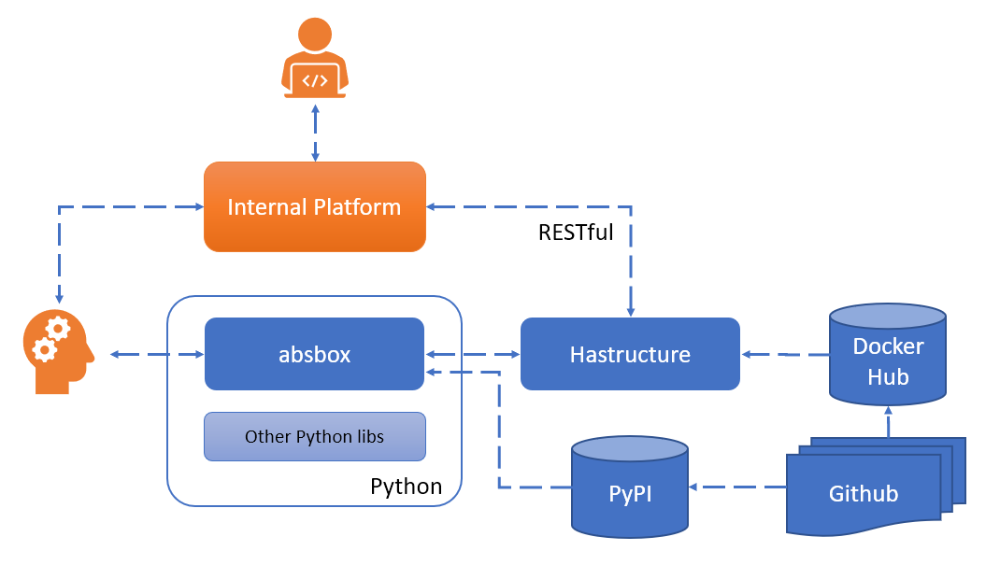

Support
=========

.. note::
  Obiviously, you have some curiosity and trouble before clicking this link.

  Structured Finance is most complicated fix-income instrument. `absbox` is being engineered to make it simple and easy to understand.

  It is simple, but takes time.

Issue & Feature Request
-------------------------

If any **Bug** found or  **features/documenent** request,please raise tickets alongside with deal documents to

https://github.com/yellowbean/AbsBox/issues

API Integration
------------------

- `absbox` can be used as a Python library embeded in other Python based application
- or building webservice layer with `absbox` to intergate with other system
- or using the `RESTful service <https://github.com/yellowbean/Hastructure>`_  directly with anyother language.
    - ``Swagger.json`` file is ready for integration.
- deploy engine locally via Docker 
    - ``docker pull yellowbean/hastructure:latest`` for stable version 
    - ``docker pull yellowbean/hastructure:dev`` for development version 
    - ``docker run -p 5000:8081 yellowbean/hastructure``
    - the server runs at port ``8081``

Email & Slack
-------------------

``absbox & hastructure`` -> https://absboxhastructure.slack.com

Consulting & Training
----------------------------

- **AbsBox** training is offered via webmeeting .
- **Hastructure** integration provided via a commercial term.

Please concact us for more details.

